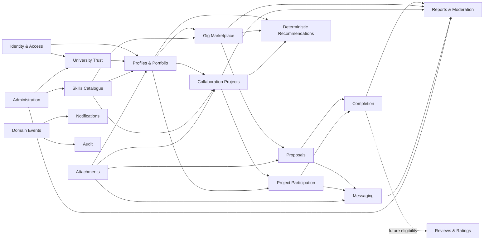
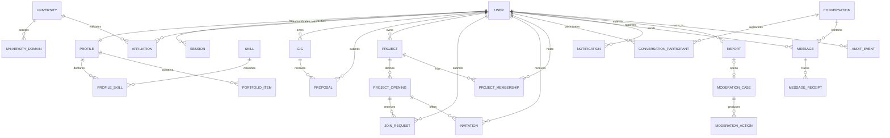
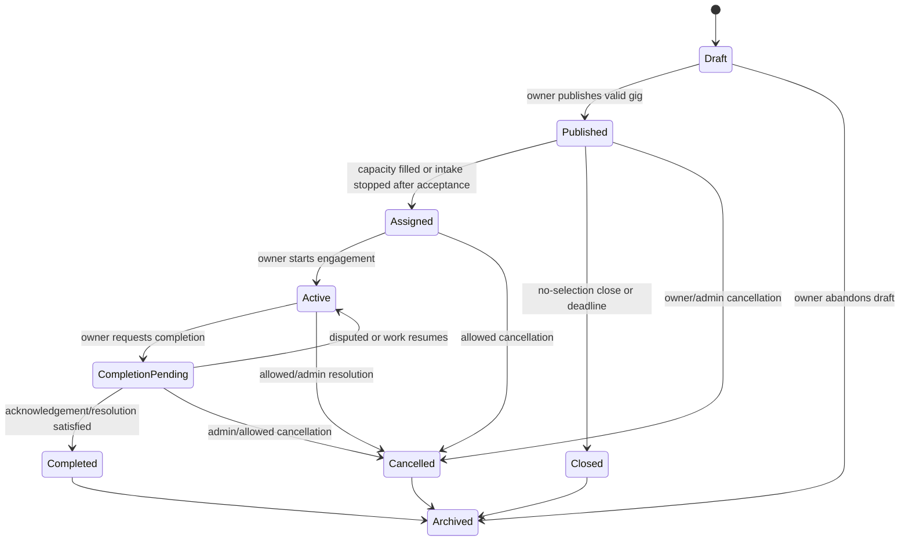
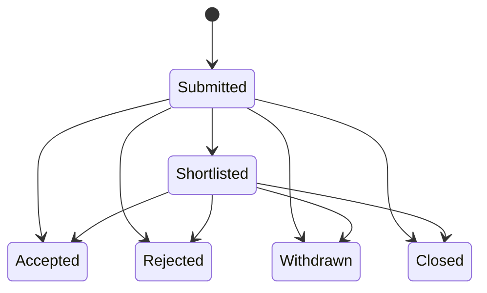
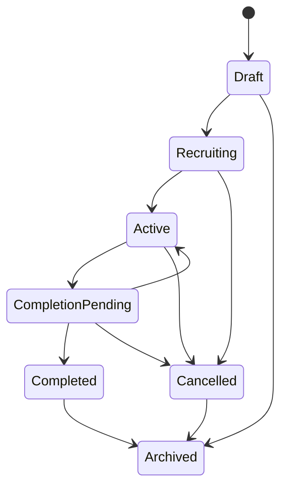
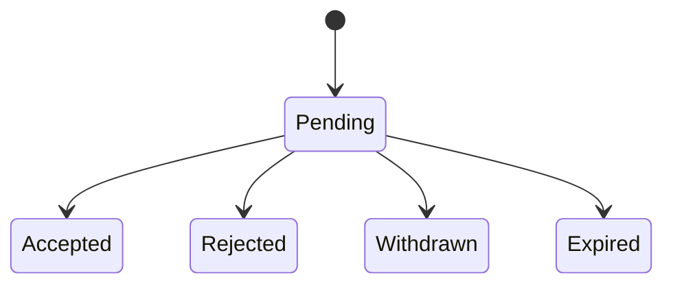
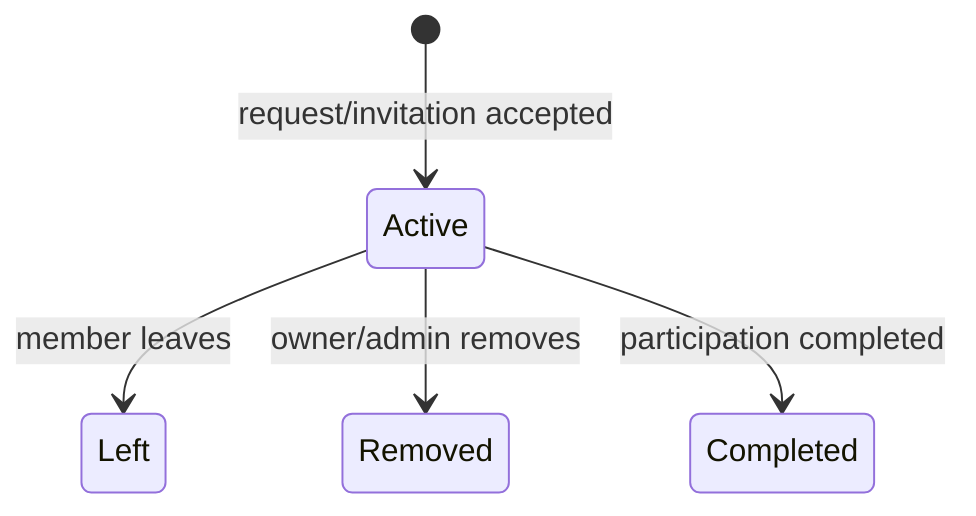
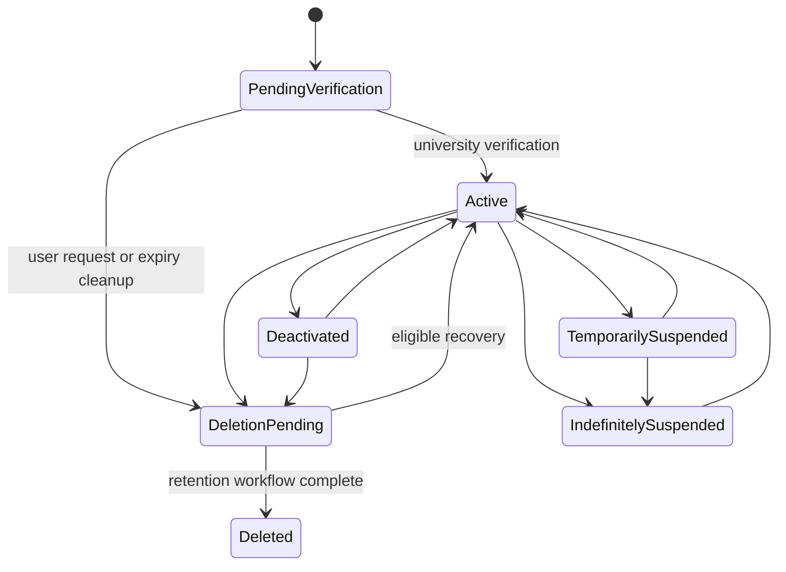

# CampusCollab — Phase 2 Domain Modeling and Authorization Design

**Document status:** Proposed architecture baseline; pending product approval where marked  
**Source of truth:** Phase 1 Requirements Specification  
**Phase boundary:** Domain and authorization design only  
**Explicit exclusions:** Application code, Mongoose schemas, Express routes/controllers, React components, and concrete REST API contracts  

## 0. Purpose and Modeling Conventions

This document transforms the Phase 1 requirements into a domain model suitable for later MongoDB and API design. It identifies bounded domains, conceptual entities, aggregate and transaction boundaries, lifecycle controls, authorization policy, security rules, domain events, and test scenarios.

Conceptual attributes describe information the domain needs; they are not database fields. References and embedding recommendations are architectural guidance for Phase 3, not schemas.

### 0.1 Terms

- **Actor:** authenticated or unauthenticated party attempting an operation.
- **Capability:** permission category granted by policy, such as creating opportunities; not a permanent persona.
- **Owner:** user accountable for a specific resource.
- **Member:** user with an active relationship to a project or conversation.
- **Aggregate:** consistency boundary whose invariants are enforced together.
- **Domain event:** fact that has already occurred; event names use past tense.
- **Terminal state:** no normal user transition leaves the state.
- **Administrative override:** exceptional, reasoned, audited correction; never a generic bypass.

## 1. Phase 1 Review

### 1.1 Core business domains

1. Identity, authentication, and account lifecycle.
2. University trust and verification.
3. Profiles, portfolios, skills, and availability.
4. Gig marketplace and proposal selection.
5. Collaboration projects, openings, applications, invitations, and teams.
6. Contextual messaging and attachments.
7. Notifications and activity summaries.
8. Completion and work history.
9. Reporting, moderation, suspension, and administration.
10. Audit and operational accountability.

### 1.2 Main actors

- **Visitor:** unauthenticated person who may browse permitted public content and register.
- **Pending user:** registered but not university-verified.
- **Verified user:** active user with an acceptable current university verification.
- **Opportunity seeker:** verified user applying to gigs or collaboration roles.
- **Resource owner:** verified user who owns a gig or project; ownership is contextual.
- **Project member:** user with an active membership in a project.
- **Conversation participant:** user authorized for a specific conversation.
- **Moderator/administrator:** privileged user operating under separately granted administrative capabilities.
- **System actor:** trusted scheduled or event-driven process performing expiry, notification, retention, or security actions.

### 1.3 Core entities

The core entity set derived from Phase 1 is:

- User Account, Authentication Session, Verification Challenge, University, University Domain.
- Profile, Profile Skill, Portfolio Item, Skill.
- Gig, Gig Bookmark, Proposal, Proposal Revision, Completion Record.
- Collaboration Project, Project Opening, Join Request, Invitation, Project Membership.
- Conversation, Conversation Participant, Message, Message Receipt, Attachment.
- Notification, Report, Moderation Case, Moderation Action, Audit Event.

Reviews/Ratings are a future entity set and must not influence MVP authorization or completion.

### 1.4 High-level relationships

- A User has one current Profile and zero or more sessions, verification attempts, skills, portfolio items, owned resources, applications, memberships, conversations, notifications, and reports.
- A University has one or more accepted University Domains and many verified user affiliations over time.
- A Gig has one owner and many Proposals; each Proposal belongs to one applicant and one Gig.
- A Project has one owner, multiple role Openings, Join Requests, Invitations, and Memberships.
- A Conversation has multiple authorized participants and many Messages.
- An Attachment has one uploader and one owning context; access is inherited from that context.
- A Report has one reporter, one reported target, and may produce a Moderation Case and actions.
- Audit Events record security- or governance-relevant actions without becoming mutable children of the affected aggregate.

### 1.5 Lifecycle states inherited from Phase 1

- **User:** pending verification, active, temporary suspension, indefinite suspension, deactivated, deletion pending, deleted.
- **Gig:** draft, published, assigned, active, completion pending, completed, closed, cancelled, archived.
- **Proposal:** submitted, shortlisted, accepted, rejected, withdrawn, closed.
- **Project:** draft, recruiting, active, completion pending, completed, cancelled, archived.
- **Join Request:** pending, accepted, rejected, withdrawn, expired.
- **Project Membership:** invited, active, left, removed, completed in Phase 1; refined in this document because Invitation is a separate entity.

### 1.6 Business-rule summary

- University verification gates trust-sensitive actions.
- Resource ownership is singular and cannot be silently transferred.
- Users cannot apply to their own resources or create duplicate active applications.
- Acceptance must recheck current state and capacity atomically.
- Project membership is unique per user/project and consumes capacity.
- Messaging requires conversation-specific participation, not merely platform membership.
- Suspension revokes sessions and mutation privileges while preserving evidence/history.
- Reports are allegations, not automatic proof, and require confidential, auditable moderation.
- Published or historically significant resources are closed/cancelled/archived rather than silently hard-deleted.

### 1.7 Authorization requirements

Every protected operation requires a policy decision using all applicable dimensions:

1. Authentication status.
2. Account lifecycle status.
3. Current university-verification status.
4. Explicit platform capability.
5. Resource ownership or membership.
6. Resource visibility.
7. Resource lifecycle state.
8. Relationship constraints, including self-dealing and blocks.
9. Administrative scope and reason when an override is attempted.

Frontend visibility is never an authorization control.

### 1.8 Important constraints

- Modular monolith; no MVP microservices.
- JavaScript MERN stack is an implementation constraint for later phases.
- No payments, AI matching, video interviews, native mobile app, or gamification in MVP.
- Public prototype data is illustrative only.
- Search, messages, notifications, and audit history must be bounded/paginated.
- High-impact transitions require idempotency, concurrency protection, and auditability.
- Private proposals, conversations, university email, and moderation evidence are not public data.

### 1.9 Open product decisions carried forward

All six Phase 1 decisions remain pending until the product owner explicitly approves them. Phase 1 numbers OD-02 and OD-03 list multiple affiliation and reverification respectively, while the Phase 2 brief presents them in the opposite order. This document identifies decisions by subject to avoid accidental renumbering.

### 1.10 Contradictions and required clarifications

| ID | Finding | Impact | Proposed resolution | Status |
|---|---|---|---|---|
| C-01 | Invitation is a separate workflow, but Phase 1 also gives Project Membership an `invited` state. | Duplicate sources of truth and ambiguous acceptance. | Invitation owns pending invitation state. Membership is created as `active` only after invitation or join-request acceptance. | Requires product approval. |
| C-02 | Gig supports configurable multi-hire capacity, but the lifecycle moves from `published` to `assigned` when acceptance fills capacity. It does not specify state after an early acceptance when capacity remains. | Later proposals may be incorrectly blocked or overaccepted. | Keep Gig `published` while unused capacity remains; accepted proposals are authoritative. Move to `assigned` when capacity is full or the owner stops intake with at least one accepted proposal. | Requires product approval. |
| C-03 | Project `active -> recruiting` appears to reverse lifecycle even though the text says it does not reverse project work. | Status alone cannot express “active and recruiting.” | Treat recruitment as an independent intake flag/capacity condition for active projects, or rename transition to a combined state. Recommend an independent `acceptingMembers` condition in Phase 3. | Requires product approval. |
| C-04 | Phase 1 allows an administrator to modify profile information but also forbids rewriting user-authored history. | Admin correction scope is unclear. | Admin may restrict visibility or correct verified/reference metadata with reason; user-authored narrative content is hidden/restored, not rewritten. | Proposed clarification. |
| C-05 | Completion requires participant acknowledgement but does not define the quorum for multi-member projects. | Projects can remain indefinitely completion-pending or complete unfairly. | Resolve through the joint completion decision in Section 2.6. | Pending decision. |
| C-06 | `pending_verification -> deletion_pending` is used for registration expiry. | Privacy deletion workflow and unclaimed-registration cleanup are conflated. | Treat expired unverified registrations as a system retention action using the same terminal cleanup pipeline, but record a distinct reason. | Proposed clarification. |

## 2. Open Product Decisions

No recommendation in this section is final until explicitly approved.

### 2.1 External clients as Project Owners

**Problem:** CampusCollab needs opportunity supply, but allowing non-student clients changes the trust model, privacy exposure, fraud risk, support burden, and registration model.

**Options**

1. **Verified students only.** Every owner must hold current student verification.
   - Advantages: simplest trust boundary; consistent onboarding; smaller abuse surface.
   - Disadvantages: fewer gigs; student founders may have limited budgets; excludes legitimate university partners.
2. **Invite-only external owners.** Administrators approve organizations or individuals after enhanced verification.
   - Advantages: improves opportunity supply while preserving control.
   - Disadvantages: new identity type, review operations, separate privacy and moderation risks.
3. **Public external registration.** Any client can register after ordinary email verification.
   - Advantages: maximum marketplace supply and growth.
   - Disadvantages: highest scam, impersonation, moderation, legal, and product-complexity risk.

**RECOMMENDED DECISION:** Option 1 for MVP closed beta: all ordinary owners are verified students. Design ownership generically enough to add an approved organization actor later.

**REQUIRES PRODUCT APPROVAL:** Yes — pending.

| Area | Effect of recommendation |
|---|---|
| Database | One user identity/affiliation trust model in MVP; do not require an organization aggregate yet. Preserve an extensible owner-subject concept for later design. |
| Backend | Opportunity creation requires active account, current verification, completed minimum profile, and create-opportunity capability. |
| Frontend | No external-client onboarding; owner mode remains available to verified students. Clearly label platform as student-only. |
| Authorization | Ownership capability does not bypass student verification. Admins do not create gigs as other users. |
| SQA | Test unverified, suspended, self-owned, and ordinary verified-user creation boundaries. |
| Future scalability | Adding organizations later requires organization verification, membership, delegated ownership, and separate moderation rules. |

### 2.2 University reverification policy

**Problem:** A once-verified address may remain trusted after graduation, loss of access, domain compromise, or affiliation change. Excessive reverification can also lock out legitimate users.

**Options**

1. **One-time verification.** Verification never expires unless revoked.
   - Advantages: lowest friction and email cost.
   - Disadvantages: trust becomes stale and “student-only” loses meaning.
2. **Periodic reverification.** Trust expires after a defined interval; viewing history remains possible while sensitive actions are gated.
   - Advantages: maintains current trust with predictable policy.
   - Disadvantages: recurring friction, delivery failures, and support work.
3. **Risk/event-based reverification only.** Trigger on email/university change, suspicious activity, or administrator action.
   - Advantages: less friction than periodic verification.
   - Disadvantages: stale accounts without detectable risk; more complex risk policy.

**RECOMMENDED DECISION:** Combine Options 2 and 3: verification is valid for 12 months and may be revoked earlier on trust-sensitive changes or security events. Expired users retain read access to their own history and recovery/settings, but cannot post, apply, invite, accept, or send new messages until reverified.

**REQUIRES PRODUCT APPROVAL:** Yes — pending, including the proposed 12-month interval.

| Area | Effect of recommendation |
|---|---|
| Database | Affiliation needs verification time, expiry, status, method, and revocation metadata; no schema is defined here. |
| Backend | A central “current verification” policy gates trust-sensitive commands and supports expiry/revocation. |
| Frontend | Advance warnings, expired-trust banner, resend flow, and restricted-mode explanations are required. |
| Authorization | Authentication remains valid, but mutation capabilities are reduced until reverification. |
| SQA | Test boundary time, timezone, revoked/expired states, session continuity, email failure, and concurrent reverification. |
| Future scalability | Supports alumni or other trust tiers later without redefining account status. |

### 2.3 Multiple university affiliations

**Problem:** Students may transfer, attend joint programs, or hold simultaneous affiliations. MVP scope currently excludes multiple active affiliations.

**Options**

1. **Exactly one active affiliation.** A new verified affiliation replaces the current one while history is retained.
   - Advantages: simplest UI, visibility rules, and trust policy.
   - Disadvantages: cannot represent legitimate joint enrollment.
2. **Multiple affiliations, one primary.** Several verified affiliations may coexist.
   - Advantages: accurate and flexible.
   - Disadvantages: more complex verification, visibility, search, expiry, and abuse rules.
3. **Immutable original affiliation.** University cannot change without support.
   - Advantages: strongest simplicity and abuse resistance.
   - Disadvantages: poor transfer support and high operational burden.

**RECOMMENDED DECISION:** Option 1 for MVP: one active affiliation with retained historical affiliation evidence; change requires verification of the new address and does not silently erase prior audit history.

**REQUIRES PRODUCT APPROVAL:** Yes — pending.

| Area | Effect of recommendation |
|---|---|
| Database | Model affiliation as a conceptual entity rather than permanently embedding only university text in User; enforce one active affiliation in MVP. |
| Backend | University change is a workflow, not an ordinary profile edit. |
| Frontend | Show one active institution and a dedicated change/reverification flow. |
| Authorization | University-scoped visibility uses the active, currently verified affiliation only. |
| SQA | Test replacement, failed verification, rollback, historical visibility, and duplicate/domain conflicts. |
| Future scalability | Entity-based affiliation allows later multiple active records without rewriting opportunity ownership. |

### 2.4 Ratings in the MVP

**Problem:** Ratings improve selection confidence but introduce retaliation, manipulation, cold-start effects, disputes, moderation, and completion dependency.

**Options**

1. **No public ratings in MVP.** Preserve verified completion facts only.
   - Advantages: protects scope and avoids premature reputation harm.
   - Disadvantages: weaker trust signal for early users.
2. **Simple mutual star rating.** One score and optional text after completion.
   - Advantages: familiar and relatively small user feature.
   - Disadvantages: still requires fraud, retaliation, editing, appeal, and aggregation policy.
3. **Structured private feedback first.** Collect internal quality signals without public display.
   - Advantages: informs product design and moderation.
   - Disadvantages: privacy purpose and operational use must be carefully defined.

**RECOMMENDED DECISION:** Option 1. Exclude Review/Rating from MVP commands and public UI; keep trustworthy Completion Records so reviews can later require genuine completed participation.

**REQUIRES PRODUCT APPROVAL:** Yes — pending.

| Area | Effect of recommendation |
|---|---|
| Database | No MVP review/rating persistence is required; Completion Record remains the future eligibility source. |
| Backend | No rating commands or score calculation; completion emits an event usable later. |
| Frontend | Do not display fake stars or review counts; show factual completed-work history where privacy permits. |
| Authorization | No review policy in MVP; future reviews require participant eligibility and one review per relationship/direction. |
| SQA | Verify no inaccessible rating controls or misleading scores appear. Test completion-history accuracy. |
| Future scalability | A later Reviews domain can consume completion identity without coupling scores to profiles now. |

### 2.5 Account-deletion behavior

**Problem:** Immediate hard deletion conflicts with recovery, fraud evidence, conversation continuity, other users’ history, moderation, and legal/privacy obligations.

**Options**

1. **Immediate hard deletion.** Remove all possible records at request time.
   - Advantages: simple user expectation and minimal retained data.
   - Disadvantages: irreversible, breaks shared history, enables abuse evidence destruction, and may violate retention duties.
2. **Recoverable deletion then erasure/anonymization.** Restrict the account, revoke sessions, allow a recovery window, then erase or anonymize by data category.
   - Advantages: balances user control, recovery, shared integrity, and compliance.
   - Disadvantages: requires retention classification and background processing.
3. **Permanent deactivation only.** Never erase historical personal data.
   - Advantages: operationally easiest.
   - Disadvantages: poor privacy posture and may be unlawful.

**RECOMMENDED DECISION:** Option 2 with a proposed 30-day recovery window. Immediately revoke sessions and prevent mutations; after the window, erase credentials/private profile data and anonymize or retain only minimally necessary shared/audit records under documented policy.

**REQUIRES PRODUCT APPROVAL:** Yes — pending, including recovery duration and jurisdiction-specific retention.

| Area | Effect of recommendation |
|---|---|
| Database | Data categories need deletion/anonymization rules and a deletion workflow record; shared authored history needs pseudonymization. |
| Backend | Deletion is a multi-step, retryable, audited workflow with legal-hold and cancellation handling. |
| Frontend | Show consequences, recovery deadline, cancellation option, and completed status without promising deletion that has not occurred. |
| Authorization | Deletion-pending users cannot mutate; narrowly permitted recovery/authentication proof remains. |
| SQA | Test session revocation, recovery boundary, idempotent retries, partial failure, legal hold, shared messages, and completion evidence. |
| Future scalability | Data-classification-based deletion supports new domains without a dangerous global cascade. |

### 2.6 Joint completion and dispute workflow

**Problem:** Owners and participants may disagree about completion. Multi-member projects also need a clear acknowledgement quorum.

**Options**

1. **Owner unilateral completion.** Owner ends the engagement immediately.
   - Advantages: simple and fast.
   - Disadvantages: unfair to participants and weak evidence quality.
2. **All participants must acknowledge.** Completion waits for unanimous confirmation.
   - Advantages: strongest agreement signal.
   - Disadvantages: one inactive member can block completion indefinitely.
3. **Owner request plus participant-level outcomes and timeout.** Owner requests completion; each active participant acknowledges or disputes. After a defined period, nonresponses become administratively resolvable rather than automatic agreement.
   - Advantages: fair, supports multi-member projects, preserves per-person history.
   - Disadvantages: more states and moderation work.

**RECOMMENDED DECISION:** Option 3. Record completion per accepted gig engagement or project membership. Overall project completion requires no unresolved disputes and either acknowledgement from all active members or a documented admin resolution after a proposed 14-day response window. Silence is not automatically treated as agreement.

**REQUIRES PRODUCT APPROVAL:** Yes — pending, including response window and admin service target.

| Area | Effect of recommendation |
|---|---|
| Database | Completion needs participant-level decisions, timestamps, dispute link, and resolution evidence. |
| Backend | Completion request, acknowledgement, dispute, timeout escalation, and finalization must be idempotent. |
| Frontend | Owners see response progress; participants see acknowledge/dispute actions and deadlines; disputes explain next steps. |
| Authorization | Owner initiates; only the affected participant responds for self; admins resolve but cannot impersonate acknowledgement. |
| SQA | Test all/partial acknowledgement, duplicate response, timeout, removal during completion, dispute, admin resolution, and concurrent finalization. |
| Future scalability | Completion Record becomes eligibility evidence for reviews, portfolios, payments, or reputation. |

## 3. Bounded Domains and Module Map

### 3.1 Domain classification

| Domain/module | Responsibility | MVP status | Depends on |
|---|---|---|---|
| Identity & Access | Account lifecycle, credentials, sessions, platform capabilities | Required | Audit |
| University Trust | Universities, domains, affiliations, verification challenges | Required | Identity, Notifications, Audit |
| Profiles & Portfolio | Public/private profile, availability, education, portfolio | Required | Identity, University Trust, Skills, Attachments |
| Skills Catalogue | Canonical skills, aliases, categories | Required | Administration, Audit |
| Gig Marketplace | Gig lifecycle, visibility, capacity, bookmarks | Required | Identity, Profiles, Skills, Attachments, Audit |
| Proposals | Proposal submission, revision, shortlisting, decision, withdrawal | Required | Gigs, Profiles, Attachments, Notifications, Audit |
| Collaboration Projects | Project lifecycle, openings, recruitment visibility | Required | Identity, Profiles, Skills, Attachments, Audit |
| Project Participation | Join requests, invitations, memberships, capacity decisions | Required | Projects, Profiles, Notifications, Audit |
| Messaging | Conversations, participants, messages, read state | Required | Identity, accepted Gigs/Participation, Attachments, Notifications |
| Attachments | File metadata, ownership context, safety status, access decision | Required | Identity, storage/security policy, Audit |
| Notifications | In-app notification lifecycle and user preferences | Required | Domain events, Identity |
| Completion | Participant acknowledgement, dispute link, completed-work evidence | Required if OD completion recommendation is approved | Gigs, Projects, Participation, Reports, Audit |
| Reports & Moderation | Reports, cases, evidence access, decisions, appeals | Required | Identity, all reportable domains, Notifications, Audit |
| Administration | Privileged reference-data and operational commands | Required | Identity & Access, University, Skills, Moderation, Audit |
| Audit | Immutable security/governance event history | Required | Consumes all sensitive domain activity |
| Recommendations | Deterministic skill/availability read model | Required, limited | Profiles, Skills, Gigs, Projects |
| Reviews & Ratings | Mutual reviews and reputation | Deferred | Completion, Moderation, Profiles |
| Payments | Payment/escrow/dispute processing | Deferred | Identity, Gigs, Completion, legal/compliance |
| AI Matching | Semantic recommendations or generated assistance | Deferred | Mature data/governance |

### 3.2 Dependency principles

- Identity is foundational but must not absorb profile, verification, or business-resource behavior.
- University Trust decides affiliation validity; business domains ask a policy service whether trust is current.
- Opportunity domains own their lifecycles. Notifications, Audit, and Recommendations consume their facts rather than owning their transactions.
- Messaging never decides whether a proposal or membership is accepted; it receives authorized participant facts from those domains.
- Attachments own file safety and storage metadata, while the containing domain decides who may access the parent context.
- Administration orchestrates explicitly authorized commands in owning domains; it does not directly mutate arbitrary records.

### 3.3 Dependency map

### 3.4 Module interaction rule

Within the modular monolith, modules communicate through explicit application contracts or domain events. A module must not reach into another module’s persistence representation. Cross-domain commands call the owning domain synchronously when immediate correctness is required; non-critical projections and notifications may react asynchronously.

## 4. Domain Entity Catalogue

### 4.1 User Account

- **Purpose:** Stable platform identity and account lifecycle authority.
- **Owner:** The represented user; lifecycle enforcement belongs to Identity & Access.
- **Important conceptual attributes:** stable identity, normalized login identifier, account status, primary onboarding preference, granted capabilities, security timestamps, deletion status, administrative privilege references.
- **Invariants:** normalized login identity is unique; admin privilege is never self-granted; deleted is terminal; suspended/deletion-pending users cannot perform ordinary mutations.
- **Lifecycle:** Defined in Section 7.6.
- **Relationships:** One current Profile; affiliations, sessions, owned resources, applications, memberships, conversations, notifications, reports, and audit references.
- **Create/modify/archive/view:** Visitor creates through registration; user updates limited account settings; Identity policies change security state; scoped admins suspend/restore; only self and authorized administrators view private account data.
- **Security concerns:** account enumeration, credential exposure, privilege escalation, session theft, unsafe account merging, and deletion bypass.

### 4.2 Authentication Session

- **Purpose:** Represents one authenticated session/device context without placing long-lived authentication state in a process.
- **Owner:** User Account.
- **Important attributes:** session identity, user reference, issued/expiry/revoked times, safe device/security metadata, authentication assurance, rotation lineage.
- **Invariants:** active session belongs to one non-deleted account; revoked/expired sessions cannot authorize; raw secrets are never retained as readable domain attributes.
- **Lifecycle:** active -> rotated/revoked/expired; terminal sessions cannot reactivate.
- **Relationships:** Many sessions to one User; security events to Audit.
- **Create/modify/archive/view:** Identity creates after successful authentication; user may revoke own sessions; system/admin may revoke for security; only self/support with justified scope may view safe session summaries.
- **Security concerns:** fixation, replay, leakage, insecure persistence, failure to revoke after suspension/password reset.

### 4.3 Verification Challenge

- **Purpose:** Time-bound proof workflow for university email verification, reverification, or password recovery purpose.
- **Owner:** Identity/University Trust; addressed to one User.
- **Important attributes:** purpose, intended user and destination, issue/expiry/use/supersession times, attempt counters, safe delivery status.
- **Invariants:** single-purpose, single-use, expiring, latest-policy compliant; successful use applies only to the intended user/purpose.
- **Lifecycle:** issued -> consumed/expired/superseded/revoked.
- **Relationships:** User, affiliation/email being proven, audit events, notification/email delivery.
- **Create/modify/archive/view:** System creates; user consumes/resends; admins revoke but do not view secret material; challenge details are never public.
- **Security concerns:** token theft, brute force, replay, email flooding, account enumeration, logs/URL leakage.

### 4.4 University

- **Purpose:** Canonical supported higher-education institution used for trust and discovery.
- **Owner:** Platform Administration.
- **Important attributes:** canonical name, display metadata, support status, country/region, accepted-domain relationships.
- **Invariants:** canonical identity is stable; deactivation cannot corrupt historical affiliations; only approved universities allow new verification.
- **Lifecycle:** proposed -> active -> inactive; reactivation is audited.
- **Relationships:** University Domains and user Affiliations.
- **Create/modify/archive/view:** Scoped admins create/edit/deactivate; users may view safe public institution information.
- **Security concerns:** fraudulent domain mapping, duplicate identity, admin tampering, unsafe public disclosure of internal verification notes.

### 4.5 University Domain

- **Purpose:** Normalized email-domain assertion accepted for a University.
- **Owner:** University aggregate/Administration.
- **Important attributes:** normalized domain, university reference, status, verification method/evidence, effective dates.
- **Invariants:** one active owning university unless approved shared-domain exception; normalized exact/suffix matching rule is explicit; deactivation blocks new verification but preserves history.
- **Lifecycle:** pending_review -> active -> inactive/rejected.
- **Relationships:** University and verification attempts.
- **Create/modify/archive/view:** Scoped admins manage; ordinary users do not receive internal evidence.
- **Security concerns:** subdomain confusion, Unicode/lookalike domains, shared-domain false positives, administrator compromise.

### 4.6 University Affiliation

- **Purpose:** A user’s claim and verified trust relationship with a University over time.
- **Owner:** User, with verification authority controlled by University Trust.
- **Important attributes:** user, university, university email reference, verification status/time/expiry/method, active interval, revocation reason.
- **Invariants:** under pending recommendation only one active affiliation per user; verified status requires successful challenge against an active accepted domain; user cannot self-mark verified.
- **Lifecycle:** pending -> verified -> expired/revoked/replaced; expired/revoked may enter pending reverification.
- **Relationships:** User, University, Verification Challenges.
- **Create/modify/archive/view:** User initiates; system verifies; admin may revoke with reason; private email visible only to self and justified admin scope.
- **Security concerns:** forged affiliation, stale trust, email exposure, unauthorized reassignment, expiry bypass.

### 4.7 Profile

- **Purpose:** User-controlled professional and academic presentation plus eligibility/completion information.
- **Owner:** User.
- **Important attributes:** display name, department, graduation year, bio, experience level, availability, public visibility preferences, completion score, education and external-link summaries.
- **Invariants:** one current profile per user; public output excludes private identity/security data; verified institution data is derived from Affiliation rather than freely asserted.
- **Lifecycle:** incomplete -> complete/visible -> restricted/deactivated; content edits do not replace historical security identity.
- **Relationships:** User, University Affiliation, Profile Skills, Portfolio Items, Attachments, completed-work projections.
- **Create/modify/archive/view:** User creates/edits; admin may restrict visibility or correct verified metadata through owning domains, not rewrite narrative; public visibility obeys settings and account state.
- **Security concerns:** XSS, unsafe links, doxxing, impersonation, leakage of email/private fields, admin overreach.

### 4.8 Skill and Profile Skill

- **Purpose:** Skill is canonical reference data; Profile Skill links a user to a skill with declared proficiency/evidence.
- **Owner:** Skill by Administration; Profile Skill by the user.
- **Important attributes:** canonical label, aliases, category, active status; user declaration, level, evidence, display order.
- **Invariants:** opportunity matching uses canonical identity; inactive skills remain resolvable historically; duplicate active profile-skill links are disallowed.
- **Lifecycle:** Skill proposed/active/inactive; Profile Skill active/removed.
- **Relationships:** Profiles, Gigs, Project Openings, portfolio evidence.
- **Create/modify/archive/view:** Admin manages canonical Skills; user manages own Profile Skills; public visibility follows Profile.
- **Security concerns:** keyword spam, malicious labels, privilege abuse in taxonomy, misleading proficiency claims.

### 4.9 Portfolio Item

- **Purpose:** User-authored evidence of work or learning.
- **Owner:** Profile owner.
- **Important attributes:** title, description, role, skills, dates, external links, attachments, visibility, verified-completion reference when applicable.
- **Invariants:** attached completion evidence must concern the same user; links/files pass policy; removal does not erase underlying platform Completion Records.
- **Lifecycle:** draft -> published -> archived/restricted.
- **Relationships:** Profile, Skills, Attachments, optional Completion Record.
- **Create/modify/archive/view:** Owner manages; admin restricts for policy; viewers see only published permitted content.
- **Security concerns:** plagiarism, unsafe URLs/files, false credentials, personal-data disclosure.

### 4.10 Gig

- **Purpose:** Freelance opportunity with scope, required skills, terms, visibility, capacity, and lifecycle.
- **Owner:** Exactly one verified User in MVP.
- **Important attributes:** title, description, category, skills, eligibility/visibility, budget indication, deadline, capacity, accepted count, lifecycle status, material-change history.
- **Invariants:** one owner; owner cannot propose; publication requires valid content; accepted count never exceeds capacity; historical gigs are not hard-deleted; state controls available operations.
- **Lifecycle:** Section 7.2.
- **Relationships:** Owner User, Skills, Attachments, Bookmarks, Proposals, accepted engagement/completion, contextual Conversations.
- **Create/modify/archive/view:** Eligible verified user creates; owner edits/manages by state; admin may restrict/correct status with reason; discovery sees only published visible content.
- **Security concerns:** scams, discriminatory/unsafe content, misleading terms, post-application bait-and-switch, capacity races, private applicant leakage.

### 4.11 Gig Bookmark

- **Purpose:** Private user preference to revisit a Gig.
- **Owner:** Bookmarking User.
- **Important attributes:** user, gig, created time.
- **Invariants:** at most one active bookmark per user/gig; bookmark does not grant access to an otherwise inaccessible Gig.
- **Lifecycle:** active -> removed.
- **Relationships:** User and Gig.
- **Create/modify/archive/view:** User creates/removes/views own bookmarks; admins ordinarily have no reason to view.
- **Security concerns:** preference privacy and indirect leakage of inaccessible gigs.

### 4.12 Proposal and Proposal Revision

- **Purpose:** Proposal represents one applicant’s candidacy for a Gig; Revision preserves material proposal content changes.
- **Owner:** Applicant, with decision authority held by Gig owner.
- **Important attributes:** gig, applicant, status, cover/terms, availability, attachments, current revision, submission/decision times, decision reason category.
- **Invariants:** one active proposal per applicant/gig; applicant differs from gig owner; accepted count/capacity rule holds; submitted evidence/history is preserved.
- **Lifecycle:** Section 7.3; revisions are append-only after initial submission if editing is allowed.
- **Relationships:** Gig, applicant User/Profile, Attachments, optional Conversation and Completion Record.
- **Create/modify/archive/view:** Applicant submits/withdraws and may revise within policy; Gig owner views/shortlists/accepts/rejects; admin access only for authorized moderation/support.
- **Security concerns:** BOLA exposure, tampering after review, duplicate submission, acceptance race, attachment access, reason leakage.

### 4.13 Collaboration Project

- **Purpose:** Structured research, academic, startup, hackathon, or personal collaboration seeking team members.
- **Owner:** Exactly one verified User in MVP.
- **Important attributes:** title, description, type, required skills, visibility, dates/duration, lifecycle status, recruitment condition, team constraints.
- **Invariants:** owner cannot request membership; publication requires at least one valid opening or explicit no-recruitment reason; terminal projects do not accept participation changes; historical project is preserved.
- **Lifecycle:** Section 7.4.
- **Relationships:** Owner, Skills, Project Openings, Join Requests, Invitations, Memberships, Attachments, Conversations, Completion Records.
- **Create/modify/archive/view:** Eligible user creates; owner manages by state; admin restricts/resolves with reason; viewers depend on visibility and lifecycle.
- **Security concerns:** unsafe/academic-misconduct projects, capacity races, team privacy, unauthorized lifecycle change.

### 4.14 Project Opening

- **Purpose:** Defines a recruitable role and its capacity within a Project.
- **Owner:** Project aggregate owner.
- **Important attributes:** role label, description, required skills, capacity, filled count, availability status.
- **Invariants:** capacity is positive; filled count never exceeds capacity; active memberships consume capacity; accepted requests/invitations target an existing open role.
- **Lifecycle:** draft/open/filled/closed; follows Project constraints.
- **Relationships:** Project, Skills, Join Requests, Invitations, Memberships.
- **Create/modify/archive/view:** Project owner manages subject to existing applicant/member fairness; eligible viewers see public opening data; admins may restrict/correct with reason.
- **Security concerns:** concurrent overfill, malicious role labels, unfair material changes after applications.

### 4.15 Join Request

- **Purpose:** Student-initiated request to occupy a Project Opening.
- **Owner:** Applicant; decision authority belongs to Project owner.
- **Important attributes:** project, opening, applicant, message, status, timestamps, decision metadata.
- **Invariants:** applicant is active/verified and not owner/member; request targets recruiting/accepting project and open role; duplicate pending request constraint; acceptance creates exactly one membership.
- **Lifecycle:** Section 7.5.
- **Relationships:** Project, Opening, applicant User/Profile, resulting Membership, Notifications.
- **Create/modify/archive/view:** Applicant creates/withdraws; Project owner accepts/rejects; admin views/acts only for support/moderation; request is private to involved parties.
- **Security concerns:** BOLA, spam, duplicate/race acceptance, private applicant-data leakage.

### 4.16 Invitation

- **Purpose:** Owner-initiated offer for a user to occupy a Project Opening.
- **Owner:** Project owner; response authority belongs to invitee.
- **Important attributes:** project, opening, inviter, invitee, message, status, issue/expiry/response times.
- **Invariants:** inviter owns project; invitee is eligible and not a member; role has capacity at send and acceptance; only invitee responds; one equivalent pending invitation.
- **Lifecycle:** pending -> accepted/rejected/revoked/expired.
- **Relationships:** Project, Opening, Users, resulting Membership, Notifications.
- **Create/modify/archive/view:** Owner sends/revokes; invitee accepts/rejects; involved parties view; admin scope is exceptional.
- **Security concerns:** invitation spam, forged inviter identity, capacity race, blocked-user bypass, notification leakage.

### 4.17 Project Membership

- **Purpose:** Authoritative participation relationship between User and Project after accepted request/invitation.
- **Owner:** Project owns team composition; member owns voluntary departure decision.
- **Important attributes:** project, user, opening/role, source request/invitation, active interval, membership state, removal/exit/completion reason.
- **Invariants:** one active membership per user/project; user is not project owner; active membership consumes exactly one unit of applicable capacity; membership history is retained.
- **Lifecycle:** Proposed refinement: active -> left/removed/completed. Invitation is not a membership state.
- **Relationships:** Project, Opening, User, source Join Request/Invitation, Conversations, Completion Record.
- **Create/modify/archive/view:** Created only through valid acceptance; owner removes under policy; member leaves; system/admin completes/resolves; project team visibility follows project policy.
- **Security concerns:** unauthorized membership creation/removal, capacity drift, historical access after departure, role escalation.

### 4.18 Conversation and Conversation Participant

- **Purpose:** Defines a private communication context and its authorized participant set.
- **Owner:** Conversation is system-created for an accepted relationship; no user owns other participants’ data.
- **Important attributes:** context type/id, participant membership, participation status/times, send/read permissions, last activity summary.
- **Invariants:** conversation context is valid; only authorized participants read; only active permitted participants send; participant list changes derive from authoritative opportunity relationships.
- **Lifecycle:** open -> read_only/closed/restricted; participant active -> read_only/removed.
- **Relationships:** Accepted Proposal or Project, Users, Messages, Attachments.
- **Create/modify/archive/view:** System creates from domain event; authorized participants view; membership domain changes access; admins access only with justified case/support scope.
- **Security concerns:** BOLA, participant spoofing, access retained after removal, enumeration, moderator snooping.

### 4.19 Message and Message Receipt

- **Purpose:** Message is immutable communication in a Conversation; Receipt records per-recipient delivery/read progression.
- **Owner:** Sender authors content; Conversation governs access.
- **Important attributes:** conversation, sender, client idempotency key, content type/body, attachment references, sent time; receipt participant and read/delivery times.
- **Invariants:** sender is send-enabled participant; message is durably accepted once per idempotency key; MVP user cannot edit message history; receipt belongs to a conversation participant.
- **Lifecycle:** Message sent -> restricted/retained; Receipt pending -> delivered -> read.
- **Relationships:** Conversation, sender User, Attachments, receipts.
- **Create/modify/archive/view:** Authorized participant sends; participants view; system updates receipts; moderation may restrict visibility without rewriting content.
- **Security concerns:** private content exposure, XSS, spam, duplicate delivery, unsafe files, notification-content leakage, retention.

### 4.20 Attachment

- **Purpose:** Security and access metadata for a file associated with one supported domain context.
- **Owner:** Uploader, constrained by parent context.
- **Important attributes:** uploader, parent context, original/safe display name, media classification, size, storage reference, integrity marker, scan status, lifecycle.
- **Invariants:** exactly one authoritative parent context; usable only after safety checks; access never exceeds parent authorization; storage reference is not a public authorization token.
- **Lifecycle:** pending_upload -> scanning -> available/quarantined/rejected -> removed/expired.
- **Relationships:** User and one Profile/Portfolio/Proposal/Project/Message context.
- **Create/modify/archive/view:** Eligible context participant uploads; owning-domain permissions control view; uploader/owner may remove where history permits; admin quarantines/removes.
- **Security concerns:** malware, content-type spoofing, path/key leakage, insecure direct storage access, orphaned data.

### 4.21 Notification and Notification Preference

- **Purpose:** User-specific record of actionable domain activity and delivery preferences.
- **Owner:** Recipient.
- **Important attributes:** recipient, event/category, safe target reference, created/read time, delivery status; preference channel/category settings.
- **Invariants:** recipient alone sees ordinary notifications; notification does not grant target access; duplicates are controlled by source-event identity.
- **Lifecycle:** unread -> read; active -> expired/removed under retention.
- **Relationships:** User, source Domain Event, target resource.
- **Create/modify/archive/view:** System creates; recipient reads/marks/removes under policy; admins access only for support telemetry, not private browsing.
- **Security concerns:** indirect data leakage, malicious deep links, duplicate storms, preference bypass.

### 4.22 Completion Record

- **Purpose:** Evidence of completion request and participant-level outcome for an accepted gig engagement or Project Membership.
- **Owner:** Shared business record; initiating authority is resource owner, response belongs to affected participant.
- **Important attributes:** context, owner request, participant response, deadlines, dispute/report reference, resolution, final status/times.
- **Invariants:** one active completion process per engagement; only affected participant responds for self; unresolved dispute prevents normal finalization; admin resolution is never recorded as user acknowledgement.
- **Lifecycle:** not_started -> pending_acknowledgement -> acknowledged/disputed -> resolved/completed/cancelled.
- **Relationships:** Gig+accepted Proposal or Project+Membership, Users, Reports/Moderation, future Review eligibility.
- **Create/modify/archive/view:** Owner initiates; participant acknowledges/disputes; admin resolves with reason; involved parties view.
- **Security concerns:** forged acknowledgement, coercion, premature completion, admin impersonation, evidence deletion.

### 4.23 Report, Moderation Case, and Moderation Action

- **Purpose:** Report records an allegation; Case organizes investigation; Action records a policy outcome.
- **Owner:** Platform Trust & Safety. Reporter owns their submission but not the moderation decision.
- **Important attributes:** reporter, target type/id, reason, narrative/evidence, priority, confidentiality; case assignee/status; action type, scope, reason, reviewer, effective period.
- **Invariants:** reporter identity confidential from target; report is not proof; high-impact actions require adequate authority; every action has immutable audit linkage.
- **Lifecycle:** Report submitted -> triaged/linked -> resolved; Case open -> investigating -> actioned/no_violation/escalated/appealed -> closed; Action proposed -> effective/reversed/expired.
- **Relationships:** Reporter User, target resource/user, Attachments, administrators, Notifications, Audit Events.
- **Create/modify/archive/view:** Authenticated user reports; trust staff triage/resolve; subjects receive limited outcome/appeal; only scoped admins access evidence.
- **Security concerns:** retaliation, false reports, evidence tampering, moderator bias/abuse, private-content overcollection.

### 4.24 Audit Event

- **Purpose:** Append-only evidence of security, administrative, and high-impact domain activity.
- **Owner:** Platform governance; no ordinary user owner.
- **Important attributes:** event type, actor/subject, target, timestamp, reason, outcome, correlation, safe before/after classification, origin.
- **Invariants:** append-only; cannot contain passwords/raw tokens/private message bodies by default; actor and reason required for administrative actions.
- **Lifecycle:** recorded -> retained -> archived/expired under policy; never edited in place.
- **Relationships:** Any audited actor/target; may reference Moderation Case or domain event.
- **Create/modify/archive/view:** System records; scoped auditors/admins view; retention process archives; ordinary admins cannot alter.
- **Security concerns:** tampering, overlogging, secret/PII exposure, insufficient separation of duties.

## 5. Aggregates, Ownership, and Consistency Boundaries

### 5.1 Aggregate overview

| Aggregate root | Child/value entities inside boundary | Separate related aggregates | Why |
|---|---|---|---|
| User Account | Capability grants and small account-state values | Session, Affiliation, Profile, Notification | Sessions/notifications are unbounded or have separate lifecycle; Profile and trust evolve independently. |
| University | University Domain | Affiliation, Verification Challenge | Domain uniqueness and university activation must be consistent together. |
| Profile | Small education/link values and profile-display settings | Profile Skill, Portfolio Item, Attachment | Skills/items can grow and change independently; files have safety lifecycle. |
| Skill | Aliases/category values | Profile Skill and opportunity associations | Canonical reference data has independent administrative lifecycle. |
| Gig | Small requirement/visibility/capacity values | Proposal, Bookmark, Attachment, Completion Record | Proposals are unbounded and applicant-owned; acceptance coordinates aggregates. |
| Proposal | Proposal Revision values where bounded or separately retained | Gig, Attachment, Conversation, Completion | Proposal preserves applicant submission and its own state. |
| Project | Project Opening children | Join Request, Invitation, Membership, Attachment, Completion | Project and openings define capacity; applications/memberships have separate actor/state/history. |
| Join Request | Decision metadata | Project, Opening, Membership | Applicant owns request; acceptance coordinates with Project capacity and Membership creation. |
| Invitation | Response metadata | Project, Opening, Membership | Pending offer exists before membership and has invitee-controlled response. |
| Project Membership | Membership role/state values | Project, Conversation, Completion | Membership is authoritative participation and independent historical record. |
| Conversation | Conversation Participant entries | Message, Attachment | Participant set is access boundary; messages are unbounded/high volume. |
| Message | Message Receipt entries if bounded by small group | Conversation, Attachment | Message is immutable/high-volume; receipts express per-participant state. |
| Report/Moderation Case | Case notes/action references as policy permits | Moderation Action, Attachment, Audit | Evidence and outcomes require governed lifecycle and least privilege. |
| Notification | Read/delivery state | Source event/target resource | Recipient-owned, high-volume projection. |
| Completion Record | Participant decisions for one engagement | Report/Case, future Review | Completion must enforce response/quorum invariants together. |

### 5.2 Atomic operations

The following operations must appear atomic to callers, even if Phase 3 later chooses a transaction, compare-and-set, conditional update, or equivalent mechanism:

1. Register unique user identity and create current verification workflow intent.
2. Consume a verification challenge once and update the intended affiliation/account trust state.
3. Accept a Proposal while rechecking Gig ownership, proposal state, and remaining capacity; increment accepted count exactly once.
4. When Gig capacity becomes full, prevent further acceptance and close remaining active proposals according to policy.
5. Accept a Join Request or Invitation while rechecking Project/Opening capacity and creating exactly one active Membership.
6. Change Membership active state and Project Opening filled capacity together.
7. Create one Message for a client idempotency identity and advance conversation activity without duplicates.
8. Suspend a User and invalidate all active sessions promptly as one security outcome.
9. Finalize completion only when required participant outcomes contain no unresolved dispute.
10. Apply high-impact moderation action and record its immutable audit evidence.

### 5.3 Eventually consistent operations

The following may occur asynchronously after the authoritative command succeeds, with retry and idempotency:

- In-app/email notification creation and delivery.
- Search-index and recommendation projection updates.
- Dashboard counts and activity summaries.
- Analytics and non-security telemetry.
- Malware scan completion, provided unsafe files remain unavailable before approval.
- Audit export/archival after the authoritative audit event is durably recorded.
- Expiry of stale requests/invitations and reminder generation, provided command-time checks still reject expired eligibility.

### 5.4 Aggregate interaction principles

- Cross-aggregate IDs are treated as references; callers never trust client-supplied ownership claims.
- Commands load or conditionally check every aggregate needed for the invariant.
- Domain events are emitted after authoritative state succeeds; an event is not a substitute for a required atomic check.
- Derived counters are never the sole proof of membership, acceptance, or access; authoritative relationships remain queryable.
- Administrative actions invoke normal owning-domain policy with an explicit override scope rather than editing storage directly.

## 6. Relationship Model and MongoDB Direction Guidance

### 6.1 Conceptual relationship diagram

### 6.2 Relationship decisions

| Relationship | Cardinality | Ownership/reference direction | MongoDB recommendation for Phase 3 | Rationale |
|---|---|---|---|---|
| User–Profile | 1:1 | Profile references User; User may expose profile reference/read link | Separate documents, referenced | Different privacy and update boundaries; avoids loading profile for authentication. |
| User–Session | 1:N | Session references User | Separate, referenced | Unbounded, security lifecycle, mass revocation/query needs. |
| User–Affiliation | 1:N history, max 1 active in MVP | Affiliation references User and University | Separate, referenced | Trust history, expiry/revocation, future multiple affiliations. |
| University–Domain | 1:N | University owns Domain | Embed if bounded or reference if shared-domain/review lifecycle requires; decide Phase 3 | Must atomically prevent conflicts; expected small count favors embedding, governance may favor separate uniqueness. |
| Profile–Profile Skill | 1:N | Link references Profile/User and Skill | Prefer bounded embedding only if skill count cap is strict; otherwise separate links | Canonical Skill must remain referenced; user skill set is small but searchable. |
| Profile–Portfolio Item | 1:N | Item references Profile/User | Separate, referenced | Independent lifecycle, attachments, pagination, moderation. |
| User–Gig | 1:N | Gig references owner User | Separate, referenced | Gigs are independent aggregates and searchable. |
| Gig–Proposal | 1:N | Proposal references Gig and applicant | Separate, referenced | Unbounded submissions, privacy, independent status/indexes. |
| User–Gig Bookmark | M:N via Bookmark | Bookmark references User and Gig | Separate join document | Private, sparse, uniqueness and removal behavior. |
| Project–Opening | 1:N bounded | Project owns openings | Prefer embedding as child values if role count is capped | Capacity invariants belong to Project aggregate. |
| Project–Join Request | 1:N | Request references Project, Opening identity, applicant | Separate, referenced | Unbounded applications and separate applicant ownership. |
| Project–Invitation | 1:N | Invitation references Project/opening/invitee | Separate, referenced | Time-bound response lifecycle and uniqueness. |
| Project–Membership | M:N via Membership | Membership references Project, User, Opening | Separate join document | Independent history, access checks, uniqueness, team queries. |
| Conversation–Participant | 1:N bounded by context | Conversation owns participant access records | Embed for small bounded teams; separate only if group scale demands | Authorization must load participant state consistently with Conversation. |
| Conversation–Message | 1:N | Message references Conversation and sender | Separate, referenced | High volume, pagination, immutable growth. |
| Message–Receipt | 1:N bounded by participants | Message owns receipt state or separate read cursor per participant | Prefer conversation participant read cursor for MVP; per-message receipt only if UI requires it | Avoid explosive receipt growth while still supporting read state. |
| Attachment–Parent | N:1 polymorphic context | Attachment references exactly one parent type/id and uploader | Separate, referenced | Security scanning/storage lifecycle differs from content; parent controls access. |
| User–Notification | 1:N | Notification references recipient and safe target | Separate, referenced | High volume, retention, unread pagination. |
| User–Report | 1:N | Report references reporter and polymorphic target | Separate, referenced | Confidential workflow and multiple target types. |
| Report–Moderation Case | N:1 possible | Case groups related Reports/targets | Separate, referenced | Multiple reports may support one investigation. |
| Any domain–Audit Event | 1:N logical | Audit references actor/target identifiers | Separate append-only collection | Cross-domain, high volume, separate retention/security. |
| Engagement–Completion Record | 1:1 per accepted relationship | Completion references exact Proposal or Membership | Separate, referenced | Shared response workflow and future review eligibility. |

### 6.3 Reference-direction rules

1. Child/application entities reference their authoritative parent: Proposal -> Gig, Join Request -> Project/Opening, Membership -> Project/User.
2. Parent aggregates do not embed unbounded child identifiers merely for convenience.
3. User does not carry growing arrays of all gigs, proposals, messages, or notifications.
4. Authorization queries begin with the requested object and verify authoritative owner/member fields; they do not trust a User-side cached list alone.
5. Denormalized summaries may exist later for performance, but must be treated as projections and repaired from authoritative relationships.

## 7. Lifecycle State Machines

### 7.1 General transition policy

- A transition command must validate actor, account, verification, capability, object relationship, current state, target state, and version/concurrency condition.
- Repeating an already-successful idempotent command returns the existing outcome rather than applying side effects again.
- An invalid transition is rejected; the system never “best guesses” another state.
- Notifications occur after successful authoritative transition and are deduplicated by source event.
- Every administrative override and every security/high-impact lifecycle transition creates an Audit Event.

### 7.2 Gig lifecycle

| Transition | Triggered by | Preconditions | Required side effects | Notification | Audit |
|---|---|---|---|---|---|
| draft -> published | Owner | Active, verified, capable owner; complete valid gig; future deadline; positive capacity | Record publication; make discoverable | Optional followers/bookmarks only if applicable | Publication event; material security audit not required unless policy says |
| draft -> archived | Owner | Ownership; draft | Hide from normal owner workspace/archive | None | Normal domain history |
| published -> assigned | Owner/system through acceptance | At least one accepted Proposal; capacity filled or owner explicitly stops intake | Block new submissions/acceptances; close remaining active Proposals deterministically | Affected applicants and accepted users | Acceptance and closure facts |
| published -> closed | Owner/system | No accepted engagement; deadline/no-selection close policy | Close active Proposals | All active applicants | Close reason |
| published -> cancelled | Owner/admin | Valid cancellation reason; no prohibited downstream state | Expire/close proposals; preserve content/history | Applicants | Required |
| assigned -> active | Owner | Accepted engagement exists; no unresolved restriction | Enable active-work context | Accepted participants | Domain event |
| assigned -> cancelled | Owner/admin | Cancellation allowed and reason recorded | Restrict new work messaging as policy; update accepted engagement | Participants | Required |
| active -> completion_pending | Owner | Active accepted engagement; no existing completion process | Create/update participant Completion Records | Participants | Required |
| completion_pending -> completed | System/admin resolution | Required acknowledgements; no unresolved dispute | Finalize engagements; make factual completion history eligible | Owner/participants | Required |
| completion_pending -> active | Owner/system after dispute | Dispute or continued-work decision | Pause completion; retain responses | Participants | Required when disputed |
| terminal -> archived | Owner/system | Retention/display policy | Remove from ordinary discovery, preserve history | Usually none | Domain history |

**Invalid examples:** archived -> published, completed -> active, closed -> assigned, active -> draft, non-owner edit transition.

**Race risks:** simultaneous acceptances, acceptance at deadline, capacity change during acceptance, cancellation racing acceptance, duplicate completion request. Use conditional state/version and capacity checks plus idempotency identity.

### 7.3 Proposal lifecycle

| Transition | Triggered by | Preconditions | Side effects | Notification | Audit |
|---|---|---|---|---|---|
| create -> submitted | Applicant | Active/currently verified; sufficient profile; not Gig owner; Gig published/open; no duplicate active Proposal | Preserve submitted revision; update owner activity | Gig owner | Submission domain event |
| submitted -> shortlisted | Gig owner | Owns Gig; Proposal still submitted; Gig accepting/reviewable | Record decision time | Applicant | Decision history |
| submitted/shortlisted -> accepted | Gig owner | Owns Gig; Proposal current; capacity; applicant eligible; Gig state valid | Reserve/increment capacity; establish engagement; potentially change Gig/close peers; create Conversation access | Applicant and affected peers | Required high-impact event |
| submitted/shortlisted -> rejected | Gig owner | Owns Gig; Proposal current | Preserve decision without exposing unsafe internal notes | Applicant | Decision history |
| submitted/shortlisted -> withdrawn | Applicant | Owns Proposal; not accepted/terminal | Remove from consideration | Gig owner | Withdrawal history |
| submitted/shortlisted -> closed | System/Gig outcome | Gig closes/cancels or capacity fills | Preserve final reason category | Applicant | Batch outcome event/deduplicated notifications |

**Invalid examples:** accepted -> withdrawn, rejected -> accepted, applicant accepts self, owner edits applicant content.

**Race risks:** two owners/sessions accepting against final capacity; applicant withdrawal racing acceptance; duplicate client submission; stale shortlist screen. Acceptance must condition on Proposal state and remaining Gig capacity in one consistency operation.

### 7.4 Project lifecycle

Recruitment during `active` is recommended as an independent `acceptingMembers` policy condition rather than an `active -> recruiting` backward state transition. This refinement remains pending approval under C-03.

| Transition | Triggered by | Preconditions | Side effects | Notification | Audit |
|---|---|---|---|---|---|
| draft -> recruiting | Owner | Valid project/openings; active verified capable owner | Make visible; enable requests/invitations | None or subscribed users | Publication event |
| draft -> archived | Owner | Draft ownership | Hide/archive | None | Domain history |
| recruiting -> active | Owner | Minimum start conditions approved; membership/capacity consistent | Preserve open recruitment flag separately if allowed | Members and pending applicants if terms change | Start event |
| recruiting/active -> cancelled | Owner/admin | Reason; no prohibited completion state | Expire requests/invitations; restrict new participation; preserve memberships/history | Members/applicants/invitees | Required |
| active -> completion_pending | Owner | Active memberships/engagements; no existing process | Create participant completion decisions | Members | Required |
| completion_pending -> completed | System/admin resolution | Approved quorum; no unresolved dispute | Complete active Memberships and project; close recruitment | Members | Required |
| completion_pending -> active | Owner/system | Dispute or continued work | Restore active workflow; retain completion history | Members | Required |
| terminal -> archived | Owner/system | Retention/display policy | Remove from discovery, preserve authorized history | Usually none | Domain history |

**Invalid examples:** completed -> recruiting, cancelled -> active, archived -> draft, non-owner start/cancel, completion without active participation.

**Race risks:** start while request acceptance is pending, cancellation racing invitation acceptance, final member removal racing completion, stale opening capacity, duplicate completion initiation.

### 7.5 Join Request lifecycle

| Transition | Triggered by | Preconditions | Side effects | Notification | Audit |
|---|---|---|---|---|---|
| create -> pending | Applicant | Verified/active; not owner/member; Project accepts members; Opening available; no duplicate/conflict | Register candidacy | Project owner | Submission event |
| pending -> accepted | Project owner | Ownership; Project/opening still eligible; applicant active; capacity available | Create one active Membership; consume capacity; expire conflicts | Applicant; affected owner dashboard | Required participation event |
| pending -> rejected | Project owner | Ownership; still pending | Preserve outcome | Applicant | Decision event |
| pending -> withdrawn | Applicant | Own pending request | Remove from consideration | Owner | Withdrawal event |
| pending -> expired | System | Deadline, project closure, role filled, eligibility lost | Prevent response | Applicant/owner only when useful | Expiry event |

**Invalid examples:** rejected -> accepted, accepted -> withdrawn, non-owner decision, owner applies to own project.

**Race risks:** two acceptances for final opening, simultaneous withdraw and accept, invitation acceptance against same capacity, project cancellation during acceptance.

### 7.6 Project Membership lifecycle

**Recommended refinement:** remove `invited`. Invitation is a separate pending entity; membership begins only after valid acceptance.

| Transition | Triggered by | Preconditions | Side effects | Notification | Audit |
|---|---|---|---|---|---|
| create -> active | Project owner/invitee acceptance command | Valid source Request/Invitation; capacity; unique membership; active users/project | Consume opening capacity; grant team/conversation access | Member/owner/team as appropriate | Required |
| active -> left | Member | Leaving permitted; not blocked by completion policy | Release capacity if recruitment can continue; revoke send/private access; preserve history | Owner/team | Required reason/category |
| active -> removed | Project owner/admin | Ownership or scoped moderation; reason; removal policy | Release capacity; revoke access; preserve evidence/history | Member/team as safe | Required |
| active -> completed | Completion finalizer | Project/participant completion satisfied | Retain historical authorized access per policy; stop mutations | Member/owner | Required |

**Invalid examples:** left -> active by editing old membership, removed -> completed, duplicate active membership, member changes own role/capacity.

**Race risks:** request and invitation both accepted for same user; removal racing message send; departure racing completion; two memberships created from retries.

### 7.7 User Account lifecycle

| Transition | Triggered by | Preconditions | Side effects | Notification | Audit |
|---|---|---|---|---|---|
| create -> pending_verification | Visitor/system | Valid supported registration; uniqueness/rate policy | Send challenge | User email | Security event |
| pending_verification -> active | User challenge consumption | Valid latest challenge and affiliation | Mark trust current; enable onboarding | User | Required security event |
| active -> temporarily/indefinitely suspended | Scoped admin/security policy | Reason, authority, duration/review where temporary | Revoke sessions; block mutations; preserve data; apply content policy | User where safe | Mandatory high-impact audit |
| temporary suspension -> active | System/admin | Expiry or approved appeal | Restore allowed access subject to verification | User | Mandatory |
| indefinite suspension -> active | Elevated admin | Approved reinstatement | Restore subject to trust/security checks | User | Mandatory high-impact audit |
| active -> deactivated | User | Authenticated confirmation; allowed state | Revoke sessions; hide/restrict profile by policy | User | Required |
| deactivated -> active | User | Recovery proof; no overriding suspension; verification policy | Restore account | User | Required |
| eligible state -> deletion_pending | User/system | Confirmation or expired registration reason; no blocking legal hold at request stage | Revoke sessions; block mutations; schedule privacy workflow | User | Mandatory |
| deletion_pending -> active | User/admin policy | Within recovery window; no suspension/legal conflict | Cancel scheduled deletion; require security/verification checks | User | Mandatory |
| deletion_pending -> deleted | System | Recovery window passed; retention/classification workflow succeeds | Erase/anonymize by category; preserve minimal lawful shared history | Completion notice if possible | Mandatory |

**Invalid examples:** deleted -> active, suspended -> deletion escape that destroys evidence, self-granted active state, admin action without reason.

**Race risks:** login/session refresh during suspension, deletion cancellation during finalization, verification during suspension, concurrent admin decisions, stale permission cache after status change.

### 7.8 Invitation lifecycle addition

Although not requested as one of the six inherited state machines, Invitation requires an explicit lifecycle to resolve C-01:

`pending -> accepted | rejected | revoked | expired`

Only the invitee accepts/rejects; only the Project owner revokes; system expires. Acceptance must create Membership and consume capacity atomically, or fail without changing Invitation.

## 8. Authorization Model

### 8.1 Roles versus capabilities

- **Student** is the base verified-community identity/persona, not blanket permission to every action.
- **Project Owner** is not a permanent exclusive role. It is a capability and a resource relationship created when an eligible user owns a Gig or Project.
- **Administrator** is a separately granted privileged role containing scoped capabilities such as university management, skill management, moderation, suspension, audit viewing, and appeal resolution.
- A single user may be both opportunity seeker and owner for different resources, but never applicant and owner of the same resource.
- Administrative actions must be distinguished from the administrator’s ordinary user actions.

### 8.2 Policy evaluation order

For a protected command, the backend must evaluate:

1. **Authenticate:** Is there a valid, non-revoked session?
2. **Account:** Is the account state permitted for this operation?
3. **Trust:** Is current university verification required and satisfied?
4. **Capability:** Does the actor have the platform capability?
5. **Object:** Does the target exist within the actor’s allowable visibility scope?
6. **Relationship:** Is the actor owner, applicant, invitee, member, participant, reporter, assignee, or scoped admin as required?
7. **State:** Does the target lifecycle allow the action?
8. **Conflict:** Does self-dealing, blocking, duplicate, capacity, or concurrent version policy reject it?
9. **Data scope:** Which fields may this actor read or change?
10. **Audit:** Does this decision/action require reasoned audit evidence?

Failure should reveal no more than necessary. For sensitive private resources, “not found” may be safer than distinguishing existence from forbidden access.

### 8.3 Account-state permissions

| Account/trust state | Public browse | Own recovery/settings | Read own authorized history | Ordinary mutations | Admin functions |
|---|---:|---:|---:|---:|---:|
| Visitor | Limited | Registration only | No | No | No |
| Pending verification | Limited | Yes | Limited | No verified-only actions | No |
| Active + current verification | Yes | Yes | Yes | Yes, subject to all policies | Only if separately granted |
| Active + expired verification (pending decision) | Yes | Yes/reverify | Yes | No trust-sensitive mutations | Admin role may also require current staff policy |
| Temporarily/indefinitely suspended | Public only as anonymous where allowed | Appeal/security contact only | No normal authenticated access | No | No ordinary admin session; privileged status reviewed |
| Deactivated | Public only | Reactivation/deletion | No normal access | No | No |
| Deletion pending | Public only | Cancel deletion if eligible | Limited export/status by policy | No | No |
| Deleted | Public only | No ordinary recovery | No | No | No |

### 8.4 Authorization matrix

Legend: **Public** = visible under resource visibility; **Self** = subject user; **Owner** = owner of target Gig/Project; **Applicant** = Proposal/Request owner; **Member** = active Project/Conversation member; **Invitee** = invitation recipient; **Scoped admin** = explicit relevant admin capability and purpose. All mutation rows also require an active account and current verification unless stated.

| Resource | Action | Visitor | Verified user | Contextual owner/member | Scoped admin | Additional policy |
|---|---|---:|---:|---|---:|---|
| User Account | View public identity | Limited | Public | Public | Yes by scope | Privacy/account visibility |
| User Account | View private account | No | Self | No | Yes | Least privilege and purpose |
| User Account | Edit settings | No | Self | No | Limited | Admin cannot impersonate narrative edits |
| User Account | Deactivate/delete request | No | Self | No | Assist by policy | Reauthentication, legal hold, state |
| User Account | Suspend/restore | No | No | No | Yes | Elevated capability, reason, audit |
| Affiliation | Start/reverify | No | Self | No | Support/revoke | Supported domain, rate limit |
| University/Domain | View public | Yes | Yes | Yes | Yes | Internal evidence hidden |
| University/Domain | Create/edit/deactivate | No | No | No | Yes | Reference-data capability, conflicts, audit |
| Profile | View | Limited public | Public/self private | Public | Case/support scope | Visibility and account status |
| Profile | Create/edit | No | Self | No | Restrict/correct metadata only | Validation, verification-sensitive fields separated |
| Portfolio Item | Create/edit/archive | No | Self | No | Restrict only | Ownership, status, file safety |
| Skill | View | Yes | Yes | Yes | Yes | Active/inactive display policy |
| Skill | Manage catalogue | No | No | No | Yes | Taxonomy capability, audit |
| Gig | Discover/view | Published public only | Visible | Owner sees own all states | Moderation scope | Visibility/status; proposals not included |
| Gig | Create | No | Yes | User becomes Owner | No impersonation | Create-opportunity capability, profile/trust |
| Gig | Edit | No | No | Owner | Restrict/correct status | State/material-change rules |
| Gig | Publish/close/cancel/archive | No | No | Owner | Exceptional override | Valid transition, reason where required |
| Gig Bookmark | Create/remove/view | No | Self | No | Ordinarily no | Visible Gig; uniqueness |
| Proposal | Submit | No | Yes | Not Gig owner | No impersonation | Eligibility, unique active, open Gig |
| Proposal | View | No | Applicant only | Gig Owner | Case/support scope | Field-level privacy |
| Proposal | Revise/withdraw | No | Applicant | No | No | Allowed state and policy |
| Proposal | Shortlist/accept/reject | No | No | Gig Owner | Exceptional resolution, not selection | Capacity/state/concurrency |
| Project | Discover/view | Published visibility | Visible | Owner sees all own states; Members see authorized private context | Moderation scope | Visibility/status |
| Project | Create | No | Yes | User becomes Owner | No impersonation | Capability/profile/trust |
| Project | Edit/lifecycle | No | No | Project Owner | Exceptional override | State/material-change rules |
| Opening | Create/edit/close | No | No | Project Owner | Restrict/correct | Capacity and applicant fairness |
| Join Request | Submit/view/withdraw | No | Applicant | Owner views/decides | Support scope | Eligibility, project/opening state |
| Join Request | Accept/reject | No | No | Project Owner | Exceptional resolution | Capacity, uniqueness, concurrency |
| Invitation | Send/revoke | No | No | Project Owner | No impersonation | Eligibility, open role, blocks |
| Invitation | View/accept/reject | No | Invitee | Owner views | Support scope | Pending/not expired, capacity |
| Membership | View | No | Self/public team if allowed | Owner/authorized Members | Case/support scope | Project visibility and field scope |
| Membership | Leave | No | Member self | No | No | Active and departure policy |
| Membership | Remove/change role | No | No | Project Owner | Moderation override | Active, capacity, reason; no role self-escalation |
| Conversation | View | No | No | Active/read-authorized Participant | Case/support scope | Exact participant record and context |
| Conversation | Send | No | No | Send-enabled Participant | No admin impersonation | Account/state/block/rate policy |
| Message | View | No | No | Read-authorized Participant | Case scope | Same Conversation and retention policy |
| Message | Create | No | No | Send-enabled Participant | No | Idempotency, content/file policy |
| Message | Restrict | No | No | No | Moderator | Reason/audit; no rewriting |
| Attachment | Upload | No | Context-authorized user | Context owner/member as policy | Evidence upload by case role | Parent permission and file policy |
| Attachment | View/download | No | Only through authorized parent | Parent-authorized | Case/support scope | Scan available; no direct-ID access |
| Notification | View/mark read | No | Recipient only | No | Support metadata only | Target reauthorization on open |
| Completion | Initiate | No | No | Resource Owner | Resolution only | Active engagement and no current process |
| Completion | Acknowledge/dispute | No | Affected participant self | No one else | Admin resolves, does not impersonate | Pending response/state |
| Report | Submit | No | Yes | Yes | Yes as ordinary reporter | Valid target/reason, anti-abuse |
| Report | View | No | Reporter sees limited own status | Reported subject sees limited outcome only | Case staff | Confidential evidence/identity |
| Moderation Case | Investigate/resolve | No | No | No | Yes | Assignment/scope, reason, audit |
| Audit Event | View | No | Limited self security history if product supports | No | Restricted auditor/admin | Purpose, field redaction |
| Audit Event | Modify/delete | No | No | No | No ordinary capability | Retention-controlled append-only |

## 9. Object-Level Authorization and BOLA/IDOR Controls

### 9.1 Resource proof table

| Requested object | Backend proof required before returning or mutating it | Common BOLA/IDOR risk |
|---|---|---|
| User private account | Requested user ID equals authenticated subject, or admin has specific support/security scope and recorded purpose | Changing path ID to read email/account state |
| Public Profile | Profile visibility permits actor; linked account is displayable; response field allowlist excludes private data | Serializer leaks email, moderation status, private links |
| Private Profile settings | Profile.user equals actor | Editing another user’s bio/skills |
| Affiliation | Affiliation.user equals actor or scoped verification admin | Reading university email or replacing verified institution |
| Gig draft | Gig.owner equals actor or scoped moderation access | Guessing draft ID |
| Published Gig | Visibility predicate and lifecycle allow actor | University-private Gig leaked to unrelated users |
| Proposal | Proposal.applicant equals actor OR Proposal.gig owner equals actor OR case-scoped admin | Applicants reading competitors; arbitrary owners reading unrelated proposals |
| Proposal attachment | First authorize Proposal, then authorize attachment parent equals that Proposal and scan status permits | Direct storage URL bypasses Proposal policy |
| Project draft/private Project | Project.owner equals actor, active Membership grants stated view, or scoped admin | Guessing private project ID |
| Project Opening | Authorize parent Project first; mutation additionally requires Project.owner | Editing capacity through child ID |
| Join Request | Request.applicant equals actor OR Request.project owner equals actor OR scoped admin | Reading applicants for another project |
| Invitation | Invitation.invitee equals actor OR Invitation.project owner equals actor OR scoped admin | Accepting invitation addressed to another user |
| Membership | Membership.user equals actor, Project owner, permitted co-member view, or scoped admin | Using membership ID to enter private team |
| Conversation | An active/read-authorized Conversation Participant matches actor; admin requires case/support scope | Reading private chat by ID |
| Message | Authorize parent Conversation and verify message belongs to it | Message ID detached from conversation parameter |
| Attachment | Resolve Attachment parent, then run parent-domain authorization; require safe scan/lifecycle | Public object-store URL or attachment-type confusion |
| Notification | Notification.recipient equals actor | Reading another user’s activity/deep links |
| Completion Record | Actor is context owner, affected participant, or resolving case admin | Forging another participant acknowledgement |
| Report | Reporter gets limited view of own Report; case staff by assignment/scope; reported subject gets no raw Report | Reporter identity/evidence leakage |
| Moderation Case | Actor has moderation capability plus case scope/assignment | Ordinary admin browses private cases/messages |
| Audit Event | Actor has auditor capability and event-category scope; fields redacted by purpose | Broad admin token exfiltrates security data |

### 9.2 Mandatory object-level rules

1. Resolve the resource from authoritative storage; never accept `ownerId`, `memberIds`, `role`, or `isAdmin` from client input as proof.
2. Apply parent authorization to nested resources, then verify the child belongs to that exact parent.
3. Scope list queries at the data-access boundary; do not fetch global private records and filter in the client.
4. Use response field allowlists by authorization view, not one universal serializer.
5. Reauthorize when a notification/deep link is opened; notification existence is not access proof.
6. Reauthorize file downloads at access time; storage possession alone is not authorization.
7. Cache authorization only with bounded lifetime and revocation-aware keys; suspension/membership removal must take effect promptly.
8. Administrator access requires both privilege and purpose/context. “Admin” is not unrestricted database read permission.
9. Where revealing existence is sensitive, return an indistinguishable not-found/forbidden outcome while logging the true reason safely.

## 10. Business Invariants

### 10.1 Identity and trust

1. Login identity is unique after normalization.
2. A user cannot grant themselves capabilities or administrative privileges.
3. Only active accounts can perform ordinary authenticated mutations.
4. Trust-sensitive actions require current university verification.
5. Verification challenges are single-purpose, single-use, expiring, and bound to one user/destination.
6. A user cannot self-assert verified affiliation.
7. Under the MVP recommendation, a user has at most one active affiliation.
8. Suspension invalidates active sessions and blocks new ordinary sessions.
9. Deleted is terminal and cannot be restored by ordinary authentication.
10. Account deletion cannot erase evidence under active legal/safety hold.

### 10.2 Profiles and skills

11. One user has one current Profile.
12. Verified institution display derives from Affiliation, not editable Profile text.
13. Private Profile fields never appear in public responses.
14. A user has at most one active declaration per canonical Skill.
15. Inactive Skills remain resolvable for historical content but are not newly selectable.
16. Profile completion is deterministic from documented required sections.

### 10.3 Gigs and proposals

17. Every Gig has exactly one owner in MVP.
18. A Gig owner cannot submit a Proposal to that Gig.
19. Only a valid draft may be published.
20. A non-published/non-open Gig cannot receive new Proposals.
21. A user has at most one active Proposal per Gig.
22. A terminal Proposal cannot transition through ordinary user action.
23. Only the Gig owner decides Proposals.
24. Accepted Proposal count never exceeds Gig capacity.
25. Acceptance rechecks Proposal, applicant, Gig, capacity, and owner at commit time.
26. Shortlisting does not reserve capacity.
27. Submitted proposal history cannot be silently overwritten after owner reliance.
28. Closing/cancelling a Gig deterministically resolves active Proposals.
29. Historical published Gigs/Proposals are not hard-deleted by owners.

### 10.4 Projects and participation

30. Every Project has exactly one accountable owner in MVP.
31. Project owner is not a recruited Membership and cannot request to join their own Project.
32. Every Opening has positive capacity and filled count never exceeds it.
33. A user has at most one active Membership per Project.
34. An active Membership consumes exactly one applicable opening slot.
35. Only valid pending Join Requests or Invitations can create Memberships.
36. A Join Request applicant is not already owner/member.
37. Only the Project owner decides Join Requests and sends/revokes Invitations.
38. Only the Invitee accepts or rejects their Invitation.
39. One equivalent pending Request/Invitation per user, project, and opening is allowed according to conflict policy.
40. Participation acceptance rechecks account, verification, project state, opening, capacity, block, and duplicate membership.
41. Terminal/cancelled Projects accept no new participation.
42. Leaving/removal preserves Membership history and revokes mutation/private access according to policy.

### 10.5 Messaging, files, and notifications

43. Conversation access requires an authoritative Conversation Participant relationship.
44. Sending additionally requires send-enabled participant state and active account.
45. Message creation is idempotent for a client retry identity.
46. MVP messages are immutable to users after sending.
47. Moderation restricts visibility; it does not rewrite authorship/content.
48. Attachment access never exceeds parent-context access.
49. An attachment is unavailable until safety state permits it.
50. Notification recipient is the only ordinary viewer.
51. A notification never grants access to its target.
52. Event retries do not generate unbounded duplicate notifications.

### 10.6 Completion, moderation, and audit

53. Completion applies only to an active accepted engagement/membership.
54. Only the affected participant records their own acknowledgement/dispute.
55. Admin resolution is distinct from participant acknowledgement.
56. Unresolved dispute blocks normal completion.
57. A report is an allegation and does not automatically change target status.
58. Reporter identity remains confidential from the reported subject under ordinary policy.
59. High-impact moderation requires scoped authority, reason, and Audit Event.
60. Administrators cannot impersonate users or alter user-authored history.
61. Audit Events are append-only and exclude raw secrets/private content by default.
62. Administrative correction uses an explicit exceptional command and cannot silently bypass domain invariants.

## 11. Security Model

### 11.1 Security-sensitive operations

| Area | Security rule |
|---|---|
| Registration | Normalize identity, enforce supported-domain policy, prevent duplicate/response enumeration, rate-limit, and record safe security telemetry. |
| Authentication | Verify credentials securely, rotate/protect session material, use generic failures, rate-limit, and reject disallowed account states. |
| Password recovery | Use purpose-bound, expiring, single-use proof; invalidate relevant sessions after success; never reveal whether arbitrary accounts exist. |
| University verification | Match canonicalized domain safely, bind challenge to intended user/address, limit resend/attempts, invalidate superseded challenges, and audit success/revocation. |
| Authorization | Deny by default and evaluate capability, ownership/membership, state, verification, suspension, conflicts, and field scope on the backend. |
| Proposal decisions | Revalidate owner and capacity at commit time; prevent CSRF where cookie sessions are used; audit acceptance and cancellation. |
| Participation acceptance | Atomically prevent duplicate Membership and capacity overfill across requests and invitations. |
| Account suspension | Require scoped admin privilege and reason; revoke sessions promptly; avoid evidence deletion; protect appeal path. |
| Admin privileges | Grant out-of-band under controlled policy; separate ordinary/admin actions; require stronger authentication for high impact; review grants periodically. |
| Messaging privacy | Require exact Conversation participation for every read/send; do not leak previews to unauthorized notifications/logs; revoke access on relationship changes. |
| File upload/access | Validate size/type/content, quarantine until safe, store privately, authorize every access from parent context, and avoid predictable public URLs. |
| Reports | Keep reporter confidential, restrict evidence by case scope, control duplicate abuse, and separate allegation from decision. |
| Moderation | Require reasoned proportional action, prevent user impersonation, confirm high-impact actions, and preserve appeal/audit evidence. |
| Audit logs | Append only, least-privilege read, integrity/retention control, secret/PII minimization, and correlation without private message body capture. |
| Account deletion | Reauthenticate request, revoke sessions, provide recovery window, honor legal/safety holds, make workflow idempotent, and prove category-level completion. |
| Personal information | Classify public/private/restricted fields, minimize collection, redact by response view, restrict exports, and audit privileged access. |

### 11.2 Authorization decision outcomes

- **Unauthenticated:** no valid identity; challenge/login where appropriate.
- **Unauthenticated-as-hidden:** for sensitive object identifiers, do not reveal existence.
- **Forbidden:** actor is known but lacks capability/relationship/state permission.
- **Conflict:** actor is authorized in principle, but current state, duplicate, capacity, or version makes operation invalid.
- **Validation failure:** proposed data violates format or business input rules.
- **Rate limited:** abuse/control threshold reached without revealing sensitive counters.
- **Accepted/pending:** asynchronous safety or deletion workflow accepted but not complete.

These semantic distinctions inform future API design but do not define endpoints here.

### 11.3 Threat-oriented controls

- **Account takeover:** session inventory, revocation, password-reset notifications, anomaly monitoring, and stronger admin authentication.
- **Enumeration:** uniform auth/recovery responses, non-sequential opaque identifiers, scoped query results, and rate limits.
- **XSS/content injection:** allowlisted rich-text model or plain text for MVP, output-safe rendering, safe URLs, and attachment isolation.
- **NoSQL/operator injection:** typed/allowlisted query and filter input; never pass client objects directly to database operators.
- **CSRF:** if cookie authentication is selected later, require same-site policy plus CSRF defense for state-changing requests as appropriate.
- **Privilege escalation:** server-derived admin/capability state, explicit grants, separation of duties, and tests for ordinary-admin boundaries.
- **Race exploitation:** conditional transitions, unique constraints in Phase 3, idempotency, and concurrency tests for acceptance/capacity.
- **Storage bypass:** private objects, short-lived authorized delivery, parent authorization, and scan-state checks.
- **Moderation misuse:** case assignment/scope, reason requirements, high-impact confirmation, immutable audit, and appeals.

## 12. Domain Events

Events are facts, not commands. Producers must persist authoritative state before publishing/dispatching effects. Synchronous means the effect is part of the immediate correctness boundary; asynchronous means it may retry after success.

| Event | Trigger | Producer | Primary consumers/side effects | Delivery |
|---|---|---|---|---|
| USER_REGISTERED | Valid registration accepted | Identity | University Trust starts verification; Audit records security event | State synchronous; email async |
| SESSION_STARTED | Authentication succeeds | Identity | Audit/security monitoring | Async after session success |
| SESSION_REVOKED | Logout/security action | Identity | Session enforcement, Audit | Revocation synchronous; audit async-safe |
| PASSWORD_RESET_COMPLETED | Valid reset consumed | Identity | Session revocation, user security notice, Audit | Revocation synchronous; notice async |
| UNIVERSITY_VERIFICATION_REQUESTED | User starts/resends proof | University Trust | Email delivery, abuse monitoring | Async delivery |
| UNIVERSITY_EMAIL_VERIFIED | Challenge succeeds | University Trust | Account activation/trust update, onboarding notification, Audit | Trust update synchronous; effects async |
| AFFILIATION_EXPIRED | Verification validity ends | University Trust/System | Capability restriction, warning/notification, search trust projection | Restriction synchronous at policy check; effects async |
| VERIFICATION_REVOKED | Admin/security revokes trust | University Trust | Capability restriction, session/security review, notification, Audit | Synchronous restriction; effects async |
| PROFILE_UPDATED | User saves profile | Profiles | Completion recalculation, search/recommendation projection | Core synchronous; projections async |
| SKILL_CATALOGUE_CHANGED | Admin changes canonical skill | Skills | Search/recommendation refresh, Audit | Async projections |
| GIG_PUBLISHED | Owner publishes | Gigs | Search index, activity/notification candidates, Audit/domain history | Core synchronous; consumers async |
| GIG_MATERIALLY_CHANGED | Owner changes relied-upon terms | Gigs | Applicant notifications, audit/history | Async notifications; history synchronous |
| GIG_CLOSED | Close/deadline/capacity outcome | Gigs | Proposal closure, search removal, notifications | Proposal correctness synchronous/orchestrated; effects async |
| GIG_CANCELLED | Authorized cancellation | Gigs | Proposal/engagement handling, notifications, Audit | Core and necessary child outcomes coordinated; notices async |
| PROPOSAL_SUBMITTED | Valid submission | Proposals | Owner notification, dashboard activity, Audit/domain history | Core synchronous; effects async |
| PROPOSAL_SHORTLISTED | Owner shortlists | Proposals | Applicant notification | Async |
| PROPOSAL_ACCEPTED | Atomic acceptance succeeds | Proposals/Gigs | Conversation authorization, applicant/peer notifications, dashboard, Completion eligibility | Acceptance/capacity synchronous; downstream idempotent async except access may be synchronous orchestration |
| PROPOSAL_REJECTED | Owner rejects | Proposals | Applicant notification | Async |
| PROPOSAL_WITHDRAWN | Applicant withdraws | Proposals | Owner notification, dashboard | Async |
| PROJECT_PUBLISHED | Owner publishes | Projects | Search/recommendation projection | Async |
| PROJECT_STARTED | Owner starts valid project | Projects | Member notifications, dashboard | Async |
| PROJECT_CANCELLED | Authorized cancellation | Projects | Expire participation requests/invitations, restrict access, notifications, Audit | Required participation changes coordinated; effects async |
| JOIN_REQUEST_SUBMITTED | Valid request created | Participation | Owner notification | Async |
| JOIN_REQUEST_ACCEPTED | Atomic acceptance creates Membership | Participation | Conversation/team access, participant notification, capacity projection, Audit | Membership/capacity synchronous; effects async |
| JOIN_REQUEST_REJECTED | Owner rejects | Participation | Applicant notification | Async |
| INVITATION_SENT | Valid invitation created | Participation | Invitee notification | Async |
| INVITATION_ACCEPTED | Invitee acceptance creates Membership | Participation | Team/conversation access, owner notification, capacity projection, Audit | Membership/capacity synchronous; effects async |
| MEMBERSHIP_LEFT | Member leaves | Participation | Capacity release, access update, owner/team notification, Audit | Access/capacity synchronous; notices async |
| MEMBERSHIP_REMOVED | Owner/admin removes | Participation | Capacity release, access revocation, notifications, Audit | Access/capacity synchronous; notices async |
| CONVERSATION_CREATED | Accepted relationship establishes context | Messaging | Participant access, notification if needed | Synchronous or reliable orchestration before UI success |
| MESSAGE_SENT | Durable message accepted | Messaging | Real-time delivery, notification, conversation summary | Persist synchronous; deliveries async/realtime |
| MESSAGE_READ | Participant advances read state | Messaging | Sender/read-state projection | Async/realtime |
| ATTACHMENT_AVAILABLE | Safety checks pass | Attachments | Parent content becomes downloadable; user notification if delayed | Async |
| ATTACHMENT_QUARANTINED | Safety check fails/review required | Attachments | Access denial, security monitoring, moderation if needed | Async after synchronous deny-by-default |
| COMPLETION_REQUESTED | Owner initiates | Completion | Participant notifications, deadline tracking, Audit | Core synchronous; effects async |
| COMPLETION_ACKNOWLEDGED | Participant confirms | Completion | Quorum/finalization evaluation | Synchronous decision update; finalization may orchestrate |
| COMPLETION_DISPUTED | Participant disputes | Completion | Report/Case linkage, owner/admin notification, Audit | Core synchronous; case effects async |
| ENGAGEMENT_COMPLETED | Completion requirements satisfied | Completion | Gig/Project/Membership final states, factual work history, future review eligibility | State finalization coordinated; projections async |
| REPORT_SUBMITTED | User submits valid report | Reports | Moderation queue, urgent escalation, reporter acknowledgement | Core synchronous; routing async |
| MODERATION_ACTION_APPLIED | Authorized decision effective | Moderation | Target restriction/suspension, notices, Audit | Restriction synchronous; notices async |
| USER_SUSPENDED | Suspension effective | Identity/Moderation | Session revocation, mutation block, user notice, Audit | Security effect synchronous; notice async |
| USER_REINSTATED | Authorized reinstatement | Identity/Moderation | Capability restoration subject to verification, notice, Audit | Core synchronous; notice async |
| ACCOUNT_DELETION_REQUESTED | User confirms deletion | Identity/Privacy | Session revocation, recovery timer, notice, Audit | Restriction synchronous; workflow async |
| ACCOUNT_DELETION_COMPLETED | Category workflow succeeds | Privacy/System | Completion notice, audit proof, projection cleanup | Async durable workflow |
| NOTIFICATION_CREATED | Domain-event consumer creates notice | Notifications | Unread count and optional channel delivery | Async, idempotent |

### 12.1 Event reliability rules

1. Every event has stable identity and occurrence time.
2. Consumers are idempotent; at-least-once delivery must not duplicate Memberships, Messages, Notifications, or moderation actions.
3. An event payload carries minimum necessary identifiers/classification, not secrets or full private content.
4. Failed non-critical consumers do not roll back successful business state; they retry and surface operational alerts.
5. Security-critical synchronous effects such as capacity reservation, session revocation, and access removal cannot depend solely on eventual event delivery.

## 13. Domain-Level SQA Scenarios

The scenarios below are architecture-level test obligations. Phase 3 and later phases must convert them into unit, integration, concurrency, security, and end-to-end cases.

### 13.1 Identity and authentication

- **Happy:** register supported email, consume latest valid verification, authenticate, rotate/use session, logout.
- **Invalid:** malformed/unsupported email, weak password, expired/used/superseded token, incorrect credential.
- **Unauthorized/forbidden:** pending, suspended, deactivated, deletion-pending, or deleted account attempts protected action.
- **Duplicate:** repeated registration, double token consumption, repeated reset/logout.
- **Race:** verification and suspension; session refresh and revocation; deletion and login.
- **Boundary:** token expiry instant, normalization/case/Unicode, clock skew, maximum sessions.
- **Abuse:** enumeration, brute force, credential stuffing, resend flood, stolen-token replay, self-granted admin claims.

### 13.2 University Trust

- **Happy:** active domain maps to one University; affiliation verifies and later reverifies.
- **Invalid:** unknown/inactive/shared-conflict domain, wrong destination, revoked affiliation.
- **Unauthorized:** user marks self verified; non-admin manages domain; ordinary admin uses missing scope.
- **Duplicate/race:** two active domain claims; concurrent affiliation replacement; revoke during verification.
- **Boundary:** subdomains, internationalized domains, plus-addressing policy, expiry timestamp/timezone.
- **Abuse:** lookalike domain, compromised university mailbox, mass resend, admin evidence leakage.

### 13.3 Profiles, portfolio, and skills

- **Happy:** save partial profile, reach deterministic completion, publish safe portfolio, update availability.
- **Invalid:** excessive text, unsafe URL, unsupported file, invalid graduation date, duplicate Skill.
- **Unauthorized/BOLA:** edit another Profile; retrieve private fields; attach another user’s Completion Record.
- **Duplicate/race:** simultaneous profile edits, canonical Skill rename while user edits.
- **Boundary:** empty profile, maximum skills/items, inactive Skill, privacy change after cached/search projection.
- **Abuse:** XSS, doxxing, plagiarism, skill stuffing, impersonation.

### 13.4 Gigs

- **Happy:** create draft, publish, discover, close/cancel/archive through valid states.
- **Invalid:** publish incomplete/past-deadline/capacity-zero Gig; edit immutable/historical terms.
- **Unauthorized/BOLA:** non-owner reads draft or edits/changes state; owner attempts own Proposal.
- **Duplicate/race:** double publish/close; cancellation versus acceptance; deadline during submission.
- **Boundary:** last capacity slot, deadline exact instant, empty search, visibility limited to university.
- **Abuse:** scam content, bait-and-switch after applications, discriminatory text, spam publication.

### 13.5 Proposals

- **Happy:** eligible user submits; owner shortlists/accepts/rejects; user withdraws permitted Proposal.
- **Invalid:** closed Gig, duplicate active Proposal, self-application, terminal-state transition.
- **Unauthorized/BOLA:** applicant views competitor; unrelated owner views/decides; owner rewrites submission.
- **Duplicate:** request retry creates one Proposal and one owner notification.
- **Race:** two acceptances for final capacity; accept versus withdraw; close versus submit; applicant suspended during decision.
- **Boundary:** multi-hire partial capacity, attachment pending/quarantined, revision after owner view.
- **Abuse:** attachment malware, proposal spam, private detail harvesting, acceptance replay.

### 13.6 Projects and openings

- **Happy:** draft, publish/recruit, start, complete/cancel/archive; create bounded openings.
- **Invalid:** publish without valid opening, overfilled opening, terminal project mutation, invalid backward state.
- **Unauthorized/BOLA:** non-owner accesses draft/manages openings/lifecycle.
- **Duplicate/race:** concurrent opening edits and acceptances; start versus cancellation.
- **Boundary:** active project recruiting condition, zero remaining positions, minimum-start condition.
- **Abuse:** academic misconduct, unsafe recruitment, role text injection, visibility bypass.

### 13.7 Join Requests and Invitations

- **Happy:** request/send, owner/invitee decision, valid Membership creation, expiry/revocation.
- **Invalid:** owner self-request, existing member, duplicate/conflicting pending item, closed role/project.
- **Unauthorized/BOLA:** unrelated user decides Request; wrong invitee accepts; non-owner sends Invitation.
- **Duplicate:** repeated acceptance produces one Membership and one capacity change.
- **Race:** Request and Invitation accepted for same user; two candidates final slot; revoke/withdraw versus accept; project cancel versus accept.
- **Boundary:** expiry exact time, user verification expires after send but before accept, block added before accept.
- **Abuse:** invitation spam, application spam, capacity manipulation, identity probing.

### 13.8 Membership and conversation access

- **Happy:** accepted participant gains correct role/access; leaves/is removed/completes and access changes correctly.
- **Invalid:** duplicate active Membership, nonexistent Opening, unauthorized role change.
- **Unauthorized/BOLA:** user reads another private team; former member sends; member self-promotes.
- **Race:** remove versus send; leave versus completion; access-cache delay after suspension.
- **Boundary:** historical read access policy, owner not counted as recruited member, reopened recruitment.
- **Abuse:** membership ID guessing, stale authorization token, owner mass-removal harassment.

### 13.9 Messaging and attachments

- **Happy:** participant sends durable message, recipient receives/reconnects, read state advances, allowed file becomes available.
- **Invalid:** blank/oversized content, unsupported/quarantined file, send to closed/read-only conversation.
- **Unauthorized/BOLA:** nonparticipant reads Conversation/Message/downloads Attachment; moderator accesses without case purpose.
- **Duplicate:** retry/reconnect does not create repeated Messages/Notifications.
- **Race:** participant removal/suspension during send; scan result changes while download begins; read cursor across devices.
- **Boundary:** pagination boundaries, same-timestamp messages, offline duration, maximum file/message size.
- **Abuse:** XSS, spam, malware, URL leakage, message scraping, notification preview leakage.

### 13.10 Notifications

- **Happy:** one appropriate notice per event; recipient reads/marks; safe navigation reauthorizes target.
- **Invalid:** missing/deleted target renders safe fallback.
- **Unauthorized/BOLA:** another user reads notification; deep link bypasses target policy.
- **Duplicate/race:** repeated event delivery; mark-read across devices; target access revoked after notice.
- **Boundary:** large unread count, retention expiry, disabled preference for optional category.
- **Abuse:** notification flood and private content in push/email preview.

### 13.11 Completion

- **Happy:** owner requests; all affected participants acknowledge; engagement finalizes once.
- **Invalid:** no active relationship, duplicate process, terminal context, unauthorized acknowledgement.
- **Forbidden:** owner acknowledges for participant; admin impersonates response.
- **Duplicate/race:** repeated acknowledgement; last acknowledgement concurrent with dispute/removal/cancellation.
- **Boundary:** nonresponse deadline, removed member, multi-hire Gig, project with zero recruited members.
- **Abuse:** coercive completion, dispute spam, premature completion to manufacture reputation.

### 13.12 Reports, moderation, and administration

- **Happy:** user reports; case triaged; scoped admin resolves; outcome and Audit Event recorded.
- **Invalid:** unsupported target/reason, missing high-impact reason, conflicting university domain.
- **Unauthorized/BOLA:** reporter reads case notes; reported user identifies reporter; admin without case/reference scope acts.
- **Duplicate/race:** repeated reports grouped safely; two moderators decide concurrently; suspension and reinstatement race.
- **Boundary:** urgent safety category, appeal after action expiry, target already deleted, legal hold.
- **Abuse:** retaliatory reports, moderator snooping, mass suspension, audit tampering, privilege grant abuse.

### 13.13 Account deletion and audit

- **Happy:** authenticated deletion request, session revocation, recovery cancellation, final category processing and proof.
- **Invalid:** recovery after terminal deletion, mutation while pending, deletion used to evade active safety hold.
- **Unauthorized:** one user deletes another; ordinary admin modifies Audit Event.
- **Duplicate/race:** repeat request/finalizer; cancellation during final step; backup/restoration reintroduces deleted private data.
- **Boundary:** recovery deadline, outstanding project/dispute, retained shared messages, anonymized completion history.
- **Abuse:** evidence destruction, deletion enumeration, overretention of private data.

## 14. MVP versus Future Domain Classification

| Domain capability | MVP | Future | Notes |
|---|---:|---:|---|
| User identity, credentials, sessions | Yes | Enhancements | Stronger authentication may evolve. |
| University/domain/affiliation verification | Yes | Alumni/multiple affiliation | Pending decisions affect trust model. |
| Profile, skills, portfolio, availability | Yes | Imports/endorsements | GitHub import deferred. |
| Gig and Proposal lifecycle | Yes | Contracts/payments/milestones | No escrow in MVP. |
| Project/opening/request/invitation/membership | Yes | Rich workspaces | Core collaboration required. |
| Contextual Messaging, read state, basic attachments | Yes | Search/templates/video | Message edit not in MVP. |
| In-app Notifications | Yes | Multi-channel sophistication | Email may support critical events. |
| Completion Record | Yes under recommended completion decision | Review/payment eligibility | Needed for reliable outcome history. |
| Reports, moderation, suspension | Yes | Automation/fraud scoring | Human decision remains authoritative. |
| Administration and Audit | Yes | Fine-grained operations portal | Least privilege required from MVP. |
| Deterministic recommendations | Yes, simple | AI/semantic matching | Skill/availability rules only. |
| Public Reviews/Ratings | No | Yes | Pending approval but recommended deferred. |
| Payments/Escrow | No | Yes | Requires separate compliance architecture. |
| Organization/external owner identity | No under recommendation | Possible | Requires approval and new domain model. |
| Native mobile/video/gamification | No | Possible | Outside current domain model. |

## 15. Domain Ownership Summary

| Resource | Accountable business owner | User-controlled actions | Administrative boundary |
|---|---|---|---|
| User/Profile | Subject user | Account/profile/privacy/deletion requests | Suspend/restrict/correct verified metadata; no impersonation |
| University/Skill | Platform | Suggestion may be future | Scoped reference-data management |
| Gig | Creating verified user | Draft/edit/lifecycle within rules | Restrict/cancel only through governed override |
| Proposal | Applicant authors; Gig owner decides | Submit/revise/withdraw | Investigate/restrict; not ordinary selection |
| Project/Opening | Creating verified user | Manage lifecycle/team capacity | Restrict/resolve exceptional state |
| Join Request | Applicant authors; Project owner decides | Submit/withdraw | Case/support only |
| Invitation | Project owner offers; invitee decides | Send/revoke or accept/reject by party | Case/support only |
| Membership | Project relationship | Member leaves; owner removes under policy | Moderation removal/resolution |
| Conversation/Message | Shared authorized context; sender authors Message | Send/read where permitted | Evidence access/restriction with purpose; no rewrite |
| Notification | Recipient | Read/preferences | Operational metadata only |
| Completion | Shared engagement | Owner initiates; participant responds | Dispute resolution without impersonation |
| Report/Case | Platform Trust & Safety | Reporter submits/limited status | Scoped investigation/outcome |
| Audit Event | Platform governance | None | Scoped read/retention; no ordinary modification |

## 16. Architecture Risks and Controls

| Risk | Design control | Remaining decision/dependency |
|---|---|---|
| Invitation/Membership duplicate truth | Separate Invitation from Membership; Membership begins active | Approve C-01 |
| Multi-hire capacity inconsistency | Conditional acceptance, authoritative accepted Proposals, state refinement | Approve C-02 and define max capacity product behavior |
| Project state mixes work and recruitment | Independent recruitment condition while active | Approve C-03 |
| Capability becomes a disguised broad role | Evaluate resource relationship and state on every operation | Define initial capability-grant policy in Phase 3/4 |
| Admin becomes universal bypass | Scoped admin capabilities, purpose, owning-domain override, audit | Define admin role catalogue and high-impact approval policy |
| MongoDB cross-aggregate race | Explicit atomic boundaries and conditional uniqueness/transactions later | Phase 3 implementation design |
| Event loss causes missing access/notifications | Security/access correctness synchronous; reliable idempotent consumers | Phase 4/application architecture |
| Account deletion corrupts shared history | Data classification and anonymization workflow | Product/legal approval OD deletion |
| Stale verification either blocks or overtrusts | Affiliation entity and central current-trust policy | Approve interval/recovery behavior |
| Completion deadlock/dispute burden | Participant-level Completion Records and admin resolution | Approve quorum and service target |
| Message/attachment BOLA | Parent-context authorization on every access | Storage delivery design in Phase 3/4 |
| Audit overcollection | Event allowlist, redaction, restricted retention | Privacy/operations policy before production |

## 17. Questions Requiring Product Approval

The following must not be treated as final until explicitly approved:

1. **External clients:** Approve verified-students-only owners for MVP?
2. **Reverification:** Approve 12-month verification validity plus risk/event revocation and restricted read-only mode after expiry?
3. **Affiliations:** Approve one active affiliation with retained history for MVP?
4. **Ratings:** Approve excluding public ratings/reviews while preserving Completion Records?
5. **Deletion:** Approve a 30-day recovery window followed by category-based erasure/anonymization, subject to legal/safety holds?
6. **Completion:** Approve owner request plus participant-level acknowledgement/dispute, 14-day response window, and admin resolution without treating silence as agreement?
7. **Invitation model (C-01):** Approve Invitation as separate from Membership and remove `invited` from Membership lifecycle?
8. **Multi-hire Gig (C-02):** Approve keeping a Gig published while capacity remains and moving to assigned when capacity fills or intake stops after at least one acceptance?
9. **Active recruitment (C-03):** Approve recruitment as a condition independent from Project work lifecycle rather than `active -> recruiting`?
10. **Admin profile scope (C-04):** Approve restrict/hide or verified-metadata correction only, never rewriting user-authored narrative/history?

## 18. Phase 2 Exit Criteria

Phase 2 is ready for approval when:

1. Bounded domains and dependencies are accepted.
2. Entity and aggregate ownership boundaries are accepted.
3. The relationship model is sufficient to guide Phase 3 without yet defining schemas.
4. Lifecycle refinements C-01 through C-03 are explicitly approved or returned for revision.
5. The authorization matrix and object-level proof rules have no known gaps for MVP resources.
6. Atomic versus eventually consistent operations are accepted.
7. Business invariants and domain events cover the critical lifecycle outcomes.
8. Domain-level SQA scenarios are accepted as the minimum future test inventory.
9. The six product decisions remain visibly pending until approved.
10. No application code, schema, route, controller, React component, or concrete API contract has been created.

After approval, the recommended next phase is **Phase 3 — MongoDB Database Architecture and Schema Design**. Phase 3 must not begin automatically.
