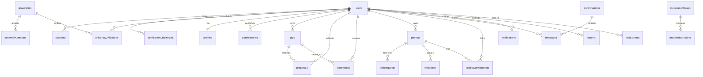
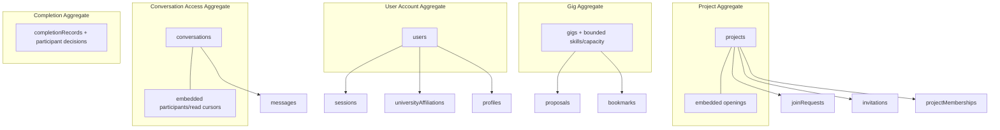
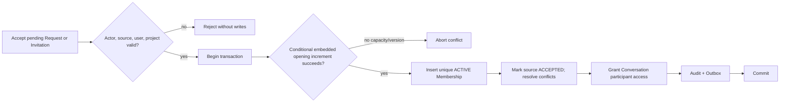
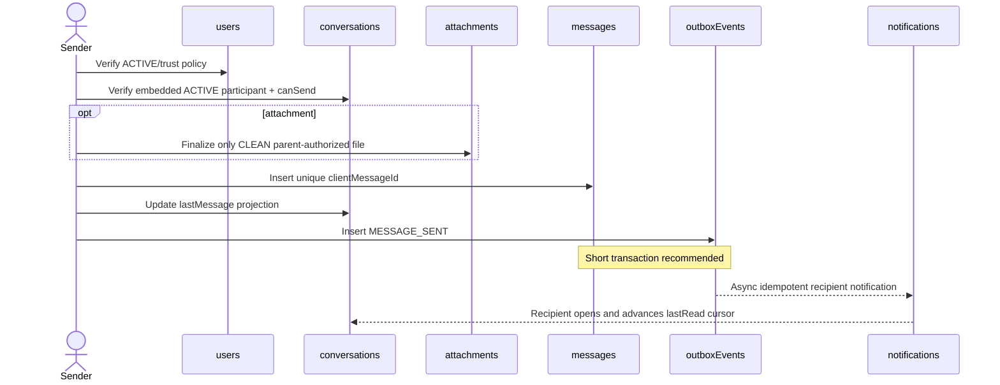

# CampusCollab — Phase 3 MongoDB Database Architecture and Schema Design

**Document status:** Proposed database baseline  
**Sources of truth:** Phase 1 Requirements Specification and Phase 2 Domain Model  
**Phase boundary:** Persistence architecture and schema design only  
**Explicit exclusions:** Mongoose models, application code, routes, controllers, React components, authentication implementation, migrations, and seed files  

## 0. Scope, Assumptions, and Approval Status

This document maps the approved MVP domain model to production-oriented MongoDB storage. It defines collections, BSON fields, validation expectations, indexes, references, consistency boundaries, lifecycle persistence, transactions, retention, and database-level tests.

Phase 2 retains ten product/architecture approvals. To make this design usable without pretending those decisions are final, Phase 3 uses the following **provisional design assumptions**:

1. Ordinary owners are verified students during MVP.
2. University verification is valid for a provisional 12 months and can be revoked earlier.
3. A user has at most one active university affiliation in MVP.
4. Ratings/reviews are deferred; factual completion records are persisted.
5. Account deletion has a provisional 30-day recovery window followed by category-based erasure/anonymization.
6. Completion uses participant-level acknowledgement/dispute and a provisional 14-day response window.
7. Invitation is separate from Membership; Membership begins as `ACTIVE` after acceptance.
8. A multi-hire Gig remains `PUBLISHED` while capacity remains and becomes `ASSIGNED` when intake stops after at least one acceptance.
9. Project recruitment is stored independently as `acceptingMembers`; work lifecycle does not move backward from `ACTIVE` to `RECRUITING`.
10. Administrators restrict/hide user-authored content or correct verified metadata through governed workflows; they do not rewrite authorship.

Every affected field, constraint, and workflow remains subject to product approval. No future code should silently promote these assumptions to policy.

### 0.1 Naming and notation

- Collection names use lower camel case to match the requested project vocabulary.
- Field names use lower camel case.
- Status values are shown in uppercase for unambiguous persisted enums.
- All timestamps are BSON `Date` stored in UTC.
- Monetary amounts, when present only as informational Gig terms, use integer minor units plus ISO currency code; never binary floating point.
- `_id` uses `ObjectId` unless a collection explicitly requires another identity.
- “Mutable: System” means only trusted backend workflow code may change the field.
- “Sensitive: Yes” means exclude from ordinary projections and logs; additional field-level encryption is considered separately.

## 1. Database Design Principles

### 1.1 Embed only bounded, aggregate-owned data

Embed values that are loaded and changed with the aggregate and have a strict product cap: Project openings, Conversation participants, Profile skill declarations, small education/link arrays, Gig skill requirements, and Completion participant decisions. Embedding makes the parent update atomic because MongoDB single-document writes are atomic.

Do not embed Proposals, Messages, Notifications, Memberships, Join Requests, Invitations, Reports, Audit Events, or Sessions. They can grow without a safe bound, require independent queries/lifecycles, or have different security boundaries. MongoDB documents have a finite size and hot growing arrays create contention.

### 1.2 Reference independent and unbounded aggregates

Use `ObjectId` references from child/application records to their authoritative parents. Parent documents do not contain unbounded child-ID arrays. For example, Proposal references Gig and applicant; Gig does not embed every Proposal. Integrity is enforced by application policy, database validation, unique indexes, conditional writes, and transactions where cross-document correctness is mandatory.

### 1.3 Normalize authoritative facts; denormalize read summaries deliberately

Authoritative identity, verification, lifecycle, membership, capacity, and security state stay normalized. Bounded owner/skill/display snapshots may be duplicated where a concrete list/search query would otherwise require repeated joins. Every snapshot names a source of truth and tolerates temporary staleness; it never authorizes access.

### 1.4 Align collection boundaries with domain ownership

Collections reflect aggregate and security boundaries, not one collection per conceptual entity. Examples:

- Project Opening is embedded in Project because capacity acceptance needs atomic conditional updates.
- Conversation Participant is embedded in Conversation because authorization needs a consistent participant set.
- Message receipts are represented by participant read cursors in Conversation for MVP; a per-message receipt collection is deferred.
- Recommendation output is computed from indexed Profiles, Gigs, and Projects; no recommendation collection is required in MVP.

### 1.5 Prefer single-document atomicity; use transactions only for cross-aggregate invariants

Use conditional updates with status/version predicates for ordinary lifecycle changes. Use multi-document transactions for Proposal acceptance, Join Request/Invitation acceptance, Membership capacity changes, completion finalization, suspension/session revocation, and other operations that must change multiple authoritative documents together. MongoDB documents that single-document writes are atomic and that multi-document transactions carry additional cost, so transactions must be short and targeted ([MongoDB transactions](https://www.mongodb.com/docs/manual/core/transactions/)).

### 1.6 Treat counters as guarded projections

`acceptedCount`, opening `filledCount`, conversation `lastMessageAt`, and dashboard summaries improve read performance but are not sole relationship proof. Counter changes occur in the same transaction as authoritative acceptance/membership changes. Reconciliation jobs may compare counters to source records.

### 1.7 Design from query patterns

Indexes exist only for documented login, discovery, owner/applicant dashboards, authorization, messaging, moderation, expiry, and cursor-pagination queries. Compound index order follows equality filters, then range/sort fields. Indexes are reviewed using actual query plans and production-like data before launch.

### 1.8 Prefer cursor pagination for changing/high-volume data

Messages, Notifications, Reports, Proposals, Gigs, and Projects use stable compound cursors based on sort key plus `_id`. Small bounded admin reference lists may use offset pagination. Cursor tokens are opaque, signed/validated by the application later, and bind to the filter/sort shape.

### 1.9 Soft-delete shared business history; hard-delete ephemeral secrets

Published opportunities, submitted applications, Memberships, Messages, Reports, Completion Records, and Audit Events retain lifecycle/history rather than disappearing. Expired Sessions and Verification Challenges may be TTL-deleted after their useful security window because durable security facts live in Audit Events. Account deletion anonymizes shared history and hard-deletes or erases private/credential data according to category.

### 1.10 Make auditability append-only

Security, administrative, verification, suspension, acceptance, membership, completion, moderation, and deletion actions generate immutable Audit Events. Audit payloads use allowlisted metadata; they do not contain raw tokens, password hashes, message bodies, or full report evidence.

### 1.11 Secure by default

MongoDB access uses least-privilege database roles, encrypted transport, provider-managed encryption at rest, protected backups, network restrictions, and secret management. Sensitive fields are excluded by default from application projections. High-risk fields may use client-side/application field encryption if threat and query needs justify it; encryption key management remains separate from the database.

## 2. Collection Inventory

### 2.1 MVP collections

| Collection | Purpose/domain | Accountable owner | Why separate | Important relationships | Expected access pattern |
|---|---|---|---|---|---|
| `users` | Identity/account lifecycle | Subject user; Identity module | Authentication/security state must not load public Profile | Profile, Sessions, Affiliations, owned resources | Login lookup, status/capability checks, self/admin account view |
| `sessions` | Authenticated session lifecycle | User/Identity | Unbounded devices, TTL, independent revocation | User | Lookup hashed token/session ID, list/revoke by user, TTL expiry |
| `verificationChallenges` | Email verification and password-reset proof | Identity/University Trust | Secret/time-bound lifecycle and TTL | User, Affiliation | Consume by hashed token/purpose, revoke/supersede by user |
| `universities` | Canonical institutions | Administration | Independently managed/searchable reference data | Domains, Affiliations | Public list/detail, admin status management |
| `universityDomains` | Globally unique accepted domains | Administration | Global uniqueness and independent evidence/status | University | Exact normalized-domain lookup, admin review |
| `universityAffiliations` | User-to-university trust history | User/University Trust | Expiry/revocation/history and future multiple affiliations | User, University | Current affiliation by user, users by university/status |
| `profiles` | Public/private professional profile | User | Privacy/update boundary separate from authentication | User, Skills, Affiliation | Self edit, public profile, skill/availability discovery |
| `skills` | Canonical taxonomy | Administration | Shared reference identity and lifecycle | Profiles, Gigs, Projects | Autocomplete/list, admin management |
| `portfolioItems` | Portfolio evidence | Profile owner | Independent lifecycle, pagination, attachments/moderation | User/Profile, Skills, Completion | Public owner items, self drafts, moderation lookup |
| `gigs` | Gig aggregate and discovery | Gig owner | Searchable lifecycle aggregate | User, Skills, Proposals, Attachments | Published discovery, owner dashboard, status/deadline jobs |
| `proposals` | Applicant candidacy and decision | Applicant/Gig owner decision | Unbounded per Gig, private fields, independent state | Gig, applicant, attachments | By Gig/owner, by applicant, decision by ID |
| `bookmarks` | Private saved Gigs | User | Sparse M:N relationship and uniqueness | User, Gig | List by user, add/remove exact pair |
| `projects` | Collaboration aggregate including embedded openings | Project owner | Searchable project lifecycle and atomic opening capacity | User, Skills, Memberships, applications | Recruiting discovery, owner dashboard, capacity update |
| `joinRequests` | Applicant-initiated project application | Applicant/Project owner decision | Unbounded, private, independent lifecycle | Project/opening, applicant | By Project/status, by applicant/status |
| `invitations` | Owner-initiated project offer | Project owner/invitee response | Expiring response lifecycle before Membership | Project/opening, inviter/invitee | Pending by invitee or Project, expiry sweep |
| `projectMemberships` | Authoritative project participation | Project relationship | M:N history, authorization, uniqueness | Project/opening, User, source Request/Invitation | Active members by Project, memberships by user |
| `conversations` | Messaging context and embedded participant authorization | Shared context/System | Participant access must be consistent; messages unbounded separately | Accepted Proposal or Project, Users | Conversations by participant/activity, authorization lookup |
| `messages` | Immutable message stream | Sender/Conversation | High-volume append/read pagination | Conversation, sender, Attachments | Cursor history by Conversation, idempotent insert |
| `attachments` | File metadata/safety/access context | Uploader plus parent domain | Storage and scan lifecycle independent from parent | User and exactly one parent | Resolve by ID then parent authorization, scan queue/status |
| `notifications` | Recipient activity projection | Recipient | High-volume private feed/read state | User, source event/target | Unread/recent by recipient, mark read |
| `completionRecords` | Participant-level completion evidence | Shared engagement | Shared acknowledgement/dispute lifecycle and future eligibility | Proposal or Membership, Users, Report/Case | Active completion by context, participant inbox/history |
| `reports` | User allegation | Trust & Safety | Confidential evidence and polymorphic targets | Reporter, target, Case | Queue by status/priority, reporter limited status, target grouping |
| `moderationCases` | Investigation container | Trust & Safety | Can group multiple Reports and manage assignment/state | Reports, targets, admins | Queue by status/assignee/priority |
| `moderationActions` | Append-oriented policy action | Trust & Safety | Independent effective/reversal history and target queries | Case, actor, target | Active actions by target, actions by Case |
| `auditEvents` | Immutable security/governance history | Platform governance | Cross-domain append volume, restricted retention/access | Actor and target identifiers | Time/correlation/actor/target/category investigations |
| `outboxEvents` | Reliable domain-event delivery | Producing module | Guarantees retriable async consumers without dual-write loss | Aggregate/event consumers | Poll unpublished, claim/retry, cleanup processed |
| `accountDeletionJobs` | Recoverable, retryable deletion/anonymization workflow | Privacy/Identity | Multi-category workflow cannot safely live as ad hoc User flags only | User, Audit, legal/safety holds | Due jobs, step status, retry/error review |

### 2.2 Evaluated entities not mapped to separate MVP collections

| Entity | Storage decision | Reason |
|---|---|---|
| Project Opening | Embedded bounded array in `projects` | Expected small capped set; capacity must update atomically with Project version. A stable embedded `_id` supports external references. |
| Conversation Participant | Embedded bounded array in `conversations` | Primary authorization check loads Conversation; groups are bounded by project capacity. |
| Profile Skill | Embedded bounded array in `profiles`, referencing `skills` | Profile edits/read usually need skills; cap prevents unbounded growth. |
| Education/External Link | Embedded bounded value arrays in `profiles` | Owned and changed with Profile; strict item and text caps. |
| Proposal Revision | Embedded bounded array in `proposals` | Revisions belong exclusively to Proposal; cap count/size to avoid growth. |
| Message Receipt | No collection in MVP; participant read cursor embedded in `conversations` | Meets unread/read-state requirement without O(messages × participants) write growth. Exact per-message delivery receipts are deferred. |
| Notification Preference | Embedded bounded object in `profiles` or `users`; recommended `profiles.preferences` | One small user-owned setting group; no independent queries. Security notifications ignore optional opt-out. |
| Recommendation result | Not persisted | Deterministic matching can query indexed skills/availability/status. Persist only if measured query cost later justifies a rebuildable projection. |

### 2.3 Deferred/future collections

| Collection | Future purpose | Why deferred |
|---|---|---|
| `reviews` | Mutual review/reputation evidence | Ratings are pending and recommended out of MVP. |
| `ratingAggregates` | Rebuildable public score summaries | Depends on approved review policy and anti-manipulation rules. |
| `organizations` / `organizationMemberships` | External/client organization ownership | External owners are pending and recommended out of MVP. |
| `payments`, `escrows`, `transactions`, `disputes` | Financial processing | Explicitly out of scope; requires compliance/legal architecture. |
| `aiEmbeddings`, `matchScores`, `modelFeedback` | AI/semantic matching | Explicitly deferred; no AI infrastructure. |
| `messageReceipts` | Exact per-message delivery/read receipts | Conversation read cursor is sufficient for MVP; separate collection only if product later needs exact receipts. |
| `recommendationSnapshots` | Precomputed deterministic/AI result sets | No proven MVP performance need; avoid stale personalized storage. |

## 3. Collection Relationships and Aggregate Boundaries

### 3.1 Collection relationship diagram



### 3.2 Main aggregate boundaries



### 3.3 Core reference rules

1. References always use immutable `_id`, never email, display name, or array position.
2. Embedded Project openings have their own stable `ObjectId` generated when created; requests, invitations, and memberships reference that embedded ID plus `projectId`.
3. A child reference must be validated against its parent: an `openingId` is valid only if found inside the referenced Project.
4. Polymorphic targets use a strict allowlisted `targetType` plus `targetId`, never a user-provided collection name.
5. Parent documents do not store growing child-ID arrays.
6. Denormalized snapshots never replace references and never authorize access.

## 4. Complete Field-Level Schema Design

### 4.1 Shared field conventions

Every mutable business collection uses `_id: ObjectId`, `createdAt: Date`, `updatedAt: Date`, and `version: Int32` unless explicitly declared append-only. `version` starts at `0`, is System-controlled, and increments on guarded changes for optimistic concurrency. All required string fields are trimmed, Unicode-normalized, length-bounded, and reject null bytes. User-authored rich text is not stored as arbitrary HTML in MVP; use plain text or a later allowlisted document format.

Table abbreviations: **Req** = required, **Opt** = optional, **Sys** = System-controlled, **User** = directly user-controlled, **Admin** = scoped administrator-controlled, **Sens** = sensitive/restricted field.

### 4.2 `users`

| Field | BSON type | Requirement/default | Allowed values, validation, reference | Mutability/control | Sensitive |
|---|---|---|---|---|---|
| `_id` | ObjectId | Req, generated | Unique identity | Immutable/Sys | No |
| `email` | String | Req | Normalized lowercase canonical email; valid length/format; unique | Email-change workflow/User+Sys | Yes |
| `passwordHash` | String | Req for password accounts | Output of approved adaptive password hash; never plaintext | Password workflow/Sys | Critical |
| `status` | String | Req, `PENDING_VERIFICATION` | `PENDING_VERIFICATION`, `ACTIVE`, `TEMPORARILY_SUSPENDED`, `INDEFINITELY_SUSPENDED`, `DEACTIVATED`, `DELETION_PENDING`, `DELETED` | Lifecycle/Sys or scoped Admin | Yes |
| `primaryExperience` | String | Req | `SEEKING_WORK`, `OWNING_WORK`; presentation preference only | User | No |
| `capabilities` | Array<String> | Req, bounded default base set | Allowlisted capability identifiers; max 32; no duplicates | Policy/Sys or scoped Admin | Yes |
| `adminGrants` | Array<Document> | Opt, default `[]` | Bounded entries: `capability`, `scope`, `grantedByUserId`, `grantedAt`, optional `expiresAt`; refs `users` | Elevated Admin workflow | Critical |
| `securityVersion` | Int32 | Req, `0` | Non-negative; increment revokes prior auth material/caches | Sys | Yes |
| `lastLoginAt` | Date | Opt | Valid UTC date | Sys | Yes |
| `passwordChangedAt` | Date | Opt | Valid UTC date | Sys | Yes |
| `statusChangedAt` | Date | Req, created time | Valid UTC date | Sys | Yes |
| `statusReasonCode` | String | Opt | Allowlisted non-narrative reason; required for suspension/deletion | Sys/Admin | Yes |
| `suspendedUntil` | Date | Opt | Required only for temporary suspension; future when set | Sys/Admin | Yes |
| `deletionRequestedAt` | Date | Opt | Set when deletion begins | Sys | Yes |
| `deletionScheduledFor` | Date | Opt | Provisional `deletionRequestedAt + 30 days` | Sys | Yes |
| `legalOrSafetyHold` | Boolean | Req, `false` | Boolean; does not reveal case details | Elevated Admin/Sys | Critical |
| `createdAt`, `updatedAt` | Date | Req | UTC | Sys | No |
| `version` | Int32 | Req, `0` | Non-negative | Sys | No |

### 4.3 `sessions`

| Field | BSON type | Requirement/default | Allowed values, validation, reference | Mutability/control | Sensitive |
|---|---|---|---|---|---|
| `_id` | ObjectId | Req | Session record identity | Immutable/Sys | No |
| `userId` | ObjectId | Req | Ref `users` | Immutable/Sys | Yes |
| `tokenHash` | BinData/String | Req | Cryptographic hash/HMAC of session secret; unique; raw token never stored | Immutable/Sys | Critical |
| `familyId` | UUID/String | Req | Rotation family identity | Immutable/Sys | Critical |
| `status` | String | Req, `ACTIVE` | `ACTIVE`, `ROTATED`, `REVOKED` | Sys | Yes |
| `authMethod` | String | Req | `PASSWORD`; future allowlisted methods | Immutable/Sys | Yes |
| `issuedAt` | Date | Req | UTC | Immutable/Sys | Yes |
| `expiresAt` | Date | Req | After `issuedAt`; TTL candidate | Immutable/Sys | Critical |
| `lastSeenAt` | Date | Opt | Throttled update; never extends absolute expiry unless rotation policy says | Sys | Yes |
| `rotatedToSessionId` | ObjectId | Opt | Ref `sessions`; only for rotated session | Sys | Critical |
| `revokedAt` | Date | Opt | Required if `REVOKED` | Sys | Yes |
| `revokeReason` | String | Opt | Allowlisted reason | Sys/Admin | Yes |
| `userAgentSummary` | String | Opt | Sanitized, max 256; not raw fingerprint | Sys from request | Yes |
| `ipHash` | BinData/String | Opt | Keyed hash or coarse privacy-preserving representation; never raw unless policy approved | Sys | Critical |
| `createdAt`, `updatedAt` | Date | Req | UTC | Sys | Yes |
| `version` | Int32 | Req, `0` | Optimistic revocation/rotation | Sys | No |

### 4.4 `verificationChallenges`

| Field | BSON type | Requirement/default | Allowed values, validation, reference | Mutability/control | Sensitive |
|---|---|---|---|---|---|
| `_id` | ObjectId | Req | Challenge identity | Immutable/Sys | No |
| `userId` | ObjectId | Req | Ref `users` | Immutable/Sys | Yes |
| `affiliationId` | ObjectId | Opt | Ref `universityAffiliations`; required for university proof purposes | Immutable/Sys | Yes |
| `purpose` | String | Req | `UNIVERSITY_VERIFY`, `UNIVERSITY_REVERIFY`, `PASSWORD_RESET`, `EMAIL_CHANGE` | Immutable/Sys | Yes |
| `tokenHash` | BinData/String | Req | Cryptographic hash/HMAC; unique; never raw | Immutable/Sys | Critical |
| `destinationEmail` | String | Req | Normalized intended destination; encrypted at field/application level if chosen | Immutable/Sys | Critical |
| `status` | String | Req, `ISSUED` | `ISSUED`, `CONSUMED`, `SUPERSEDED`, `REVOKED` (expiry determined by time/TTL) | Sys | Critical |
| `attemptCount` | Int32 | Req, `0` | 0..configured maximum | Sys | Yes |
| `issuedAt` | Date | Req | UTC | Immutable/Sys | Yes |
| `expiresAt` | Date | Req | Purpose-specific future time; TTL candidate | Immutable/Sys | Critical |
| `consumedAt` | Date | Opt | Required when consumed | Sys | Yes |
| `supersededAt` | Date | Opt | Required when superseded | Sys | Yes |
| `createdAt`, `updatedAt` | Date | Req | UTC | Sys | Yes |
| `version` | Int32 | Req, `0` | Conditional single consumption | Sys | No |

### 4.5 `universities`

| Field | BSON type | Requirement/default | Allowed values, validation, reference | Mutability/control | Sensitive |
|---|---|---|---|---|---|
| `_id` | ObjectId | Req | University identity | Immutable/Sys | No |
| `name` | String | Req | 2..160; canonical display | Admin | No |
| `normalizedName` | String | Req | Normalized for duplicate detection; unique candidate | Sys from Admin input | No |
| `shortName` | String | Opt | 2..32 | Admin | No |
| `countryCode` | String | Req | ISO 3166-1 alpha-2 uppercase | Admin | No |
| `region` | String | Opt | Max 100 | Admin | No |
| `websiteUrl` | String | Opt | HTTPS allowlisted URL form | Admin | No |
| `status` | String | Req, `PROPOSED` | `PROPOSED`, `ACTIVE`, `INACTIVE` | Admin | No |
| `createdByUserId` | ObjectId | Req | Ref `users` admin | Immutable/Sys | Yes |
| `updatedByUserId` | ObjectId | Req | Ref `users` admin | Sys | Yes |
| `createdAt`, `updatedAt` | Date | Req | UTC | Sys | No |
| `version` | Int32 | Req, `0` | Optimistic admin updates | Sys | No |

### 4.6 `universityDomains`

| Field | BSON type | Requirement/default | Allowed values, validation, reference | Mutability/control | Sensitive |
|---|---|---|---|---|---|
| `_id` | ObjectId | Req | Domain assertion identity | Immutable/Sys | No |
| `universityId` | ObjectId | Req | Ref `universities` | Admin workflow | No |
| `domain` | String | Req | ASCII/punycode normalized lowercase, no `@`, valid DNS form; globally unique while retained | Admin via validation | No |
| `matchMode` | String | Req, `EXACT` | `EXACT`; `SUBDOMAIN_ALLOWED` only with explicit review | Admin | Yes |
| `status` | String | Req, `PENDING_REVIEW` | `PENDING_REVIEW`, `ACTIVE`, `INACTIVE`, `REJECTED` | Admin | No |
| `evidenceSummary` | String | Opt | Sanitized max 1000; no secret credentials | Admin | Yes |
| `effectiveAt` | Date | Opt | Required when active | Sys/Admin | No |
| `deactivatedAt` | Date | Opt | Required when inactive | Sys/Admin | No |
| `createdByUserId`, `updatedByUserId` | ObjectId | Req | Ref `users` admin | Sys | Yes |
| `createdAt`, `updatedAt` | Date | Req | UTC | Sys | No |
| `version` | Int32 | Req, `0` | Optimistic update | Sys | No |

### 4.7 `universityAffiliations`

| Field | BSON type | Requirement/default | Allowed values, validation, reference | Mutability/control | Sensitive |
|---|---|---|---|---|---|
| `_id` | ObjectId | Req | Affiliation identity | Immutable/Sys | No |
| `userId` | ObjectId | Req | Ref `users` | Immutable/Sys | Yes |
| `universityId` | ObjectId | Req | Ref `universities` | Replacement workflow | Yes |
| `universityDomainId` | ObjectId | Req | Ref `universityDomains` | Immutable per verification attempt/Sys | Yes |
| `email` | String | Req | Normalized university email; field/application encryption considered | User via workflow/Sys | Critical |
| `status` | String | Req, `PENDING` | `PENDING`, `VERIFIED`, `EXPIRED`, `REVOKED`, `REPLACED` | Sys/Admin revoke | Critical |
| `isActive` | Boolean | Req, `true` for pending/current | At most one active per user provisionally | Sys | Yes |
| `verificationMethod` | String | Opt | `EMAIL_LINK`; required when verified | Sys | Yes |
| `verifiedAt` | Date | Opt | Required when verified | Sys | Yes |
| `verificationExpiresAt` | Date | Opt | Provisional verifiedAt + 12 months | Sys | Yes |
| `revokedAt` | Date | Opt | Required when revoked | Sys/Admin | Yes |
| `revokedByUserId` | ObjectId | Opt | Ref `users` admin/system actor representation | Sys/Admin | Critical |
| `revocationReasonCode` | String | Opt | Allowlisted | Admin/Sys | Critical |
| `replacedByAffiliationId` | ObjectId | Opt | Ref same collection | Sys | Yes |
| `createdAt`, `updatedAt` | Date | Req | UTC | Sys | Yes |
| `version` | Int32 | Req, `0` | Conditional trust changes | Sys | No |

### 4.8 `profiles`

| Field | BSON type | Requirement/default | Allowed values, validation, reference | Mutability/control | Sensitive |
|---|---|---|---|---|---|
| `_id` | ObjectId | Req | Profile identity | Immutable/Sys | No |
| `userId` | ObjectId | Req | Ref `users`; unique | Immutable/Sys | Yes |
| `displayName` | String | Req | 2..80; no impersonation/prohibited chars policy | User | Public |
| `headline` | String | Opt | Max 120 | User | Public |
| `department` | String | Opt | Max 120; user-authored unless canonicalized later | User | Public |
| `graduationYear` | Int32 | Opt | Reasonable configured range | User | Potentially sensitive |
| `bio` | String | Opt | Max 2000, plain text | User | Public if profile visible |
| `experienceLevel` | String | Opt | `BEGINNER`, `INTERMEDIATE`, `ADVANCED` | User | Public |
| `availability` | Document | Req, unavailable default | `status`: `AVAILABLE`, `LIMITED`, `UNAVAILABLE`; optional `hoursPerWeek` 0..80 and `availableFrom` Date | User | Public/limited |
| `skillEntries` | Array<Document> | Req, `[]`, max 30 | Each: `skillId` ref `skills`, `level` enum, optional evidence text max 300; unique `skillId` in array | User | Public |
| `educationEntries` | Array<Document> | Req, `[]`, max 10 | Bounded: institution display/ref, qualification, field, start/end year; verified flag Sys-only | User + verified flag Sys | Potentially sensitive |
| `externalLinks` | Array<Document> | Req, `[]`, max 10 | `type` allowlist, HTTPS `url`, label max 50 | User | Public |
| `visibility` | String | Req, `PLATFORM` | `PLATFORM`, `UNIVERSITY`, `PRIVATE` | User | No |
| `completionScore` | Int32 | Req, `0` | 0..100 deterministic | Sys | No |
| `isCompleteForApplications` | Boolean | Req, `false` | Deterministic policy result | Sys | No |
| `moderationStatus` | String | Req, `VISIBLE` | `VISIBLE`, `RESTRICTED`, `HIDDEN` | Admin/Sys | Yes |
| `preferences` | Document | Req, defaults | Notification category/channel booleans and privacy settings; security notices not suppressible | User within policy | Yes |
| `searchUpdatedAt` | Date | Opt | Projection freshness marker | Sys | No |
| `createdAt`, `updatedAt` | Date | Req | UTC | Sys | No |
| `version` | Int32 | Req, `0` | Optimistic profile edits | Sys | No |

### 4.9 `skills`

| Field | BSON type | Requirement/default | Allowed values, validation, reference | Mutability/control | Sensitive |
|---|---|---|---|---|---|
| `_id` | ObjectId | Req | Canonical skill identity | Immutable/Sys | No |
| `name` | String | Req | 1..80 | Admin | No |
| `normalizedName` | String | Req | Normalized unique canonical value | Sys from Admin input | No |
| `aliases` | Array<String> | Req, `[]`, max 20 | Normalized, unique within document, max 80 each | Admin | No |
| `category` | String | Req | Allowlisted category slug | Admin | No |
| `status` | String | Req, `ACTIVE` | `ACTIVE`, `INACTIVE` | Admin | No |
| `createdByUserId`, `updatedByUserId` | ObjectId | Req | Ref `users` admin | Sys | Yes |
| `createdAt`, `updatedAt` | Date | Req | UTC | Sys | No |
| `version` | Int32 | Req, `0` | Optimistic admin edits | Sys | No |

### 4.10 `portfolioItems`

| Field | BSON type | Requirement/default | Allowed values, validation, reference | Mutability/control | Sensitive |
|---|---|---|---|---|---|
| `_id` | ObjectId | Req | Portfolio item identity | Immutable/Sys | No |
| `userId` | ObjectId | Req | Ref `users`; ownership | Immutable/Sys | Yes |
| `profileId` | ObjectId | Req | Ref `profiles` | Immutable/Sys | Yes |
| `title` | String | Req | 1..160 | User | Public when published |
| `description` | String | Req | 1..3000 plain text | User | Public when published |
| `role` | String | Opt | Max 120 | User | Public |
| `skillIds` | Array<ObjectId> | Req, `[]`, max 20 | Refs `skills`, unique | User | Public |
| `startedAt`, `endedAt` | Date | Opt | End >= start; future dates policy | User | Public |
| `externalLinks` | Array<Document> | Req, `[]`, max 10 | HTTPS URL + allowlisted type/label | User | Public |
| `completionRecordId` | ObjectId | Opt | Ref `completionRecords`; must concern same user | User proposes, Sys verifies | Yes |
| `status` | String | Req, `DRAFT` | `DRAFT`, `PUBLISHED`, `ARCHIVED`, `RESTRICTED` | User; restricted by Admin | No |
| `publishedAt`, `archivedAt` | Date | Opt | Required by corresponding status | Sys | No |
| `createdAt`, `updatedAt` | Date | Req | UTC | Sys | No |
| `version` | Int32 | Req, `0` | Optimistic edits | Sys | No |

### 4.11 `gigs`

| Field | BSON type | Requirement/default | Allowed values, validation, reference | Mutability/control | Sensitive |
|---|---|---|---|---|---|
| `_id` | ObjectId | Req | Gig identity | Immutable/Sys | No |
| `ownerId` | ObjectId | Req | Ref `users`; exactly one owner | Immutable except governed future transfer | Yes |
| `ownerSnapshot` | Document | Req at publish | `displayName`, optional avatar key, `universityId`; derived from Profile/Affiliation | Sys projection | Public |
| `title` | String | Req | 5..180 | Owner | Public when published |
| `description` | String | Req | 20..10000 plain text | Owner subject to material-change rules | Public when published |
| `category` | String | Req | Allowlisted category slug | Owner | Public |
| `skillRequirements` | Array<Document> | Req, max 20 | `skillId` ref `skills`, `level` enum, `required` Boolean; unique skill | Owner | Public |
| `workMode` | String | Req, `REMOTE` | `REMOTE`, `HYBRID`, `ONSITE` | Owner | Public |
| `locationText` | String | Opt | Max 160; required for hybrid/onsite as policy | Owner | Potential location data |
| `visibility` | String | Req, `PLATFORM` | `PLATFORM`, `UNIVERSITY` | Owner | No |
| `universityId` | ObjectId | Opt | Ref `universities`; required for university visibility | Owner via verified context | No |
| `budget` | Document | Opt | `type`: `FIXED`/`RANGE`/`UNPAID`; integer `minMinor`/`maxMinor`; ISO 4217 `currency`; non-negative, min<=max | Owner | Public; no payment data |
| `deadlineAt` | Date | Req for published | Future at publish | Owner under material-change rule | Public |
| `capacity` | Int32 | Req, `1` | 1..configured MVP max | Owner before acceptance | Public |
| `acceptedCount` | Int32 | Req, `0` | 0..capacity; guarded projection | Sys transaction only | Public summary |
| `proposalCount` | Int32 | Req, `0` | Non-negative approximate/repairable projection | Sys | Public summary |
| `acceptingProposals` | Boolean | Req, `false` | True only while lifecycle/terms permit | Sys/Owner through lifecycle | No |
| `status` | String | Req, `DRAFT` | `DRAFT`, `PUBLISHED`, `ASSIGNED`, `ACTIVE`, `COMPLETION_PENDING`, `COMPLETED`, `CLOSED`, `CANCELLED`, `ARCHIVED` | Lifecycle/Sys | No |
| `materialRevision` | Int32 | Req, `0` | Increments for applicant-relevant changes | Sys | No |
| `moderationStatus` | String | Req, `VISIBLE` | `VISIBLE`, `RESTRICTED`, `HIDDEN` | Admin/Sys | Yes |
| `publishedAt`, `assignedAt`, `startedAt`, `completionRequestedAt`, `completedAt`, `closedAt`, `cancelledAt`, `archivedAt` | Date | Opt | Required when corresponding transition occurs | Sys | No |
| `statusReasonCode` | String | Opt | Required for close/cancel/admin correction | Owner/Admin via workflow | Yes when moderation-related |
| `createdAt`, `updatedAt` | Date | Req | UTC | Sys | No |
| `version` | Int32 | Req, `0` | Conditional lifecycle/capacity updates | Sys | No |

### 4.12 `proposals`

| Field | BSON type | Requirement/default | Allowed values, validation, reference | Mutability/control | Sensitive |
|---|---|---|---|---|---|
| `_id` | ObjectId | Req | Proposal identity | Immutable/Sys | No |
| `gigId` | ObjectId | Req | Ref `gigs` | Immutable/Sys | Yes |
| `applicantId` | ObjectId | Req | Ref `users`; must differ from Gig owner | Immutable/Sys | Yes |
| `applicantSnapshot` | Document | Req at submit | Display name, headline, skill IDs, university summary; derived | Sys | Private to parties |
| `status` | String | Req, `SUBMITTED` | `SUBMITTED`, `SHORTLISTED`, `ACCEPTED`, `REJECTED`, `WITHDRAWN`, `CLOSED` | Applicant/Owner through lifecycle | Yes |
| `revisions` | Array<Document> | Req, max 10 | Each: stable `_id`, `revisionNumber`, cover message max 5000, informational proposed budget/duration, availability, `createdAt`; append-only after submit | Applicant within policy; Sys | Yes |
| `currentRevisionNumber` | Int32 | Req, `1` | Matches existing revision | Sys | Yes |
| `submittedGigRevision` | Int32 | Req | Snapshot of Gig materialRevision at submission | Sys | No |
| `decisionReasonCode` | String | Opt | Allowlisted; public-safe subset returned to applicant | Owner/Sys | Yes |
| `decisionNoteInternal` | String | Opt | Max 1000, owner-only; must not contain prohibited sensitive data | Owner | Critical |
| `submittedAt` | Date | Req | UTC | Immutable/Sys | No |
| `shortlistedAt`, `acceptedAt`, `rejectedAt`, `withdrawnAt`, `closedAt` | Date | Opt | Corresponding lifecycle timestamp | Sys | No |
| `decidedByUserId` | ObjectId | Opt | Ref `users`; should be Gig owner or scoped resolution admin | Sys | Yes |
| `idempotencyKey` | String | Req | Opaque user-scoped command identity; bounded; unique with applicant/gig | Sys from request | Yes |
| `createdAt`, `updatedAt` | Date | Req | UTC | Sys | No |
| `version` | Int32 | Req, `0` | Conditional decisions/withdrawal | Sys | No |

### 4.13 `bookmarks`

| Field | BSON type | Requirement/default | Allowed values, validation, reference | Mutability/control | Sensitive |
|---|---|---|---|---|---|
| `_id` | ObjectId | Req | Bookmark identity | Immutable/Sys | No |
| `userId` | ObjectId | Req | Ref `users` | Immutable/Sys | Yes |
| `gigId` | ObjectId | Req | Ref `gigs` | Immutable/Sys | Yes |
| `createdAt` | Date | Req | UTC | Immutable/Sys | Yes |

Bookmarks are hard-deleted on removal because they are private preferences without required history. Audit is not required for ordinary add/remove.

### 4.14 `projects` with embedded `openings`

| Field | BSON type | Requirement/default | Allowed values, validation, reference | Mutability/control | Sensitive |
|---|---|---|---|---|---|
| `_id` | ObjectId | Req | Project identity | Immutable/Sys | No |
| `ownerId` | ObjectId | Req | Ref `users` | Immutable in MVP | Yes |
| `ownerSnapshot` | Document | Req at publish | Display name, university summary, avatar key | Sys | Public |
| `title` | String | Req | 5..180 | Owner | Public when visible |
| `description` | String | Req | 20..12000 plain text | Owner subject to material-change rules | Public/private by visibility |
| `projectType` | String | Req | `RESEARCH`, `ACADEMIC`, `STARTUP`, `HACKATHON`, `PERSONAL`, `OTHER` | Owner | Public |
| `requiredSkillIds` | Array<ObjectId> | Req, max 30 | Refs `skills`, unique; summary across openings | Owner/Sys | Public |
| `visibility` | String | Req, `PLATFORM` | `PLATFORM`, `UNIVERSITY`, `PRIVATE` | Owner | No |
| `universityId` | ObjectId | Opt | Ref `universities`; required for university visibility | Owner/Sys | No |
| `expectedStartAt`, `expectedEndAt` | Date | Opt | End >= start | Owner | Public |
| `openings` | Array<Document> | Req, max 20 | Embedded schema below; stable `_id` values | Owner + capacity Sys | Public/private by Project |
| `acceptingMembers` | Boolean | Req, `false` | Independent recruitment condition; true only if eligible opening remains and Project state allows | Owner/Sys | No |
| `status` | String | Req, `DRAFT` | `DRAFT`, `RECRUITING`, `ACTIVE`, `COMPLETION_PENDING`, `COMPLETED`, `CANCELLED`, `ARCHIVED` | Lifecycle/Sys | No |
| `materialRevision` | Int32 | Req, `0` | Increment on applicant/member-relevant change | Sys | No |
| `moderationStatus` | String | Req, `VISIBLE` | `VISIBLE`, `RESTRICTED`, `HIDDEN` | Admin/Sys | Yes |
| `publishedAt`, `startedAt`, `completionRequestedAt`, `completedAt`, `cancelledAt`, `archivedAt` | Date | Opt | Corresponding transition timestamps | Sys | No |
| `statusReasonCode` | String | Opt | Required for cancel/admin correction | Owner/Admin via workflow | Yes when moderation-related |
| `createdAt`, `updatedAt` | Date | Req | UTC | Sys | No |
| `version` | Int32 | Req, `0` | Conditional opening/capacity/lifecycle updates | Sys | No |

**Embedded Project Opening document**

| Field | BSON type | Requirement/default | Allowed/validation/reference | Mutability/control | Sensitive |
|---|---|---|---|---|---|
| `_id` | ObjectId | Req, generated | Stable opening identity unique within Project | Immutable/Sys | No |
| `roleName` | String | Req | 2..100 | Owner | Public |
| `description` | String | Req | 1..2000 | Owner | Public |
| `requiredSkillIds` | Array<ObjectId> | Req, max 20 | Refs `skills`, unique | Owner | Public |
| `capacity` | Int32 | Req | 1..configured max | Owner before accepted members | Public |
| `filledCount` | Int32 | Req, `0` | 0..capacity; transactionally guarded | Sys | Public summary |
| `status` | String | Req, `OPEN` | `OPEN`, `FILLED`, `CLOSED` | Owner/Sys | No |
| `createdAt`, `updatedAt` | Date | Req | UTC | Sys | No |

### 4.15 `joinRequests`

| Field | BSON type | Requirement/default | Allowed values, validation, reference | Mutability/control | Sensitive |
|---|---|---|---|---|---|
| `_id` | ObjectId | Req | Request identity | Immutable/Sys | No |
| `projectId` | ObjectId | Req | Ref `projects` | Immutable/Sys | Yes |
| `openingId` | ObjectId | Req | Stable embedded opening ID in referenced Project | Immutable/Sys | Yes |
| `applicantId` | ObjectId | Req | Ref `users`; not Project owner/member | Immutable/Sys | Yes |
| `applicantSnapshot` | Document | Req | Display name, headline, relevant skill IDs, university summary | Sys | Private to parties |
| `message` | String | Req | 1..3000 plain text | Applicant until submit only | Yes |
| `status` | String | Req, `PENDING` | `PENDING`, `ACCEPTED`, `REJECTED`, `WITHDRAWN`, `EXPIRED` | Applicant/Owner/System lifecycle | Yes |
| `submittedProjectRevision` | Int32 | Req | Project materialRevision at submission | Sys | No |
| `idempotencyKey` | String | Req | Opaque applicant-scoped identity | Sys from request | Yes |
| `decidedByUserId` | ObjectId | Opt | Ref `users`; Project owner or resolution admin | Sys | Yes |
| `decisionReasonCode` | String | Opt | Allowlisted | Owner/Sys | Yes |
| `submittedAt` | Date | Req | UTC | Immutable/Sys | No |
| `acceptedAt`, `rejectedAt`, `withdrawnAt`, `expiredAt` | Date | Opt | Corresponding transition timestamp | Sys | No |
| `createdAt`, `updatedAt` | Date | Req | UTC | Sys | No |
| `version` | Int32 | Req, `0` | Conditional decision/withdrawal | Sys | No |

### 4.16 `invitations`

| Field | BSON type | Requirement/default | Allowed values, validation, reference | Mutability/control | Sensitive |
|---|---|---|---|---|---|
| `_id` | ObjectId | Req | Invitation identity | Immutable/Sys | No |
| `projectId` | ObjectId | Req | Ref `projects` | Immutable/Sys | Yes |
| `openingId` | ObjectId | Req | Stable embedded opening ID | Immutable/Sys | Yes |
| `inviterId` | ObjectId | Req | Ref `users`; must equal current Project owner | Immutable/Sys | Yes |
| `inviteeId` | ObjectId | Req | Ref `users`; not owner/member | Immutable/Sys | Yes |
| `message` | String | Opt | Max 3000 plain text | Inviter at creation | Yes |
| `status` | String | Req, `PENDING` | `PENDING`, `ACCEPTED`, `REJECTED`, `REVOKED`, `EXPIRED` | Owner/invitee/System lifecycle | Yes |
| `expiresAt` | Date | Req | Future; used for command-time check and expiry sweep; no auto-delete | Immutable/Sys | No |
| `idempotencyKey` | String | Req | Opaque inviter-scoped identity | Sys from request | Yes |
| `respondedAt`, `revokedAt`, `expiredAt` | Date | Opt | Corresponding transition timestamp | Sys | No |
| `responseReasonCode` | String | Opt | Allowlisted | Invitee/Owner/Sys | Yes |
| `createdAt`, `updatedAt` | Date | Req | UTC | Sys | No |
| `version` | Int32 | Req, `0` | Conditional response/revoke | Sys | No |

### 4.17 `projectMemberships`

| Field | BSON type | Requirement/default | Allowed values, validation, reference | Mutability/control | Sensitive |
|---|---|---|---|---|---|
| `_id` | ObjectId | Req | Membership identity | Immutable/Sys | No |
| `projectId` | ObjectId | Req | Ref `projects` | Immutable/Sys | Yes |
| `openingId` | ObjectId | Req | Stable embedded opening ID | Immutable/Sys | Yes |
| `userId` | ObjectId | Req | Ref `users`; not Project owner | Immutable/Sys | Yes |
| `roleSnapshot` | Document | Req | Role name and skill summary copied from Opening at acceptance | Sys | Team-visible |
| `sourceType` | String | Req | `JOIN_REQUEST`, `INVITATION` | Immutable/Sys | No |
| `sourceId` | ObjectId | Req | Ref `joinRequests` or `invitations` according to type | Immutable/Sys | Yes |
| `status` | String | Req, `ACTIVE` | `ACTIVE`, `LEFT`, `REMOVED`, `COMPLETED` | Lifecycle/Sys | Yes |
| `joinedAt` | Date | Req | Acceptance time | Immutable/Sys | Team-visible |
| `leftAt`, `removedAt`, `completedAt` | Date | Opt | Corresponding transition timestamp | Sys | Yes |
| `changedByUserId` | ObjectId | Opt | Actor for exit/removal/completion; ref `users` | Sys | Yes |
| `statusReasonCode` | String | Opt | Required for leave/removal | Member/Owner/Admin via workflow | Yes |
| `createdAt`, `updatedAt` | Date | Req | UTC | Sys | No |
| `version` | Int32 | Req, `0` | Conditional membership change | Sys | No |

### 4.18 `conversations`

| Field | BSON type | Requirement/default | Allowed values, validation, reference | Mutability/control | Sensitive |
|---|---|---|---|---|---|
| `_id` | ObjectId | Req | Conversation identity | Immutable/Sys | No |
| `contextType` | String | Req | `GIG_ENGAGEMENT`, `PROJECT` | Immutable/Sys | Yes |
| `contextId` | ObjectId | Req | Accepted Proposal/Gig engagement identifier or Project; exact contract set in Phase 4 | Immutable/Sys | Yes |
| `participants` | Array<Document> | Req, bounded | Each schema below; unique `userId`; bounded by Gig/Project capacity + owner | Relationship workflows/Sys | Critical |
| `status` | String | Req, `OPEN` | `OPEN`, `READ_ONLY`, `CLOSED`, `RESTRICTED` | Sys/Admin through context | Yes |
| `lastMessageId` | ObjectId | Opt | Ref `messages`; projection only | Sys | Yes |
| `lastMessageAt` | Date | Opt | Projection for ordering | Sys | Yes |
| `lastMessagePreview` | String | Opt | Max 160, sanitized/minimized; optional and privacy-reviewed | Sys | Critical |
| `messageCount` | Int64 | Req, `0` | Non-negative projection | Sys | Yes |
| `createdAt`, `updatedAt` | Date | Req | UTC | Sys | Yes |
| `version` | Int32 | Req, `0` | Participant/access/conversation state | Sys | No |

**Embedded Conversation Participant**

| Field | BSON type | Requirement/default | Allowed/validation/reference | Mutability/control | Sensitive |
|---|---|---|---|---|---|
| `userId` | ObjectId | Req | Ref `users`, unique within Conversation | Immutable once added/Sys | Critical |
| `role` | String | Req | `OWNER`, `GIG_PARTICIPANT`, `PROJECT_MEMBER` | Sys from context | Yes |
| `status` | String | Req, `ACTIVE` | `ACTIVE`, `READ_ONLY`, `REMOVED` | Sys from authoritative relationship | Critical |
| `canSend` | Boolean | Req | Derived; never client-authoritative | Sys | Critical |
| `joinedAt` | Date | Req | UTC | Sys | Yes |
| `accessChangedAt` | Date | Opt | UTC | Sys | Yes |
| `lastReadAt` | Date | Opt | Monotonic forward update | Participant via Sys validation | Yes |
| `lastReadMessageId` | ObjectId | Opt | Ref `messages`; must belong to Conversation | Participant via Sys validation | Yes |

### 4.19 `messages`

| Field | BSON type | Requirement/default | Allowed values, validation, reference | Mutability/control | Sensitive |
|---|---|---|---|---|---|
| `_id` | ObjectId | Req | Message identity and cursor tie-breaker | Immutable/Sys | No |
| `conversationId` | ObjectId | Req | Ref `conversations` | Immutable/Sys | Critical |
| `senderId` | ObjectId | Req | Ref `users`; active send-enabled participant at insert | Immutable/Sys | Critical |
| `clientMessageId` | String | Req | Opaque UUID/ULID-like, max 128; unique per Conversation+sender | Immutable/User-provided identity | Yes |
| `messageType` | String | Req, `TEXT` | `TEXT`, `ATTACHMENT`, `SYSTEM` | Immutable/Sys | Yes |
| `body` | String | Conditional | 1..5000 plain text for TEXT; safe system text for SYSTEM | Immutable/User for TEXT | Critical |
| `attachmentIds` | Array<ObjectId> | Req, `[]`, max 10 | Refs `attachments`; parent must become this Message/context | Immutable/Sys after finalize | Critical |
| `moderationStatus` | String | Req, `VISIBLE` | `VISIBLE`, `RESTRICTED`, `REMOVED` | Admin/Sys | Critical |
| `sentAt` | Date | Req | Server acceptance time | Immutable/Sys | Critical |
| `restrictedAt` | Date | Opt | Required if restricted/removed | Sys/Admin | Critical |
| `restrictionReasonCode` | String | Opt | Allowlisted, not exposed normally | Admin/Sys | Critical |
| `createdAt` | Date | Req | Same as/near sentAt | Immutable/Sys | Critical |

Messages are append-only for users. No ordinary `updatedAt` or mutable version is required; moderation changes are restricted metadata updates and must be audited.

### 4.20 `attachments`

| Field | BSON type | Requirement/default | Allowed values, validation, reference | Mutability/control | Sensitive |
|---|---|---|---|---|---|
| `_id` | ObjectId | Req | Attachment identity | Immutable/Sys | No |
| `uploaderId` | ObjectId | Req | Ref `users` | Immutable/Sys | Critical |
| `parentType` | String | Req | `PORTFOLIO_ITEM`, `PROPOSAL`, `PROJECT`, `MESSAGE`, `REPORT` | Immutable after finalization/Sys | Critical |
| `parentId` | ObjectId | Opt during pending upload, then Req | ID in allowlisted parent collection | Finalized/Sys | Critical |
| `conversationId` | ObjectId | Opt | Ref `conversations` for message upload authorization | Immutable/Sys | Critical |
| `originalFileName` | String | Req | Sanitized display only, max 255; never storage path | User at upload | Critical |
| `mediaTypeDeclared` | String | Req | Allowlisted MIME string | User/transport input | Yes |
| `mediaTypeDetected` | String | Opt | Scanner-detected allowlisted MIME | Sys | Yes |
| `sizeBytes` | Int64 | Req | >0 and <= context-specific maximum | Sys | No |
| `storageProvider` | String | Req | Allowlisted provider code | Sys | Critical |
| `storageKey` | String | Req | Private opaque object key, unique; never returned normally | Immutable/Sys | Critical |
| `integrityHash` | BinData/String | Req | Cryptographic content hash | Sys | Yes |
| `scanStatus` | String | Req, `PENDING` | `PENDING`, `SCANNING`, `CLEAN`, `QUARANTINED`, `REJECTED`, `ERROR` | Scanner/Sys/Admin | Critical |
| `status` | String | Req, `PENDING_UPLOAD` | `PENDING_UPLOAD`, `AVAILABLE`, `QUARANTINED`, `REMOVED`, `EXPIRED` | Sys/Admin | Critical |
| `scanDetailsCode` | String | Opt | Safe allowlisted code, not raw scanner dump | Sys | Critical |
| `availableAt`, `quarantinedAt`, `removedAt` | Date | Opt | Corresponding transition | Sys | Yes |
| `createdAt`, `updatedAt` | Date | Req | UTC | Sys | Yes |
| `version` | Int32 | Req, `0` | Conditional scan/finalize/remove | Sys | No |

### 4.21 `notifications`

| Field | BSON type | Requirement/default | Allowed values, validation, reference | Mutability/control | Sensitive |
|---|---|---|---|---|---|
| `_id` | ObjectId | Req | Notification identity/cursor tie-breaker | Immutable/Sys | No |
| `recipientId` | ObjectId | Req | Ref `users` | Immutable/Sys | Critical |
| `sourceEventId` | String/ObjectId | Req | Stable outbox/domain event identity | Immutable/Sys | Yes |
| `category` | String | Req | Allowlisted proposal/project/message/security/moderation category | Immutable/Sys | Yes |
| `targetType` | String | Req | Allowlisted resource type | Immutable/Sys | Yes |
| `targetId` | ObjectId | Opt | Target reference; reauthorize on navigation | Immutable/Sys | Critical |
| `title` | String | Req | Safe template output, max 160 | Sys | Yes |
| `preview` | String | Opt | Minimized safe text, max 300; no message/report secrets | Sys | Critical |
| `status` | String | Req, `UNREAD` | `UNREAD`, `READ`, `ARCHIVED` | Recipient/Sys | Yes |
| `createdAt` | Date | Req | UTC | Immutable/Sys | Yes |
| `readAt`, `archivedAt` | Date | Opt | Corresponding transition | Recipient/Sys | Yes |
| `expiresAt` | Date | Opt | Only if approved retention; no default MVP TTL | Sys | Yes |
| `version` | Int32 | Req, `0` | Read/archive race | Sys | No |

### 4.22 `completionRecords`

| Field | BSON type | Requirement/default | Allowed values, validation, reference | Mutability/control | Sensitive |
|---|---|---|---|---|---|
| `_id` | ObjectId | Req | Completion identity | Immutable/Sys | No |
| `contextType` | String | Req | `GIG_PROPOSAL`, `PROJECT_MEMBERSHIP` | Immutable/Sys | Yes |
| `contextId` | ObjectId | Req | Ref `proposals` or `projectMemberships`; unique active/final record per context | Immutable/Sys | Yes |
| `resourceId` | ObjectId | Req | Ref `gigs` or `projects` for query efficiency | Immutable/Sys | Yes |
| `ownerId` | ObjectId | Req | Resource owner ref `users` | Immutable/Sys | Yes |
| `participantId` | ObjectId | Req | Accepted applicant/member ref `users` | Immutable/Sys | Yes |
| `status` | String | Req, `PENDING_ACKNOWLEDGEMENT` | `PENDING_ACKNOWLEDGEMENT`, `ACKNOWLEDGED`, `DISPUTED`, `RESOLVED`, `COMPLETED`, `CANCELLED` | Lifecycle/Sys | Critical |
| `requestedAt` | Date | Req | UTC | Immutable/Sys | Yes |
| `responseDueAt` | Date | Req | Provisional requestedAt + 14 days | Sys | Yes |
| `participantResponse` | String | Opt | `ACKNOWLEDGED`, `DISPUTED`; never set by owner/admin as participant | Participant through Sys | Critical |
| `respondedAt` | Date | Opt | Required with response | Sys | Yes |
| `reportId` | ObjectId | Opt | Ref `reports` when disputed | Sys | Critical |
| `resolutionType` | String | Opt | Allowlisted admin resolution; distinct from acknowledgement | Admin/Sys | Critical |
| `resolvedByUserId` | ObjectId | Opt | Ref `users` admin | Sys | Critical |
| `resolvedAt`, `completedAt`, `cancelledAt` | Date | Opt | Corresponding lifecycle | Sys | Yes |
| `idempotencyKey` | String | Req | Owner/context scoped request identity | Sys from request | Yes |
| `createdAt`, `updatedAt` | Date | Req | UTC | Sys | Yes |
| `version` | Int32 | Req, `0` | Concurrent participant/admin decisions | Sys | No |

### 4.23 `reports`

| Field | BSON type | Requirement/default | Allowed values, validation, reference | Mutability/control | Sensitive |
|---|---|---|---|---|---|
| `_id` | ObjectId | Req | Report identity | Immutable/Sys | No |
| `reporterId` | ObjectId | Req | Ref `users`; confidential from target | Immutable/Sys | Critical |
| `targetType` | String | Req | `USER`, `PROFILE`, `GIG`, `PROJECT`, `PROPOSAL`, `MESSAGE`, `PORTFOLIO_ITEM`, `ATTACHMENT` | Immutable/Sys from validated input | Critical |
| `targetId` | ObjectId | Req | ID in allowlisted target collection | Immutable/Sys | Critical |
| `reasonCode` | String | Req | Allowlisted policy reason | User | Critical |
| `details` | String | Opt | Max 5000 plain text | User | Critical |
| `status` | String | Req, `SUBMITTED` | `SUBMITTED`, `TRIAGED`, `LINKED_TO_CASE`, `RESOLVED`, `DISMISSED` | Trust & Safety | Critical |
| `priority` | String | Req, `NORMAL` | `LOW`, `NORMAL`, `HIGH`, `URGENT`; user cannot set final priority | Sys/Admin | Critical |
| `caseId` | ObjectId | Opt | Ref `moderationCases` | Sys/Admin | Critical |
| `duplicateGroupKey` | String | Opt | Keyed hash/derived grouping, not user visible | Sys | Critical |
| `submittedAt` | Date | Req | UTC | Immutable/Sys | Critical |
| `resolvedAt` | Date | Opt | Required for resolved/dismissed | Sys | Critical |
| `createdAt`, `updatedAt` | Date | Req | UTC | Sys | Critical |
| `version` | Int32 | Req, `0` | Queue/case linking | Sys | No |

### 4.24 `moderationCases`

| Field | BSON type | Requirement/default | Allowed values, validation, reference | Mutability/control | Sensitive |
|---|---|---|---|---|---|
| `_id` | ObjectId | Req | Case identity | Immutable/Sys | No |
| `primaryTargetType` | String | Req | Allowlisted target type | Immutable/Admin workflow | Critical |
| `primaryTargetId` | ObjectId | Req | Target reference | Immutable/Admin workflow | Critical |
| `reportIds` | Array<ObjectId> | Req, bounded max configured | Refs `reports`; if growth exceeds cap use report caseId query as source | Sys/Admin | Critical |
| `status` | String | Req, `OPEN` | `OPEN`, `INVESTIGATING`, `ACTIONED`, `NO_VIOLATION`, `ESCALATED`, `APPEALED`, `CLOSED` | Trust & Safety | Critical |
| `priority` | String | Req | `LOW`, `NORMAL`, `HIGH`, `URGENT` | Trust & Safety | Critical |
| `assignedToUserId` | ObjectId | Opt | Ref `users` with required moderation grant | Admin | Critical |
| `summary` | String | Opt | Max 4000, moderator-authored; no unnecessary copied private content | Admin | Critical |
| `openedAt` | Date | Req | UTC | Immutable/Sys | Critical |
| `closedAt` | Date | Opt | Required when closed | Admin/Sys | Critical |
| `createdAt`, `updatedAt` | Date | Req | UTC | Sys | Critical |
| `version` | Int32 | Req, `0` | Prevent concurrent conflicting decisions | Sys | No |

### 4.25 `moderationActions`

| Field | BSON type | Requirement/default | Allowed values, validation, reference | Mutability/control | Sensitive |
|---|---|---|---|---|---|
| `_id` | ObjectId | Req | Action identity | Immutable/Sys | No |
| `caseId` | ObjectId | Req | Ref `moderationCases` | Immutable/Sys | Critical |
| `actorUserId` | ObjectId | Req | Ref `users` scoped admin | Immutable/Sys | Critical |
| `targetType` | String | Req | Allowlisted User/content target | Immutable/Sys | Critical |
| `targetId` | ObjectId | Req | Target reference | Immutable/Sys | Critical |
| `actionType` | String | Req | `WARNING`, `CONTENT_RESTRICT`, `CONTENT_HIDE`, `TEMP_SUSPEND`, `INDEFINITE_SUSPEND`, `REINSTATE`, `NO_ACTION`, `ESCALATE` | Admin through policy | Critical |
| `reasonCode` | String | Req | Allowlisted | Admin | Critical |
| `reasonDetails` | String | Opt | Max 4000; restricted | Admin | Critical |
| `status` | String | Req, `EFFECTIVE` | `PROPOSED`, `EFFECTIVE`, `REVERSED`, `EXPIRED` | Admin/Sys | Critical |
| `effectiveAt` | Date | Req | UTC | Sys | Critical |
| `expiresAt` | Date | Opt | Required for temporary action | Admin/Sys | Critical |
| `reversedByActionId` | ObjectId | Opt | Ref same collection | Sys | Critical |
| `createdAt` | Date | Req | UTC | Immutable/Sys | Critical |

### 4.26 `auditEvents`

| Field | BSON type | Requirement/default | Allowed values, validation, reference | Mutability/control | Sensitive |
|---|---|---|---|---|---|
| `_id` | ObjectId | Req | Audit identity | Immutable/Sys | No |
| `eventName` | String | Req | Allowlisted past-tense/domain security event | Immutable/Sys | Yes |
| `category` | String | Req | `AUTH`, `VERIFICATION`, `AUTHORIZATION`, `LIFECYCLE`, `ADMIN`, `MODERATION`, `PRIVACY`, `SECURITY` | Immutable/Sys | Yes |
| `actorType` | String | Req | `USER`, `ADMIN`, `SYSTEM` | Immutable/Sys | Yes |
| `actorId` | ObjectId | Opt | Ref `users`; absent for system | Immutable/Sys | Critical |
| `targetType` | String | Req | Allowlisted resource type | Immutable/Sys | Yes |
| `targetId` | ObjectId | Opt | Target reference; may be pseudonymized later | Immutable/Sys | Critical |
| `action` | String | Req | Allowlisted concise action | Immutable/Sys | Yes |
| `result` | String | Req | `SUCCESS`, `DENIED`, `FAILURE`, `PARTIAL` | Immutable/Sys | Yes |
| `reasonCode` | String | Opt | Required for admin/denial/high-impact | Immutable/Sys | Critical |
| `correlationId` | String | Req | Opaque request/workflow correlation | Immutable/Sys | Yes |
| `requestContext` | Document | Opt | Safe channel, route/operation code, hashed/coarse IP/user-agent; no secrets/body | Immutable/Sys | Critical |
| `metadata` | Document | Opt | Strict event-specific allowlist; size max; no arbitrary payload | Immutable/Sys | Critical |
| `occurredAt` | Date | Req | UTC event time | Immutable/Sys | Yes |
| `createdAt` | Date | Req | UTC persistence time | Immutable/Sys | Yes |

Audit Events are append-only. No application workflow updates or deletes them; retention/archival is a separately controlled operation.

### 4.27 `outboxEvents`

| Field | BSON type | Requirement/default | Allowed values, validation, reference | Mutability/control | Sensitive |
|---|---|---|---|---|---|
| `_id` | ObjectId | Req | Stable event identity | Immutable/Sys | No |
| `eventName` | String | Req | Allowlisted domain event | Immutable/Sys | Yes |
| `aggregateType` | String | Req | Allowlisted producer aggregate | Immutable/Sys | No |
| `aggregateId` | ObjectId | Req | Producer aggregate identity | Immutable/Sys | Yes |
| `aggregateVersion` | Int32 | Req | Version after event | Immutable/Sys | No |
| `payload` | Document | Req | Minimal versioned allowlisted identifiers/classification; no secrets/private bodies | Immutable/Sys | Sensitive by event |
| `status` | String | Req, `PENDING` | `PENDING`, `PROCESSING`, `PROCESSED`, `FAILED` | Sys worker | Yes |
| `attemptCount` | Int32 | Req, `0` | Non-negative, capped alert threshold | Sys | No |
| `availableAt` | Date | Req | Retry scheduling | Sys | No |
| `claimedAt` | Date | Opt | Worker lease time | Sys | Yes |
| `processedAt` | Date | Opt | Required when processed; TTL cleanup candidate | Sys | No |
| `lastErrorCode` | String | Opt | Safe classification only | Sys | Yes |
| `createdAt`, `updatedAt` | Date | Req | UTC | Sys | No |
| `version` | Int32 | Req, `0` | Worker lease/claim concurrency | Sys | No |

### 4.28 `accountDeletionJobs`

| Field | BSON type | Requirement/default | Allowed values, validation, reference | Mutability/control | Sensitive |
|---|---|---|---|---|---|
| `_id` | ObjectId | Req | Deletion workflow identity | Immutable/Sys | No |
| `userId` | ObjectId | Req | Ref `users`; only one active job per user | Immutable/Sys | Critical |
| `status` | String | Req, `RECOVERY_WINDOW` | `RECOVERY_WINDOW`, `BLOCKED_HOLD`, `READY`, `PROCESSING`, `PARTIAL_FAILURE`, `COMPLETED`, `CANCELLED` | Privacy workflow/Sys | Critical |
| `requestedAt` | Date | Req | UTC | Immutable/Sys | Critical |
| `scheduledFor` | Date | Req | Provisional +30 days | Sys | Critical |
| `cancelledAt`, `startedAt`, `completedAt` | Date | Opt | Corresponding workflow times | Sys | Critical |
| `holdReasonCode` | String | Opt | Allowlisted; no case narrative | Elevated Admin/Sys | Critical |
| `steps` | Array<Document> | Req, bounded fixed catalogue | Each: category, status, attempts, completedAt, safe error code | Sys | Critical |
| `anonymizedSubjectId` | String | Opt | Non-reversible platform pseudonym for retained shared history | Sys | Critical |
| `lastErrorCode` | String | Opt | Safe workflow code | Sys | Critical |
| `createdAt`, `updatedAt` | Date | Req | UTC | Sys | Critical |
| `version` | Int32 | Req, `0` | Recovery/finalizer race protection | Sys | No |

## 5. Embedding vs. Referencing Decisions

| Relationship | Decision | Read/write and atomicity rationale | Growth/concurrency consequence |
|---|---|---|---|
| User -> Profile | Reference, separate collection | Authentication rarely needs Profile; public/profile privacy changes independently | Prevents auth hot document and sensitive/public projection mixing |
| User -> Sessions | Reference | Sessions queried/revoked/expired independently and are unbounded | TTL and mass revocation without growing User |
| User -> Affiliation | Reference | Trust has independent history, expiry, and future multiple affiliations | Partial unique active rule; verification transaction spans documents |
| University -> Domains | Reference | Global exact domain lookup/uniqueness and independent review are primary queries | Extra lookup is cheap and index-backed; avoids duplicate domain embedded scans |
| User -> Profile Skills | Hybrid: Profile embeds bounded skill entries that reference canonical Skills | Profile and discovery need skills together; user edits them as one set | Cap 30 prevents growth; multikey indexes add write cost but remain bounded |
| Profile -> Portfolio Items | Reference | Items have drafts, moderation, files, pagination, and independent updates | Avoids Profile growth and array rewrite contention |
| Gig -> skill requirements | Embed refs | Bounded and always shown/filtered with Gig | Multikey index; canonical names may be snapshot-projected |
| Gig -> Proposals | Reference | Proposal count is unbounded and private; queried by Gig/applicant/status | Parent carries only guarded counts; acceptance uses transaction |
| Gig -> Bookmarks | Reference join collection | Sparse private M:N relationship | Unique pair; removal is hard delete |
| Project -> Openings | Embed | Small capped set and capacity is Project aggregate invariant | Single-document conditional opening update; Project may become moderately hot during acceptance |
| Project -> Memberships | Reference | Memberships need user/project queries, history, authorization, and independent lifecycle | Transaction coordinates opening count and Membership; no growing member array |
| Project -> Join Requests/Invitations | Reference | Unbounded applications and independent private response history | Transaction coordinates acceptance; partial unique pending constraints |
| Conversation -> Participants | Embed | Authorization and conversation list need participant state with conversation | Bounded by project/gig capacity; multikey participant index; single document access revocation |
| Conversation -> Messages | Reference | Message stream is unbounded/high-write and cursor-paginated | Append-only message writes; small projection update on Conversation |
| Message -> Attachments | Reference | File scan/storage lifecycle may finish after Message intent | Parent access gates file; attachment finalization may need transaction/compensating cleanup |
| Message -> Receipts | Hybrid read cursor on embedded Conversation participant | MVP needs unread/read state, not exact per-message receipt history | One update per read advancement instead of per message × recipient; exact receipts deferred |
| User -> Notifications | Reference | High-volume private feed with independent read/retention | Cursor index; no User array |
| Report -> Case | Reference in both direction only in bounded summary | Reports are independently submitted; a Case may group several | `reports.caseId` is authoritative grouping query; Case list is bounded convenience |
| Any resource -> Audit | Reference from Audit to target only | Audit is cross-domain append-only and must not mutate target | No unbounded audit arrays in business records |

## 6. Relationship Integrity and Orphan Prevention

### 6.1 Integrity mechanisms

MongoDB does not enforce general foreign keys. CampusCollab therefore uses layered integrity:

1. Database JSON Schema validation for types, required fields, enums, bounds, and conditional field shapes.
2. Unique/partial indexes for enforceable uniqueness.
3. Application-domain validation using authoritative parent reads.
4. Conditional updates using status, capacity, ownership, and version predicates.
5. Multi-document transactions when references and counters must change together.
6. Append-only audit/outbox records for high-impact changes.
7. Scheduled integrity reconciliation for counters, orphaned files, stale projections, and impossible active references.

### 6.2 Reference-change behavior

| Referenced change | Required behavior |
|---|---|
| User suspended | Keep User and all references. Revoke Sessions; authorization rejects mutations. Preserve authored business history and apply explicit content moderation visibility rules. |
| User enters deletion pending | Keep references for recovery window; block mutations and revoke Sessions. `accountDeletionJobs` tracks category steps. |
| User deletion completes | Hard-delete credentials/sessions/challenges/private Profile data as policy permits; replace user-facing identity snapshots/shared records with non-reversible deleted-user representation; retain minimum Proposal/Membership/Message/Report/Audit relationships needed for other parties and governance. |
| University deactivated | Preserve Affiliations historically; prevent new verification. Existing verified affiliations become expired/revoked according to approved policy, not silently reassigned. |
| University Domain changed | Do not mutate domain to a different institution casually. Deactivate/replace through audited workflow; historical Affiliation points to original assertion. |
| Gig archived/cancelled | Keep Gig and Proposals; close remaining active Proposals transactionally/batched with retry. Remove from discovery indexes by status predicate. |
| Gig owner deleted | Retain Gig ownerId only if needed internally or replace subject reference according to deletion policy; owner snapshot becomes deleted-user display. Active work requires moderation/operational resolution before final deletion step. |
| Proposal terminal/deleted request | Proposal is not owner-hard-deleted after submission. User deletion anonymizes applicant snapshot/content where possible while preserving outcome needed by Gig owner. |
| Project cancelled/archived | Preserve Project, Openings, Membership history; expire pending Requests/Invitations; revoke active send/access as policy. |
| Opening closed | Keep embedded Opening and stable ID; pending applications expire; existing Membership references remain valid historically. Never remove an Opening referenced by history. |
| Membership left/removed | Keep record; decrement/release opening capacity within transaction; update Conversation participant to read-only/removed per policy. |
| Invitation expires | Set `EXPIRED`; do not TTL-delete. It can no longer create Membership. Preserve history. |
| Join Request withdrawn/cancelled | Set terminal state; do not hard-delete after submission. It cannot create Membership. |
| Conversation context deleted/hidden | Preserve Conversation subject to retention; access policy derives from context and participant state. Do not orphan Messages. |
| Attachment parent removed | Mark Attachment removed/expired and delete storage object through retryable cleanup when retention permits. Parent record and storage cleanup are reconciled. |

### 6.3 Orphan prevention and repair

- Creating a child first verifies the parent in an allowable state.
- Transactions create dependent Membership/Conversation/Outbox records where partial creation would break authorization.
- Reconciliation reports, rather than silently deleting, detect references to missing parents.
- Storage-object cleanup is idempotent; an unavailable/missing file does not cause deletion of the parent business record.
- Hard deletion is limited to ephemeral/preferences/private data with no shared-history obligation.

## 7. Unique Constraints

MongoDB unique compound indexes enforce combinations, and partial unique indexes limit the constraint to documents matching a filter ([MongoDB unique indexes](https://www.mongodb.com/docs/manual/core/index-unique/), [partial indexes](https://www.mongodb.com/docs/manual/core/index-partial/)). Queries using partial indexes must include a compatible predicate.

| Collection | Index keys | Options/filter | Invariant and soft-delete effect |
|---|---|---|---|
| `users` | `{ email: 1 }` | Unique | Login identity remains reserved through deletion to prevent unsafe account takeover/reuse; deletion may replace email with unique non-reversible tombstone after policy approval. |
| `sessions` | `{ tokenHash: 1 }` | Unique | No two sessions share a secret hash; TTL deletion later releases irrelevant hash. |
| `verificationChallenges` | `{ tokenHash: 1 }` | Unique | Token proof identity cannot collide. |
| `verificationChallenges` | `{ userId: 1, purpose: 1 }` | Unique partial `{status: 'ISSUED'}` | At most one current issued challenge per purpose; resend supersedes prior in transaction/ordered workflow. |
| `universities` | `{ normalizedName: 1, countryCode: 1 }` | Unique | Prevent canonical duplicates while allowing same name in different countries if product approves. |
| `universityDomains` | `{ domain: 1 }` | Unique | Domain remains globally reserved even inactive; reassignment is audited update, not duplicate insertion. |
| `universityAffiliations` | `{ userId: 1 }` | Unique partial `{isActive: true}` | Provisional one active Affiliation; historical inactive records coexist. |
| `profiles` | `{ userId: 1 }` | Unique | Exactly one current Profile per User. |
| `skills` | `{ normalizedName: 1 }` | Unique | Canonical skill identity remains stable even inactive. |
| `proposals` | `{ gigId: 1, applicantId: 1 }` | Unique partial status in `SUBMITTED`, `SHORTLISTED`, `ACCEPTED` | At most one active/accepted relationship; terminal rejected/withdrawn/closed could allow later resubmission only if product policy permits. |
| `proposals` | `{ applicantId: 1, gigId: 1, idempotencyKey: 1 }` | Unique | Retry cannot duplicate submission. |
| `bookmarks` | `{ userId: 1, gigId: 1 }` | Unique | One saved relation; hard delete allows re-add. |
| `joinRequests` | `{ projectId: 1, openingId: 1, applicantId: 1 }` | Unique partial `{status: 'PENDING'}` | One pending Request per opening/user; terminal history remains. |
| `joinRequests` | `{ applicantId: 1, projectId: 1, idempotencyKey: 1 }` | Unique | Request retry safety. |
| `invitations` | `{ projectId: 1, openingId: 1, inviteeId: 1 }` | Unique partial `{status: 'PENDING'}` | One equivalent pending Invitation. Cross-collection conflict with Join Request needs transaction policy. |
| `invitations` | `{ inviterId: 1, projectId: 1, idempotencyKey: 1 }` | Unique | Send retry safety. |
| `projectMemberships` | `{ projectId: 1, userId: 1 }` | Unique partial `{status: 'ACTIVE'}` | One active Membership; retained terminal history. |
| `projectMemberships` | `{ sourceType: 1, sourceId: 1 }` | Unique | One Membership per accepted Request/Invitation source. |
| `conversations` | `{ contextType: 1, contextId: 1 }` | Unique | One Conversation per exact accepted engagement/project context. |
| `messages` | `{ conversationId: 1, senderId: 1, clientMessageId: 1 }` | Unique | Message send retry is idempotent. |
| `attachments` | `{ storageKey: 1 }` | Unique | One database record owns each private object key. |
| `notifications` | `{ recipientId: 1, sourceEventId: 1, category: 1 }` | Unique | Event retry does not duplicate a category notification to recipient. |
| `completionRecords` | `{ contextType: 1, contextId: 1 }` | Unique | One completion process/history per accepted relationship in MVP. |
| `moderationActions` | `{ caseId: 1, _id: 1 }` | `_id` already unique; no extra business unique | Multiple actions per case are legitimate; reversal links prevent mutation. |
| `outboxEvents` | `{ aggregateType: 1, aggregateId: 1, aggregateVersion: 1, eventName: 1 }` | Unique | Same aggregate transition cannot enqueue same named event twice. |
| `accountDeletionJobs` | `{ userId: 1 }` | Unique partial status in active job states | One active deletion workflow; completed/cancelled history may coexist. |

**Important limitation:** unique partial filters must be verified against the selected MongoDB deployment/version during Phase 4. Cross-collection uniqueness—such as a user having both a pending Invitation and Request for the same opening—cannot be enforced by one index and requires transactional policy.

## 8. Index Strategy

Indexes listed below are the proposed initial set beyond MongoDB’s automatic `_id` indexes. Each index has a named query; optional indexes must not be created until the query exists and is measured. Every secondary index adds storage and write amplification.

### 8.1 Identity and trust indexes

| Collection | Index keys/options | Query supported | Reason | Cost |
|---|---|---|---|---|
| `users` | `{email: 1}`, unique | Login/recovery identity lookup | Critical exact lookup and uniqueness | One index update on rare email change |
| `users` | `{status: 1, createdAt: -1}` | Admin account queue/status review | Bounded admin operational query | Status/write overhead; contains sensitive classification |
| `sessions` | `{tokenHash: 1}`, unique | Authenticate/rotate session | Critical O(log n) lookup | Every session create; hash index storage |
| `sessions` | `{userId: 1, status: 1, createdAt: -1}` | List/revoke user sessions | Required security and suspension workflow | Session writes update two indexes |
| `sessions` | `{expiresAt: 1}`, TTL | Expire sessions | Automatic ephemeral cleanup | TTL maintenance |
| `verificationChallenges` | `{tokenHash: 1}`, unique | Consume challenge | Critical secure exact lookup | Challenge write overhead |
| `verificationChallenges` | `{userId: 1, purpose: 1, status: 1, createdAt: -1}` | Supersede/resend/current challenge | Avoid token scans and support rate policy | Moderate short-lived write cost |
| `verificationChallenges` | `{expiresAt: 1}`, TTL | Expire proof records | Security cleanup | TTL maintenance |
| `universityDomains` | `{domain: 1}`, unique | Registration domain verification | Critical exact normalized lookup | Very low write rate |
| `universityDomains` | `{universityId: 1, status: 1}` | Admin/public domains by University | Governance query | Low write rate |
| `universityAffiliations` | `{userId: 1, isActive: 1, status: 1}` | Current trust authorization | Critical capability check | Updated on verification lifecycle |
| `universityAffiliations` | `{universityId: 1, status: 1, verificationExpiresAt: 1}` | University user/admin expiry processing | Reverification sweep and scoped counts | Sensitive index; restrict database access |

### 8.2 Profile/reference indexes

| Collection | Index keys/options | Query supported | Reason | Cost |
|---|---|---|---|---|
| `profiles` | `{userId: 1}`, unique | Self/public Profile by User | Core 1:1 lookup | Low write cost |
| `profiles` | `{'skillEntries.skillId': 1, 'availability.status': 1, visibility: 1, updatedAt: -1}` | Deterministic student discovery | Matches required skill/availability filters | Multikey write/storage cost; bounded 30 skills |
| `profiles` | `{visibility: 1, moderationStatus: 1, updatedAt: -1}` | Recent visible profiles | Discovery fallback | Extra profile-edit cost |
| `skills` | `{normalizedName: 1}`, unique | Canonical exact lookup | Prevent duplicates | Low write rate |
| `skills` | `{status: 1, category: 1, name: 1}` | Active catalogue/autocomplete fallback | Admin/user skill list | Low write rate |
| `portfolioItems` | `{userId: 1, status: 1, createdAt: -1, _id: -1}` | Public/self portfolio cursor | Direct requested list | Every portfolio status/write |

### 8.3 Gig and Proposal indexes

| Collection | Index keys/options | Query supported | Reason | Cost |
|---|---|---|---|---|
| `gigs` | `{status: 1, moderationStatus: 1, visibility: 1, createdAt: -1, _id: -1}` partial published/visible if supported | Default published feed | Highest-frequency discovery query | Publication/update write cost; partial reduces size |
| `gigs` | `{ownerId: 1, status: 1, createdAt: -1, _id: -1}` | Owner dashboard | Required owner management | Each Gig write |
| `gigs` | `{status: 1, category: 1, createdAt: -1, _id: -1}` | Category-filtered feed | Figma/requirements filter | Multiplies discovery write cost; validate use |
| `gigs` | `{status: 1, 'skillRequirements.skillId': 1, createdAt: -1, _id: -1}` | Skill-filtered feed/recommendation | Core matching requirement | Multikey index storage; cap skills |
| `gigs` | `{status: 1, workMode: 1, createdAt: -1, _id: -1}` | Remote/mode filter | Required only if UI exposes filter | Optional until confirmed |
| `gigs` | `{status: 1, deadlineAt: 1}` | Deadline closure sweep/upcoming feed | Lifecycle job and deadline filter | Deadline edits cost |
| `gigs` | `{universityId: 1, status: 1, createdAt: -1, _id: -1}` | University-scoped feed | Authorization/discovery | Optional for closed beta multi-university |
| `proposals` | `{gigId: 1, status: 1, submittedAt: -1, _id: -1}` | Owner reviews proposals | Core Gig inbox | Every Proposal transition |
| `proposals` | `{applicantId: 1, status: 1, submittedAt: -1, _id: -1}` | Applicant dashboard | Core user history | Every Proposal transition |
| `proposals` | Partial unique indexes from Section 7 | Duplicate/capacity relationship | Invariant | Write conflict checks |
| `bookmarks` | `{userId: 1, createdAt: -1, _id: -1}` | Saved Gig list | Core bookmark experience | Small private write cost |

### 8.4 Project and participation indexes

| Collection | Index keys/options | Query supported | Reason | Cost |
|---|---|---|---|---|
| `projects` | `{status: 1, acceptingMembers: 1, moderationStatus: 1, createdAt: -1, _id: -1}` | Recruiting/default project feed | Core discovery | Project lifecycle/capacity writes |
| `projects` | `{ownerId: 1, status: 1, createdAt: -1, _id: -1}` | Owner dashboard | Core management | Every Project write |
| `projects` | `{status: 1, projectType: 1, createdAt: -1, _id: -1}` | Type-filtered projects | Required project categories | Validate selectivity |
| `projects` | `{status: 1, requiredSkillIds: 1, createdAt: -1, _id: -1}` | Skill-filtered projects | Core matching | Multikey cost, bounded skills |
| `projects` | `{universityId: 1, status: 1, createdAt: -1, _id: -1}` | University-scoped projects | Visibility query | Optional depending rollout |
| `joinRequests` | `{projectId: 1, status: 1, submittedAt: -1, _id: -1}` | Owner request queue | Core participation | Transition writes |
| `joinRequests` | `{applicantId: 1, status: 1, submittedAt: -1, _id: -1}` | Applicant request history | Core dashboard | Transition writes |
| `invitations` | `{inviteeId: 1, status: 1, createdAt: -1, _id: -1}` | Invitee inbox | Core invitation flow | Transition writes |
| `invitations` | `{projectId: 1, status: 1, createdAt: -1, _id: -1}` | Owner invitation list | Core management | Transition writes |
| `invitations` | `{status: 1, expiresAt: 1}` | Expiry sweep | Required status transition | No TTL deletion; periodic scan |
| `projectMemberships` | `{projectId: 1, status: 1, joinedAt: 1}` | Team list/authorization support | Core team query | Membership transitions |
| `projectMemberships` | `{userId: 1, status: 1, joinedAt: -1, _id: -1}` | User active/history projects | Dashboard and access | Membership transitions |

Projects-by-member are queried through `projectMemberships`, then Projects by `_id`; do not add a growing member array to `projects`.

### 8.5 Messaging/notification indexes

| Collection | Index keys/options | Query supported | Reason | Cost |
|---|---|---|---|---|
| `conversations` | `{'participants.userId': 1, status: 1, lastMessageAt: -1, _id: -1}` | Conversation list by user | Core inbox and object-level scope | Multikey participant index updated for activity; potentially hot |
| `conversations` | `{contextType: 1, contextId: 1}`, unique | Conversation by accepted context | Idempotent creation | Low |
| `messages` | `{conversationId: 1, sentAt: -1, _id: -1}` | Message history cursor | Highest-volume read; stable order | Every Message insert |
| `messages` | `{conversationId: 1, senderId: 1, clientMessageId: 1}`, unique | Idempotent send | Prevent duplicates | Every Message insert |
| `attachments` | `{storageKey: 1}`, unique | Storage callback/reconciliation | Integrity | Every attachment |
| `attachments` | `{scanStatus: 1, createdAt: 1}` | Scanner queue/stuck scan monitor | Operational safety | Scan transitions |
| `attachments` | `{parentType: 1, parentId: 1, status: 1}` | Parent file list/cleanup | Parent context query | Every attachment status change |
| `notifications` | `{recipientId: 1, status: 1, createdAt: -1, _id: -1}` | Unread/recent feed | Core private feed | Each notice/read update |
| `notifications` | `{recipientId: 1, sourceEventId: 1, category: 1}`, unique | Deduplicate event | Reliability | Each notice insert |

Conversation unread count should be calculated from each participant’s `lastReadAt/lastReadMessageId` and message timeline or maintained as a bounded participant projection. Do not create a global “unread messages” index disconnected from conversation authorization.

### 8.6 Completion/moderation/audit/operations indexes

| Collection | Index keys/options | Query supported | Reason | Cost |
|---|---|---|---|---|
| `completionRecords` | `{participantId: 1, status: 1, responseDueAt: 1}` | Participant pending responses/deadline sweep | Core completion | Response transitions |
| `completionRecords` | `{ownerId: 1, status: 1, requestedAt: -1}` | Owner completion dashboard | Core workflow | Response transitions |
| `reports` | `{status: 1, priority: -1, submittedAt: 1, _id: 1}` | Moderation queue | Core operational queue | Report updates |
| `reports` | `{targetType: 1, targetId: 1, submittedAt: -1}` | Related reports by target | Detect patterns/group case | Sensitive index/storage |
| `reports` | `{reporterId: 1, submittedAt: -1, _id: -1}` | Reporter limited history/abuse control | User status and rate policy | Sensitive |
| `moderationCases` | `{status: 1, priority: -1, updatedAt: 1, _id: 1}` | Case queue | Core operations | Case updates |
| `moderationCases` | `{assignedToUserId: 1, status: 1, priority: -1, updatedAt: 1}` | Moderator work queue | Required assignment | Case writes |
| `moderationActions` | `{targetType: 1, targetId: 1, status: 1, effectiveAt: -1}` | Current/history policy actions | Authorization/moderation enforcement | Sensitive write cost |
| `moderationActions` | `{caseId: 1, createdAt: 1}` | Case action history | Core case review | Low |
| `auditEvents` | `{occurredAt: -1, _id: -1}` | Recent audited activity | Baseline investigation | High-volume write/storage |
| `auditEvents` | `{actorId: 1, occurredAt: -1, _id: -1}` | Actor investigation | Required governance | High-volume storage |
| `auditEvents` | `{targetType: 1, targetId: 1, occurredAt: -1}` | Target history | Required moderation/security | High-volume storage |
| `auditEvents` | `{correlationId: 1, occurredAt: 1}` | Reconstruct one workflow/request | Incident diagnosis | Extra write cost |
| `outboxEvents` | `{status: 1, availableAt: 1, createdAt: 1}` | Claim pending/retry events | Reliable consumers | Every event status change; hot queue |
| `outboxEvents` | `{processedAt: 1}`, partial TTL candidate | Cleanup processed events | Bound queue size | TTL overhead |
| `accountDeletionJobs` | `{status: 1, scheduledFor: 1}` | Due deletion jobs | Privacy workflow | Very low volume |

### 8.7 Index governance

1. Assign explicit index names and manage them as versioned infrastructure in a later phase.
2. Validate each query with `explain` on representative data.
3. Review multikey index size and `conversations` activity write amplification before scale.
4. Remove redundant prefix indexes only after verifying all query/sort shapes.
5. Do not use `sparse` where a partial index states the business predicate more precisely.
6. Unique-index builds require clean data and controlled deployment; they are not casually rolled into live traffic.

## 9. Search Architecture

### 9.1 Recommended MVP approach

Use two modes:

1. **Production:** MongoDB Atlas Search for full-text, autocomplete, relevance scoring, facets, and compound filtering over published/visible Gigs and Projects.
2. **Local/CI fallback:** ordinary indexed exact filters plus optional MongoDB `$text` index for basic keyword tests. Feature behavior that depends on relevance/autocomplete is tested separately against a shared Atlas test environment.

Atlas Search is recommended because CampusCollab needs keyword search across title/description, skill/category filters, status/visibility predicates, relevance, autocomplete, and stable pagination. Atlas Search supports indexed full-text queries and `searchAfter`/`searchBefore` pagination tokens for sequential result navigation ([Atlas Search pagination](https://www.mongodb.com/docs/search/query/paginate-results/)).

### 9.2 Search index concepts

**Gigs search document fields**

- Text/autocomplete: `title`, `description`, owner snapshot display, category label, denormalized skill labels.
- Facets/filters: `status`, `moderationStatus`, `visibility`, `universityId`, `category`, skill IDs, `workMode`, `deadlineAt`, budget type/currency/range.
- Sort: relevance, `createdAt`, `deadlineAt`, optionally informational budget.
- Mandatory query predicate: only authorized visibility plus `PUBLISHED`, `acceptingProposals: true`, visible moderation state, deadline valid.

**Projects search document fields**

- Text/autocomplete: `title`, `description`, project type label, role names, skill labels.
- Facets/filters: status, `acceptingMembers`, moderation, visibility, university, project type, required skill IDs, opening availability.
- Sort: relevance, `createdAt`, expected start/end.
- Mandatory predicate: authorized visibility, allowed lifecycle, visible moderation state, actual open capacity.

### 9.3 Technology evaluation

| Option | Use | Decision |
|---|---|---|
| Atlas Search | Production text/autocomplete/facets/relevance | Recommended |
| Native `$text` | Development fallback/basic keyword | Acceptable fallback, less flexible scoring/facets |
| Anchored normalized regex | Admin exact/prefix lookup on small reference data only | Allowed with index-compatible prefix; not marketplace search |
| Unanchored/case-insensitive regex over content | None | Reject: scan risk, poor relevance, abuse/performance exposure |
| Exact MongoDB filters | Status, IDs, category, skills, visibility, dates | Required alongside search |

### 9.4 Search consistency and security

- Search results are projections and may lag briefly; detail retrieval rechecks current status/visibility/authorization.
- Draft/private/restricted records must be excluded at index definition/query level, not filtered only after retrieval.
- User input is treated as data, limited in length/complexity, and never accepted as an arbitrary aggregation stage.
- Search cursor/token is bound to normalized query/filter/sort so it cannot be reused to alter scope.

## 10. Pagination Strategy

| Dataset | Default sort/cursor | Strategy | Why |
|---|---|---|---|
| Gigs default feed | `(createdAt desc, _id desc)` | Cursor | Stable recent feed; avoids deep skip cost |
| Gig/Project relevance search | Atlas `searchAfter` token bound to query; stable tie-breaker | Search cursor | Preserves search order; token supplied by Atlas |
| Projects default feed | `(createdAt desc, _id desc)` | Cursor | Changing discovery dataset |
| Proposals by Gig | `(submittedAt desc, _id desc)` | Cursor | Potentially large and updated; owner needs stable traversal |
| Proposals by applicant | `(submittedAt desc, _id desc)` | Cursor | Dashboard history |
| Messages | `(sentAt desc, _id desc)` for backward history | Cursor only | High volume and concurrent inserts; no deep skip |
| Notifications | `(createdAt desc, _id desc)` | Cursor | High volume, read-state changes do not affect order |
| Reports moderation queue | `(priority desc, submittedAt asc, _id asc)` | Cursor | Oldest high-priority first; stable tie-breaker |
| Moderation Cases | `(priority desc, updatedAt asc, _id asc)` | Cursor | Work queue; cursor may invalidate when priority/update changes, so refresh action is supported |
| Universities/Skills admin lists | `name asc, _id asc`; offset allowed for very small lists | Cursor preferred, skip/limit acceptable under proven small bound | Operator convenience and low cardinality |

### 10.1 Cursor rules

1. Always include `_id` as a unique tie-breaker.
2. Cursor comparison must reproduce the exact sort direction and filter scope.
3. Cursor values are validated/encoded, not inserted as arbitrary query input.
4. Page size has a server maximum (proposed 50 ordinary lists, 100 admin reference lists, 50 messages).
5. Deletions/updates may cause items to disappear between pages; no snapshot consistency is promised unless a specific workflow requires it.
6. Offset pagination is limited to shallow small lists; never use large `skip` for Messages or feeds.

## 11. Lifecycle and Status Storage

Database enum validation prevents unknown states; application/domain transition tables prevent invalid known-state transitions. Status fields alone do not authorize transitions.

| Aggregate | Status field/enums | Timestamp/actor evidence | Database and application validation |
|---|---|---|---|
| User | `users.status`: Phase 2 seven states | `statusChangedAt`, reason, suspension/deletion dates; Audit actor | JSON Schema enum; conditional required fields; guarded version transition; high-impact transaction with Sessions/Audit/Outbox |
| Gig | `gigs.status`: nine states; `acceptingProposals` independent derived condition | Per-transition timestamps, reason, version; Audit on cancel/accept/complete | Enum + numeric bounds; command predicates on owner/status/version/capacity/deadline |
| Proposal | six states | Corresponding decision timestamps, `decidedByUserId`, reason, version | Enum; partial unique active index; conditional state update in acceptance transaction |
| Project | seven states; `acceptingMembers` independent | Per-transition timestamps, reason, version | Enum; opening bound validation; guarded transition/version |
| Join Request | five states | Submitted and corresponding terminal time/actor | Enum; partial unique pending; conditional decision update in transaction |
| Project Membership | `ACTIVE`, `LEFT`, `REMOVED`, `COMPLETED` | `joinedAt`, exit/completion timestamps, actor/reason | Enum; partial unique active; transaction with embedded Opening count and Conversation access |
| Invitation | five states | `expiresAt`, response/revoke/expiry timestamps | Enum; partial unique pending; command-time expiry; no TTL deletion |
| Completion | six states | Request/due/response/resolution/completion timestamps and actor references | Enum; unique context; versioned conditional response; finalization transaction |

### 11.1 Conditional validation examples

- `TEMPORARILY_SUSPENDED` User requires `suspendedUntil` and reason.
- `PUBLISHED` Gig requires publication timestamp, valid future deadline at transition, and `acceptingProposals=true` unless immediately full is impossible.
- `ACCEPTED` Proposal requires `acceptedAt` and `decidedByUserId`.
- `CANCELLED` Project requires `cancelledAt` and reason.
- `ACTIVE` Membership requires `joinedAt`; terminal Membership requires matching terminal timestamp.
- `DISPUTED` Completion requires participant response and linked Report/Case workflow.

## 12. Concurrency, Atomicity, and Transaction Boundaries

Transactions require an Atlas replica set/sharded deployment and should use majority-appropriate write concern selected in implementation. Keep transactions short; do not send email, scan files, or perform network calls inside them.

### 12.1 Proposal acceptance

**Race:** Two owner sessions accept different Proposals when one capacity slot remains, or applicant withdraws while owner accepts.

**Transaction boundary**

1. Read/validate Gig by `_id`, `ownerId`, valid status, `acceptingProposals`, `acceptedCount < capacity`, and expected version.
2. Conditionally update selected Proposal from `SUBMITTED|SHORTLISTED` to `ACCEPTED` using expected version.
3. Conditionally increment `gigs.acceptedCount` with `$lt: capacity` and version predicate.
4. If capacity is now full, set Gig `ASSIGNED`, `acceptingProposals=false`, and close remaining active Proposals (possibly bounded in transaction or via reliable follow-up; intake is already closed atomically).
5. Create unique Conversation for engagement context if required synchronously.
6. Insert Audit and Outbox records in the same transaction.

If any predicate matches zero documents or a unique conflict occurs, abort and return a conflict. A retry with the same idempotency identity reads the existing accepted outcome.

```mermaid
sequenceDiagram
    actor O as Gig Owner
    participant G as gigs
    participant P as proposals
    participant C as conversations
    participant X as auditEvents/outboxEvents
    O->>G: Begin transaction; verify owner/state/version/capacity
    O->>P: Conditional SUBMITTED|SHORTLISTED -> ACCEPTED
    O->>G: Increment acceptedCount if below capacity
    alt capacity filled
      O->>G: status=ASSIGNED, acceptingProposals=false
    end
    O->>C: Upsert unique engagement conversation
    O->>X: Insert audit + domain event
    O-->>O: Commit or conflict/abort
```

### 12.2 Project opening capacity and participation acceptance

**Race:** Two Requests/Invitations compete for one embedded Opening; the same user is accepted via both flows; Project cancels concurrently.

**Transaction boundary**

1. Validate source Request/Invitation pending and actor relationship.
2. Conditionally update Project using `_id`, allowed status, `acceptingMembers=true`, matching `openings._id`, `openings.filledCount < openings.capacity`, and expected version; increment matched opening count.
3. Insert Project Membership. Partial unique active `(projectId,userId)` and unique source prevent duplicates.
4. Mark source accepted; expire/revoke conflicting pending source items for same user/project/opening according to approved policy.
5. Update/create Conversation participant access.
6. Insert Audit and Outbox events.



### 12.3 Duplicate Invitations

**Race:** Two owner requests create the same pending Invitation.

- Partial unique `(projectId, openingId, inviteeId)` for `PENDING` is the final guard.
- Idempotency unique key handles exact retries.
- Creation first validates owner, Project/opening, user eligibility, active Membership, block relationship, and pending Join Request conflict.
- If duplicate key occurs, return the existing pending Invitation for same idempotency key or a domain conflict otherwise.
- No transaction is necessary when only inserting Invitation after authoritative reads, unless resolving a cross-collection pending Request conflict atomically.

### 12.4 Membership versus alternate acceptance

**Race:** Join Request and Invitation for same user/project are accepted at once.

- Both flows use the same transaction path and partial unique active Membership index.
- Both conditionally consume opening capacity.
- One transaction commits; the other aborts on Membership unique conflict or stale Project version/capacity.
- Failure recovery reloads authoritative Membership and source statuses; a reconciliation job finds accepted source without Membership (should be impossible if transaction succeeds).

### 12.5 Membership departure/removal

**Race:** Member leaves while owner removes or completion finalizes.

- Transaction conditionally changes Membership from `ACTIVE` using version.
- Decrement opening `filledCount` only once and never below zero.
- Update Conversation participant access in the same transaction for immediate privacy enforcement.
- Insert Audit/Outbox. Second operation sees zero matched active Membership and resolves idempotently/conflicts.

### 12.6 Completion acknowledgements

**Race:** Multiple participants respond simultaneously, a participant disputes as owner/admin finalizes, or duplicate acknowledgements arrive.

- Each accepted relationship has one Completion Record, so participant response is a conditional single-document update by expected state/version.
- For Project-wide finalization, query all required Completion Records inside a short transaction or use a parent completion coordination record if Phase 4 chooses one. No unresolved `DISPUTED` may exist.
- Final transaction updates Project/Gig, Memberships/accepted engagements, Completion Records, Audit, and Outbox.
- Exact duplicate response returns existing result; conflicting second response is rejected or handled through an explicit change/dispute policy.

### 12.7 Message send

**Race:** Network retry inserts duplicate Message; user is removed/suspended at send time.

- Verify current User/account and embedded active Conversation participant immediately before write.
- Transaction is recommended when Message insert, Conversation last-message projection, and Outbox notification must be consistent.
- Unique `(conversationId,senderId,clientMessageId)` makes retry idempotent.
- If performance later avoids a transaction, Message remains authoritative and Conversation projection/outbox must be repairable with a reliable pattern; privacy authorization still occurs synchronously.

### 12.8 Suspension and deletion

- Suspension transaction changes User status/securityVersion, revokes active Sessions, inserts Moderation Action/Audit/Outbox. If the session set is too large for one transaction, `securityVersion` immediately invalidates all sessions, and physical session updates occur reliably afterward.
- Deletion request transaction sets User `DELETION_PENDING`, increments securityVersion, creates unique active Deletion Job, revokes/bypasses sessions, and records Audit/Outbox.
- Final deletion is a retryable multi-step workflow, not one enormous transaction. Each category step is idempotent and Audit records overall completion.

## 13. Soft Deletion, Retention, and Account Deletion

### 13.1 Data action definitions

- **Soft deletion:** record remains with terminal/hidden status and deletion metadata; ordinary queries exclude it.
- **Anonymization:** identifying values are irreversibly removed/replaced while shared business facts remain.
- **Hard deletion:** document or storage object is physically removed.
- **Retention:** record remains unchanged or minimized for an approved operational/safety purpose; this document does not invent legal durations.

### 13.2 Per-collection deletion behavior

| Data | During 30-day recovery | After finalization (provisional) | Reason |
|---|---|---|---|
| `users` | `DELETION_PENDING`, sessions invalid, email/credentials retained only for recovery | Erase passwordHash and private security metadata; replace email with unique tombstone or separately retained non-reversible lookup as policy requires; status `DELETED` | Prevent recovery after final state while preserving stable subject reference |
| `sessions` | Revoke immediately | Hard delete/TTL | Ephemeral secret-derived data |
| `verificationChallenges` | Revoke/supersede | Hard delete/TTL | Ephemeral proof data |
| `universityAffiliations` | Retain for recovery, disable trust-sensitive actions | Erase university email; retain minimized university/status/times only if needed for shared trust history | Email is private; institution history may support platform records |
| `profiles` | Hide/deactivate | Hard delete private Profile or anonymize minimal display as needed; search projection removed | User-owned presentation data |
| `portfolioItems` | Hide | Hard delete user-only drafts; anonymize/archive shared verified completion-linked items according to policy | Avoid false public identity while preserving shared evidence only if necessary |
| `gigs` | Hide owner mutations; active engagements require resolution | Retain published/shared Gig; replace owner snapshot with deleted-user label and minimize owner reference exposure | Other applicants/participants need history |
| `proposals` | Preserve; no mutations | Retain outcome and terms needed by Gig owner/engagement; erase/minimize applicant narrative/attachment after retention allows; deleted-user snapshot | Shared application history and disputes |
| `bookmarks` | Retain for recovery | Hard delete | Private preference only |
| `projects` | Hide owner mutations; resolve active team | Retain shared Project; anonymize owner display/reference exposure | Members need history |
| `joinRequests`/`invitations` | Preserve and stop pending actions | Retain minimized terminal history or hard delete rejected/private narrative after approved retention; preserve source link if Membership exists | Membership integrity and privacy balance |
| `projectMemberships` | Preserve, resolve active state | Retain anonymized participation relationship | Shared team history/completion |
| `conversations` | Disable sending for user; retain recovery access policy | Keep shared Conversation; participant becomes deleted/read-only pseudonym | Other participants’ history |
| `messages` | Preserve | Retain shared message content only under approved policy; replace sender display through pseudonymized participant/user handling; delete attachments when retention permits | Shared communication cannot be unilaterally erased without policy |
| `attachments` | Block new access where parent policy requires; retain recovery | Hard delete private/orphaned files; retain/quarantine evidence only under case/hold; parent record marked removed | Storage minimization and evidence integrity |
| `notifications` | Retain for recovery | Hard delete recipient’s Notifications | Private projection, not source of truth |
| `completionRecords` | Preserve | Retain anonymized outcome evidence | Other party and future factual history |
| `reports`/Cases/Actions | Preserve; deletion cannot remove active evidence | Retain restricted/minimized under approved safety policy; reporter subject pseudonymized where possible | Safety evidence/confidentiality |
| `auditEvents` | Preserve | Retain/minimize/pseudonymize actor target according to audit policy; never rewrite event meaning | Security/governance integrity |
| `outboxEvents` | Process security/deletion events | TTL processed events after operational window | Infrastructure data |
| `accountDeletionJobs` | Active workflow and recovery | Retain minimized completion proof; no detailed erased payload | Demonstrate workflow completion without recreating deleted data |

### 13.3 Soft-delete query rule

Every normal query explicitly scopes allowed lifecycle/moderation status. “Deleted” records are not hidden only in serializers. Unique constraints either reserve identity across deletion or use an approved tombstone strategy; do not casually release verified email identity to a new account.

### 13.4 Recovery rule

Cancelling deletion before `scheduledFor` conditionally changes the active Deletion Job to `CANCELLED` and User to `ACTIVE` only if no suspension/hold conflicts and identity proof succeeds. Recovery may still require university reverification. Once finalization reaches irreversible credential/profile erasure, ordinary recovery is unavailable.

## 14. Sensitive Data and Database Security

### 14.1 Sensitive-field handling matrix

| Field category | Examples | Storage requirement | Normal API return | Authorized access | Hash/encrypt/TTL |
|---|---|---|---|---|---|
| Password material | `users.passwordHash` | Adaptive one-way password hash; never log/replicate to analytics | Never | Authentication verifier only | Hash; no TTL while account active |
| Session secret | Raw session token | Never stored | Cookie/token transport only | User agent holds raw; server verifies | Store only `tokenHash`; Session TTL |
| Verification/reset token | Raw challenge token | Never stored/logged | Never returned after issue | Intended flow only | Store hash/HMAC; Challenge TTL |
| Login/university email | `users.email`, Affiliation email | Encrypt at rest/provider; consider field/application encryption; normalized query implications reviewed | Self only; never public | Identity/verification and justified support | Email needs exact lookup; tokenized/hash companion may be considered in Phase 4; no TTL until deletion |
| Admin grants/status reasons | `adminGrants`, suspension reasons | Restricted collection projections and DB role | Self only where appropriate; internal reasons not normal | Identity/security admins | At-rest encryption; audited access |
| Profile personal info | graduation year, availability, education | Minimize and honor visibility | Field allowlist by public/self view | Self, authorized viewers, case-scoped admin | At-rest; delete/anonymize |
| Proposal/application content | revisions, applicant snapshot, internal decision note | Private; separate from public Gig | Applicant/Gig owner view only; internal note owner only | Parties and case-scoped staff | At-rest; minimize/anonymize after deletion |
| Messages | body, participant/read metadata | Private collection; no body in logs/search outside conversation | Authorized participants only | Participants; justified case staff | At-rest; field encryption evaluated against search/read needs; no TTL until retention approved |
| Attachments | storageKey, original name, file | Private object storage, signed short-lived access, malware scan | Metadata only after parent auth; never storageKey | Parent-authorized users/scanner/case staff | Storage encryption; delete by lifecycle; no public URLs |
| Notifications | preview/target | Minimal preview, private recipient index | Recipient only | Recipient; limited support telemetry | At-rest; optional future TTL |
| Reports/cases | reporter, evidence, moderator notes | Highly restricted collections/DB role and application scopes | Reporter limited status; never raw to target | Assigned/scoped Trust & Safety | At-rest; consider field encryption; no generic TTL |
| Audit request metadata | IP hash, correlation, actor/target | Allowlisted/minimized and access logged | Not ordinary API | Auditors/security | Keyed hash for network identifiers; retention policy |
| Deletion workflow | hold/status/errors | Restricted, minimal; no copies of erased data | Self status only | Privacy/security operations | At-rest; retained completion proof policy |

### 14.2 Database deployment controls

1. Use MongoDB Atlas production cluster with replica-set transaction support.
2. Require TLS for all connections and provider-managed encryption at rest; encryption keys/access policies are separated from application credentials ([MongoDB encryption at rest](https://www.mongodb.com/docs/manual/core/security-encryption-at-rest/)).
3. Restrict network access to application/administrative paths; no public database exposure.
4. Create separate least-privilege database users for application runtime, background workers, read-only analytics if approved, and controlled administration.
5. Application runtime cannot drop collections/indexes or bypass validation in normal operation.
6. Backups are encrypted, access-controlled, tested, and included in deletion-restoration threat review.
7. Production data is not copied into development; use synthetic fixtures.
8. MongoDB profiler/log settings must not capture raw secrets or full private payloads.

## 15. TTL and Expiration Strategy

TTL deletion is asynchronous, so authorization always checks `expiresAt` at command time. TTL is cleanup, not the security boundary. MongoDB TTL indexes operate on date fields and remove expired documents asynchronously ([MongoDB TTL indexes](https://www.mongodb.com/docs/manual/core/index-ttl/)).

| Collection/data | TTL design | Proposed duration | After expiry | Security sensitivity |
|---|---|---|---|---|
| `sessions` | TTL index `{expiresAt:1}`, `expireAfterSeconds:0` | Absolute session duration set per session; value approved in auth phase | Document removed; auth already rejects by timestamp | High; must check time before TTL worker deletes |
| `verificationChallenges` | TTL `{expiresAt:1}`, `expireAfterSeconds:0` | University proof proposed 24h; password reset proposed 30m; exact values require Phase 4 security approval | Challenge removed; Audit retains safe success/security facts | Critical; raw token already absent |
| `invitations` | No TTL deletion | Business expiry stored in `expiresAt`; background job marks `EXPIRED` | Retained terminal record | Permanent business history; TTL rejected |
| `notifications` | No MVP TTL | Retention decision pending | User may archive; later TTL only after policy | Private but useful history; not ephemeral proof |
| `outboxEvents` processed | Partial TTL or cleanup index on `processedAt` | Proposed 30 days after processing | Infrastructure event removed after operational window; Audit/business state retained | Medium; confirm consumer replay window |
| Pending upload Attachments | No direct TTL until orphan policy approved; cleanup job by `status+createdAt` | Proposed 24h for never-finalized uploads | Storage object and record removed/expired | Ensure not attached to valid parent |
| Registration pending users | No direct User TTL | Workflow moves to deletion cleanup after approved inactivity | Controlled deletion/anonymization, not automatic User drop | Account/reference safety |
| Audit/Reports/Messages/Proposals/Memberships | No TTL | Retention policy required | Managed archive/anonymization only | Permanent/shared business records |

## 16. Audit Strategy

### 16.1 Required audit events

- Registration, successful verification/reverification, verification revocation.
- Successful login, security-relevant failures/lock protections where useful, password reset, session revocation.
- Capability/admin grant or revocation.
- User suspension, reinstatement, deactivation, deletion request/cancellation/completion.
- University/domain/Skill governance changes.
- Gig/Project publication, material change, cancellation, administrative restriction, completion.
- Proposal acceptance and exceptional correction; ordinary submission/rejection may be domain history plus outbox, with audit level configurable.
- Join Request/Invitation acceptance, Membership leave/removal/completion.
- Conversation participant access grant/revocation and Message moderation restriction—not Message bodies.
- Attachment quarantine/removal and security scan result classification.
- Report/case access where required, moderation decisions, appeals, high-impact actions.
- Database/operator maintenance that affects protected data or audit retention.

### 16.2 Audit content rules

- Actor: type, user ID if present, admin scope/capability used.
- Action: allowlisted code, not free-form operation name.
- Target: allowlisted type and immutable ID.
- Time: occurrence and persistence time.
- Context: correlation ID, channel, safe operation code, privacy-preserving request metadata.
- Result: success/denied/failure/partial and safe reason code.
- Metadata: event-specific allowlist only; no password hash, raw token, message body, full Proposal, Report evidence, or file content.
- Integrity: append-only application behavior, restricted collection permissions, protected backups, and monitoring for unexpected update/delete operations.

## 17. Denormalization Strategy

| Duplicate field/projection | Source of truth | Concrete query benefit | Update mechanism | Stale behavior |
|---|---|---|---|---|
| Gig/Project `ownerSnapshot` | Profile + active Affiliation | Discovery cards avoid per-item Profile/University lookups | Outbox consumer on Profile/Affiliation change; publish captures initial | Display may lag; authorization always uses ownerId/User state |
| Gig/Project skill label/search representation | `skills` + referenced IDs | Atlas text/autocomplete and cards | Search projection update on Skill rename; IDs remain authoritative | Old label may show/search briefly; filters by ID remain correct |
| Proposal/Request `applicantSnapshot` | Profile/Affiliation at submission | Owner review preserves what applicant presented and avoids repeated joins | Immutable submission snapshot; optional separate current Profile link | Deliberately historical; labeled as submitted snapshot |
| Membership `roleSnapshot` | Embedded Project Opening at acceptance | Historical team role survives later opening edits | Captured transactionally on acceptance | Deliberately historical; opening ID remains authoritative link |
| Gig `acceptedCount`/`proposalCount` | Accepted/current Proposals | Feed/dashboard capacity/count without aggregation | Acceptance/submission transactions or reliable projection; reconciliation | Never authorize solely from count; repair if drift detected |
| Opening `filledCount` | Active Memberships | Atomic capacity predicate inside Project | Same acceptance/departure transaction | Membership is proof; reconciliation repairs count |
| Conversation `lastMessageAt`, `lastMessageId`, optional preview/count | Messages | Sort inbox without scanning messages | Message transaction/outbox repair | Stale summary may lag; Message stream authoritative |
| Notification title/preview | Source event/template at creation | Feed works after target changes and avoids joins | Immutable/minimized render | Does not grant access; safe fallback if target unavailable |
| Profile completion score | Profile fields/policy version | Dashboard/eligibility check efficiency | Recompute on Profile change/policy migration | Backend may recompute before trust-sensitive command if policy version stale |

No denormalized snapshot carries capabilities, suspension truth, verification truth, or Conversation authorization.

## 18. Representative JSON-Like Documents

Examples illustrate shape only. IDs, names, dates, counts, and content are synthetic and are not seed data.

### 18.1 User

```javascript
{
  _id: ObjectId("64f000000000000000000001"),
  email: "student@university.edu",
  passwordHash: "<adaptive-password-hash>",
  status: "ACTIVE",
  primaryExperience: "SEEKING_WORK",
  capabilities: ["APPLY_TO_GIG", "CREATE_GIG", "CREATE_PROJECT"],
  adminGrants: [],
  securityVersion: 2,
  lastLoginAt: ISODate("2026-08-27T10:00:00Z"),
  statusChangedAt: ISODate("2026-08-01T08:00:00Z"),
  legalOrSafetyHold: false,
  createdAt: ISODate("2026-08-01T07:55:00Z"),
  updatedAt: ISODate("2026-08-27T10:00:00Z"),
  version: 4
}
```

### 18.2 Profile

```javascript
{
  _id: ObjectId("64f100000000000000000001"),
  userId: ObjectId("64f000000000000000000001"),
  displayName: "Sample Student",
  headline: "Frontend developer and research collaborator",
  department: "Computer Science",
  graduationYear: 2027,
  bio: "Interested in accessible web applications.",
  experienceLevel: "INTERMEDIATE",
  availability: { status: "AVAILABLE", hoursPerWeek: 15 },
  skillEntries: [
    { skillId: ObjectId("64f200000000000000000001"), level: "INTERMEDIATE" }
  ],
  educationEntries: [],
  externalLinks: [{ type: "GITHUB", url: "https://github.com/example", label: "GitHub" }],
  visibility: "PLATFORM",
  completionScore: 80,
  isCompleteForApplications: true,
  moderationStatus: "VISIBLE",
  preferences: { messageNotifications: true, proposalNotifications: true },
  createdAt: ISODate("2026-08-01T08:10:00Z"),
  updatedAt: ISODate("2026-08-20T12:00:00Z"),
  version: 6
}
```

### 18.3 University

```javascript
{
  _id: ObjectId("64f300000000000000000001"),
  name: "Example University",
  normalizedName: "example university",
  shortName: "EU",
  countryCode: "BD",
  websiteUrl: "https://www.example.edu",
  status: "ACTIVE",
  createdByUserId: ObjectId("64fa00000000000000000001"),
  updatedByUserId: ObjectId("64fa00000000000000000001"),
  createdAt: ISODate("2026-07-01T00:00:00Z"),
  updatedAt: ISODate("2026-07-01T00:00:00Z"),
  version: 0
}
```

### 18.4 Gig

```javascript
{
  _id: ObjectId("650000000000000000000001"),
  ownerId: ObjectId("64f000000000000000000010"),
  ownerSnapshot: {
    displayName: "Sample Owner",
    universityId: ObjectId("64f300000000000000000001")
  },
  title: "Build an accessible campus event dashboard",
  description: "Create a responsive React dashboard for student events.",
  category: "WEB_DEVELOPMENT",
  skillRequirements: [
    { skillId: ObjectId("64f200000000000000000001"), level: "INTERMEDIATE", required: true }
  ],
  workMode: "REMOTE",
  visibility: "PLATFORM",
  budget: { type: "RANGE", minMinor: NumberLong(30000), maxMinor: NumberLong(50000), currency: "BDT" },
  deadlineAt: ISODate("2026-10-01T23:59:59Z"),
  capacity: 1,
  acceptedCount: 0,
  proposalCount: 3,
  acceptingProposals: true,
  status: "PUBLISHED",
  materialRevision: 1,
  moderationStatus: "VISIBLE",
  publishedAt: ISODate("2026-08-20T09:00:00Z"),
  createdAt: ISODate("2026-08-19T12:00:00Z"),
  updatedAt: ISODate("2026-08-20T09:00:00Z"),
  version: 2
}
```

### 18.5 Proposal

```javascript
{
  _id: ObjectId("650100000000000000000001"),
  gigId: ObjectId("650000000000000000000001"),
  applicantId: ObjectId("64f000000000000000000001"),
  applicantSnapshot: {
    displayName: "Sample Student",
    headline: "Frontend developer and research collaborator",
    skillIds: [ObjectId("64f200000000000000000001")]
  },
  status: "SUBMITTED",
  revisions: [{
    _id: ObjectId("650100000000000000000011"),
    revisionNumber: 1,
    coverMessage: "I can deliver an accessible responsive dashboard.",
    proposedBudgetMinor: NumberLong(45000),
    currency: "BDT",
    createdAt: ISODate("2026-08-22T10:00:00Z")
  }],
  currentRevisionNumber: 1,
  submittedGigRevision: 1,
  submittedAt: ISODate("2026-08-22T10:00:00Z"),
  idempotencyKey: "proposal-submit-example-001",
  createdAt: ISODate("2026-08-22T10:00:00Z"),
  updatedAt: ISODate("2026-08-22T10:00:00Z"),
  version: 0
}
```

### 18.6 Project and embedded Project Opening

```javascript
{
  _id: ObjectId("650200000000000000000001"),
  ownerId: ObjectId("64f000000000000000000010"),
  ownerSnapshot: { displayName: "Sample Owner", universityId: ObjectId("64f300000000000000000001") },
  title: "Campus accessibility research project",
  description: "Research and prototype navigation improvements.",
  projectType: "RESEARCH",
  requiredSkillIds: [ObjectId("64f200000000000000000001")],
  visibility: "PLATFORM",
  openings: [{
    _id: ObjectId("650210000000000000000001"),
    roleName: "Frontend Researcher",
    description: "Build and test accessible interface prototypes.",
    requiredSkillIds: [ObjectId("64f200000000000000000001")],
    capacity: 2,
    filledCount: 1,
    status: "OPEN",
    createdAt: ISODate("2026-08-15T10:00:00Z"),
    updatedAt: ISODate("2026-08-25T10:00:00Z")
  }],
  acceptingMembers: true,
  status: "ACTIVE",
  materialRevision: 2,
  moderationStatus: "VISIBLE",
  publishedAt: ISODate("2026-08-16T10:00:00Z"),
  startedAt: ISODate("2026-08-25T10:00:00Z"),
  createdAt: ISODate("2026-08-15T10:00:00Z"),
  updatedAt: ISODate("2026-08-25T10:00:00Z"),
  version: 5
}
```

### 18.7 Project Membership

```javascript
{
  _id: ObjectId("650300000000000000000001"),
  projectId: ObjectId("650200000000000000000001"),
  openingId: ObjectId("650210000000000000000001"),
  userId: ObjectId("64f000000000000000000001"),
  roleSnapshot: { roleName: "Frontend Researcher", skillIds: [ObjectId("64f200000000000000000001")] },
  sourceType: "JOIN_REQUEST",
  sourceId: ObjectId("650400000000000000000001"),
  status: "ACTIVE",
  joinedAt: ISODate("2026-08-25T10:00:00Z"),
  createdAt: ISODate("2026-08-25T10:00:00Z"),
  updatedAt: ISODate("2026-08-25T10:00:00Z"),
  version: 0
}
```

### 18.8 Join Request

```javascript
{
  _id: ObjectId("650400000000000000000001"),
  projectId: ObjectId("650200000000000000000001"),
  openingId: ObjectId("650210000000000000000001"),
  applicantId: ObjectId("64f000000000000000000001"),
  applicantSnapshot: { displayName: "Sample Student", skillIds: [ObjectId("64f200000000000000000001")] },
  message: "I would like to contribute to the accessibility prototype.",
  status: "ACCEPTED",
  submittedProjectRevision: 1,
  idempotencyKey: "join-request-example-001",
  decidedByUserId: ObjectId("64f000000000000000000010"),
  submittedAt: ISODate("2026-08-24T09:00:00Z"),
  acceptedAt: ISODate("2026-08-25T10:00:00Z"),
  createdAt: ISODate("2026-08-24T09:00:00Z"),
  updatedAt: ISODate("2026-08-25T10:00:00Z"),
  version: 1
}
```

### 18.9 Invitation

```javascript
{
  _id: ObjectId("650500000000000000000001"),
  projectId: ObjectId("650200000000000000000001"),
  openingId: ObjectId("650210000000000000000001"),
  inviterId: ObjectId("64f000000000000000000010"),
  inviteeId: ObjectId("64f000000000000000000020"),
  message: "Your portfolio matches this role.",
  status: "PENDING",
  expiresAt: ISODate("2026-09-10T10:00:00Z"),
  idempotencyKey: "invitation-example-001",
  createdAt: ISODate("2026-08-27T10:00:00Z"),
  updatedAt: ISODate("2026-08-27T10:00:00Z"),
  version: 0
}
```

### 18.10 Conversation

```javascript
{
  _id: ObjectId("650600000000000000000001"),
  contextType: "PROJECT",
  contextId: ObjectId("650200000000000000000001"),
  participants: [
    { userId: ObjectId("64f000000000000000000010"), role: "OWNER", status: "ACTIVE", canSend: true, joinedAt: ISODate("2026-08-16T10:00:00Z") },
    { userId: ObjectId("64f000000000000000000001"), role: "PROJECT_MEMBER", status: "ACTIVE", canSend: true, joinedAt: ISODate("2026-08-25T10:00:00Z"), lastReadAt: ISODate("2026-08-27T09:59:00Z") }
  ],
  status: "OPEN",
  lastMessageId: ObjectId("650700000000000000000001"),
  lastMessageAt: ISODate("2026-08-27T10:01:00Z"),
  messageCount: NumberLong(8),
  createdAt: ISODate("2026-08-16T10:00:00Z"),
  updatedAt: ISODate("2026-08-27T10:01:00Z"),
  version: 10
}
```

### 18.11 Message

```javascript
{
  _id: ObjectId("650700000000000000000001"),
  conversationId: ObjectId("650600000000000000000001"),
  senderId: ObjectId("64f000000000000000000010"),
  clientMessageId: "client-message-example-001",
  messageType: "TEXT",
  body: "Please review the first prototype when ready.",
  attachmentIds: [],
  moderationStatus: "VISIBLE",
  sentAt: ISODate("2026-08-27T10:01:00Z"),
  createdAt: ISODate("2026-08-27T10:01:00Z")
}
```

### 18.12 Notification

```javascript
{
  _id: ObjectId("650800000000000000000001"),
  recipientId: ObjectId("64f000000000000000000001"),
  sourceEventId: ObjectId("650900000000000000000001"),
  category: "MESSAGE_RECEIVED",
  targetType: "CONVERSATION",
  targetId: ObjectId("650600000000000000000001"),
  title: "New project message",
  preview: "A project conversation has new activity.",
  status: "UNREAD",
  createdAt: ISODate("2026-08-27T10:01:01Z"),
  version: 0
}
```

### 18.13 Report

```javascript
{
  _id: ObjectId("650a00000000000000000001"),
  reporterId: ObjectId("64f000000000000000000001"),
  targetType: "MESSAGE",
  targetId: ObjectId("650700000000000000000001"),
  reasonCode: "HARASSMENT",
  details: "The message contains repeated unwanted contact.",
  status: "SUBMITTED",
  priority: "NORMAL",
  submittedAt: ISODate("2026-08-27T10:05:00Z"),
  createdAt: ISODate("2026-08-27T10:05:00Z"),
  updatedAt: ISODate("2026-08-27T10:05:00Z"),
  version: 0
}
```

### 18.14 Audit Event

```javascript
{
  _id: ObjectId("650b00000000000000000001"),
  eventName: "PROPOSAL_ACCEPTED",
  category: "LIFECYCLE",
  actorType: "USER",
  actorId: ObjectId("64f000000000000000000010"),
  targetType: "PROPOSAL",
  targetId: ObjectId("650100000000000000000001"),
  action: "ACCEPT",
  result: "SUCCESS",
  correlationId: "corr-example-001",
  requestContext: { channel: "WEB", operationCode: "PROPOSAL_ACCEPT" },
  metadata: { gigId: ObjectId("650000000000000000000001") },
  occurredAt: ISODate("2026-08-27T10:10:00Z"),
  createdAt: ISODate("2026-08-27T10:10:00Z")
}
```

The Project Opening sample is the embedded `openings[]` item in Section 18.6; it is not a standalone collection/document.

## 19. Workflow Data Flows

### 19.1 Workflow A — Registration -> verification -> Profile

| Step | Reads | Writes | Transaction/consistency | Events/Audit |
|---|---|---|---|---|
| Register | `universityDomains` exact active lookup; `users` email uniqueness | Insert `users` pending; insert initial `universityAffiliations` pending; insert `verificationChallenges`; insert `outboxEvents` | Short transaction recommended so identity/trust/challenge intent cannot split; unique indexes final guard | `USER_REGISTERED`, `UNIVERSITY_VERIFICATION_REQUESTED`; security Audit |
| Deliver email | `outboxEvents`, Challenge destination | Update Outbox attempt/status only | Async/idempotent; registration remains valid if provider temporarily fails | Operational telemetry; no secret in Audit |
| Verify | Challenge by token hash; User/Affiliation/Domain status | Conditional Challenge consumed; Affiliation verified/expiry; User active; Outbox+Audit | Transaction; challenge single-use/version; current domain rechecked | `UNIVERSITY_EMAIL_VERIFIED`; Audit required |
| Create Profile | User/current Affiliation/Skills | Insert unique `profiles`; later Profile edits | Profile single-document writes; unique userId | `PROFILE_UPDATED`; search projection async |

### 19.2 Workflow B — Gig -> Proposal -> acceptance

| Step | Reads | Writes | Transaction/consistency | Events/Audit |
|---|---|---|---|---|
| Create draft | User status/trust/Profile eligibility, Skills | Insert `gigs` DRAFT | Single insert | Optional domain history |
| Publish | Gig by owner/version; trust; referenced Skills | Conditional Gig PUBLISHED, snapshot, timestamp; Outbox/Audit as policy | Transaction if Outbox/Audit durable with state | `GIG_PUBLISHED` |
| Submit Proposal | Gig open/deadline/owner/revision; User/Profile; unique check | Insert `proposals`; increment proposalCount projection; Outbox | Transaction recommended; unique active/idempotency final guards | `PROPOSAL_SUBMITTED`; domain/audit history |
| Accept | Gig owner/state/capacity/version; Proposal state/applicant; User trust | Proposal accepted; Gig capacity/status; close intake if full; Conversation; Audit+Outbox | Mandatory transaction; Section 12.1 | `PROPOSAL_ACCEPTED`, possible `GIG_CLOSED/ASSIGNED`; Audit required |
| Notify/close peers | Outbox and remaining Proposals | Notifications; remaining Proposal terminal states | Async only after intake closed atomically; idempotent batch | Per-recipient notifications |

### 19.3 Workflow C — Project -> Opening -> Join Request -> Membership

| Step | Reads | Writes | Transaction/consistency | Events/Audit |
|---|---|---|---|---|
| Create Project/Opening | User trust/Profile/Skills | Insert `projects` with embedded opening | Single document | None until publish |
| Publish | Project/version/opening validity | Conditional status/acceptingMembers; snapshot; Outbox | Short transaction with outbox | `PROJECT_PUBLISHED` |
| Submit Request | Project/opening/capacity/revision; User/Profile; Membership/conflicts | Insert `joinRequests`; Outbox | Unique pending/idempotency; transaction optional unless cross-collection conflict must be locked | `JOIN_REQUEST_SUBMITTED` |
| Accept | Request, Project/opening, User, Membership/conflicting Invitation | Increment embedded opening; insert Membership; Request accepted; Conversation participant; Audit/Outbox | Mandatory transaction; Section 12.2 | `JOIN_REQUEST_ACCEPTED`; Audit required |

### 19.4 Workflow D — Invitation -> Membership

| Step | Reads | Writes | Transaction/consistency | Events/Audit |
|---|---|---|---|---|
| Send | Project owner/opening, invitee trust/Profile, Membership, pending conflicts | Insert `invitations`; Outbox | Unique pending/idempotency; optional transaction for conflict resolution | `INVITATION_SENT` |
| Accept | Invitation pending/not expired/invitee; Project/opening capacity; active Membership/conflict | Opening count, Membership insert, Invitation accepted, conflict resolution, Conversation participant, Audit/Outbox | Mandatory transaction | `INVITATION_ACCEPTED`; Audit required |
| Expire | Pending Invitation due index | Status EXPIRED, timestamp; Outbox if notification needed | Conditional bulk/single updates, idempotent; no delete | Expiry event optional |

### 19.5 Workflow E — Conversation -> Message -> read cursor -> Notification



| Step | Reads | Writes | Transaction/consistency | Events/Audit |
|---|---|---|---|---|
| Send | User status; Conversation participant; Attachment scan/parent | Insert Message; update Conversation projection; Outbox | Short transaction recommended; unique clientMessageId | `MESSAGE_SENT`; normal message body not audited |
| Deliver | Outbox; current participants/preferences | Notification; Outbox processed | Async/idempotent; reauthorize target when opened | Operational event only |
| Read | Conversation and target Message membership | Monotonic participant lastReadAt/ID update | Single Conversation update with array filter/version strategy | `MESSAGE_READ` optional, no security Audit normally |

### 19.6 Workflow F — Completion -> acknowledgement -> result

| Step | Reads | Writes | Transaction/consistency | Events/Audit |
|---|---|---|---|---|
| Request | Resource owner/status; accepted Proposal(s) or active Membership(s); existing completion | Insert one `completionRecords` per relationship; resource status completion pending; Audit/Outbox | Transaction if bounded participant set; otherwise coordinator/batched records with intake/status locked first | `COMPLETION_REQUESTED`; Audit |
| Acknowledge | Record by context/participant/status/version | Conditional participant response/status; Outbox | Single-document conditional update, idempotent | `COMPLETION_ACKNOWLEDGED` |
| Dispute | Same plus report policy | Completion DISPUTED; insert Report/link; Outbox/Audit | Transaction recommended | `COMPLETION_DISPUTED`, `REPORT_SUBMITTED` |
| Finalize | All required records, no unresolved disputes, resource version | Completion(s) completed; Gig/Project completed; Memberships completed; Audit/Outbox | Mandatory transaction or bounded coordinator with versioned final gate | `ENGAGEMENT_COMPLETED`; Audit required |

## 20. Database Threat Review

| Threat | Exposure | Database/design control | Residual risk/test |
|---|---|---|---|
| Unauthorized references | Client submits another owner/user/parent ID | Server sets actor/owner IDs; parent lookup and relationship check; schema allowlists | BOLA tests for every collection/parent pair |
| Sensitive-field exposure | Universal document serialization or broad projections | Separate auth/Profile collections; field allowlists; sensitive collections/DB roles | Projection regression tests; log/profiler review |
| Duplicate records | Retry or simultaneous create | Unique/partial indexes plus idempotency keys | Duplicate-key mapping and race tests |
| Capacity/proposal race | Conditional state becomes stale | Transaction, conditional embedded count update, version, unique Membership/source | High-concurrency acceptance tests |
| Unbounded growth | Embedded Proposals/Messages/Notifications/audit arrays | Separate collections; caps on embedded arrays and revision counts | Max-bound validation and document-size monitoring |
| Excessive indexes | Generic “index everything” design | Query-linked initial set, explain review, index governance | Measure write latency/storage; prune unused indexes |
| Unsafe user fields | Arbitrary HTML, URLs, filters, polymorphic collection names | Plain text/bounded fields, URL/type allowlists, strict target enums, JSON Schema | Injection/XSS/NoSQL operator tests |
| Enumeration | Indexed exact lookups leak timing/existence | Application response uniformity/rate limits; opaque IDs; sensitive indexes not publicly queryable | Auth/recovery and sequential-ID tests |
| Soft-delete leakage | Queries omit status predicates | Repository scopes/status indexes; search indexes exclude hidden states; detail reauthorization | Deleted/suspended fixtures across every query |
| Suspended user access | Cached authorization/session remains valid | User securityVersion/status check, session revocation, bounded cache | Suspension-vs-read/send races |
| Cross-user private access | Proposal/Conversation/Report queried by `_id` alone | Queries include applicant/owner/participant/case scope; parent authorization | Direct-ID swap tests |
| Storage URL bypass | Attachment storageKey/public URL exposed | Private storage, storageKey never returned, short-lived authorized delivery, scan state | Copy/replay URL and parent-change tests |
| Audit tampering | Runtime user can update/delete audit | Append-only application behavior and restricted DB role/monitoring | Privilege test and tamper alert |
| Backup resurrection | Restored backup reintroduces deleted PII | Deletion ledger/minimized job proof and post-restore deletion reconciliation | Restore drill includes deletion replay |
| Event dual-write loss | State commits but notification/access event absent | Transactional Outbox with idempotent consumers | Kill/failover tests around commit |

## 21. Database SQA Strategy

### 21.1 Validation and schema tests

- Reject every collection document missing each required field in turn.
- Reject wrong BSON types, unknown fields where validation is strict, invalid enum values, negative counts, excessive array sizes, overlong strings, unsafe target types, invalid dates, and capacity bounds.
- Reject conditional mismatches: temporary suspension without expiry, accepted Proposal without time/actor, terminal Membership without timestamp, clean/available Attachment without detected type.
- Accept documented optional omissions and empty bounded arrays.

### 21.2 Unique constraint tests

- Duplicate normalized User email fails under case/Unicode-normalized inputs.
- Duplicate University Domain fails even when inactive.
- Second active Affiliation fails while historical inactive affiliation succeeds.
- Duplicate active Proposal/Bookmark/pending Join Request/pending Invitation/active Membership fails according to partial filters.
- Terminal applications allow or reject resubmission exactly according to final approved policy.
- Duplicate Message client ID, Notification event identity, accepted source Membership, and active deletion job fail deterministically.

### 21.3 Reference integrity tests

- Reject child creation with missing User/Gig/Project/Openings/Conversation.
- Reject opening reference that exists in a different Project.
- Reject Attachment parentType/parentId mismatch.
- Reject Completion context that does not identify an accepted Proposal/active Membership and correct participant.
- Reconciliation detects deliberately orphaned records and produces a report without destructive automatic guessing.

### 21.4 Lifecycle tests

- Every allowed Phase 2 transition persists correct status, timestamps, version, actor/reason, Audit and Outbox effects.
- Every unlisted transition matches zero documents and leaves all related documents unchanged.
- Terminal records cannot reactivate through generic updates.
- Project `acceptingMembers` changes do not illegally reverse Project work status.

### 21.5 Concurrency tests

- 20 concurrent Proposal acceptances for one slot yield exactly one accepted Proposal, acceptedCount 1, one Conversation, one effective event.
- Two slots yield exactly two acceptances and correct terminal treatment of peers.
- Concurrent Join Request/Invitation acceptance for the same user yields one Membership and one capacity increment.
- Concurrent different users for final opening yields one Membership.
- Leave/remove/completion races decrement or finalize capacity exactly once.
- Concurrent Message retries yield one Message and one Notification per recipient/category.
- Concurrent completion acknowledgement/dispute produces one valid state and no premature Project completion.
- Suspension commits before any stale session can perform a mutation after securityVersion change.

### 21.6 TTL/expiry tests

- Expired Session/Challenge is rejected before TTL deletion occurs.
- TTL removes only intended ephemeral documents; permanent business records never have TTL indexes.
- Invitation expiry changes status and preserves record.
- Outbox cleanup occurs only after processed status and approved retention.
- Clock boundary and timezone tests use UTC and deterministic clocks.

### 21.7 Soft deletion and recovery tests

- Deletion request revokes access, creates one job, and remains recoverable before scheduled boundary.
- Recovery races with finalizer and results in one valid final state.
- Legal/safety hold blocks finalization without exposing hold details.
- Finalization removes credential/private data and anonymizes shared records according to category plan.
- Normal/search queries exclude hidden/deleted data; involved-party historical queries still work where allowed.
- Backup restore followed by deletion reconciliation does not make deleted PII active again.

### 21.8 Sensitive-field tests

- PasswordHash, tokenHash, storageKey, report evidence, internal decision notes, admin grants, and raw Audit metadata never appear in ordinary projections.
- Logs, query telemetry, errors, and Outbox payloads contain no raw secrets or private message bodies.
- Database runtime role cannot update/delete Audit Events or manage indexes/users.
- Attachment downloads fail without parent authorization even with a valid Attachment ID.
- Admin access without appropriate scope/purpose cannot read Reports, Messages, or Audit categories.

### 21.9 Index and performance tests

- Explain plans confirm documented indexes for login, feeds, owner/applicant dashboards, messages, notifications, moderation queues, and expiry jobs.
- Cursor queries do not scan skipped history and do not duplicate items across identical stable datasets.
- Multikey Profile/Gig/Project indexes remain within storage/write budgets at maximum capped arrays.
- Conversation inbox projection update meets messaging throughput targets or is redesigned before public scale.
- Transaction retry and failover tests leave no partial acceptance/membership state.

## 22. Risks, Trade-offs, and Open Decisions

| Decision/trade-off | Benefit | Cost/risk | Review trigger |
|---|---|---|---|
| Embedded Project openings | Atomic capacity and simple Project read | Project is hot during acceptance; opening arrays capped | Acceptance contention or >20 openings |
| Embedded Conversation participants/read cursors | Direct authorization and low receipt volume | Inbox multikey index updated on activity/access | Large teams or exact per-message receipts required |
| Separate University Domains | Global uniqueness and direct lookup | Extra collection/administrative workflow | Shared-domain product decision |
| Separate Proposals/Memberships/Messages | Prevent unbounded parents and support queries | Transactions/reference integrity required | None; core design |
| Transactional Outbox collection | Prevent state/event dual-write loss | Worker, retries, extra writes/storage | Phase 4 delivery architecture |
| Owner/applicant snapshots | Faster cards and historical fidelity | Staleness and deletion/anonymization work | Snapshot lag/user deletion incidents |
| Atlas Search | Best search relevance/facets/autocomplete | Atlas dependency and separate dev fallback | Cost/availability or self-hosting requirements |
| Partial unique indexes | Precisely enforce active/pending uniqueness | Query/version compatibility and deployment care | MongoDB deployment version/change |
| 30-day deletion workflow | Recovery and shared-history integrity | Complex privacy jobs and retention policy | Product/legal approval |
| No persistent recommendations | Avoid stale personal data/infrastructure | More query compute | Measured latency/load exceeds target |
| Retained Messages/Reports/Audit | Shared safety/history integrity | Privacy/retention/storage burden | Approved retention policy and jurisdiction |

### 22.1 Open decisions carried into database design

The ten Phase 2 approval questions remain open. Phase 3 additionally needs the following before implementation:

1. Final maximum counts for Profile skills, Project openings/capacity, Proposal revisions, attachments, and conversation participants.
2. Whether a terminal rejected/withdrawn Proposal or Join Request permits a later fresh submission to the same target.
3. Exact auth Session durations and Verification Challenge durations.
4. Whether Message content is retained indefinitely for MVP or receives a product/privacy retention period.
5. Whether public profile/student search launches in the first beta, affecting Profile discovery indexes and privacy review.
6. Whether owner internal Proposal decision notes are required; recommended removal if no concrete use.
7. Whether Conversation previews may contain any user-authored text; recommended generic preview for privacy.

## 23. Phase 3 Exit Criteria

Phase 3 is ready for approval when:

1. All 27 MVP collections and non-collection mappings are accepted.
2. Field types, requiredness, enums, mutability, user control, and sensitivity are reviewed.
3. Embedded/reference and aggregate boundaries are approved.
4. Unique and partial constraints match final resubmission/affiliation policies.
5. Initial indexes map to real MVP queries and optional indexes are marked.
6. Atlas Search plus development fallback is approved.
7. Cursor pagination and stable sort definitions are approved.
8. Lifecycle persistence supports every Phase 2 state/transition without implying generic transitions.
9. Cross-document transaction/concurrency boundaries are accepted.
10. Soft deletion, anonymization, hard deletion, and retention categories are approved in principle.
11. TTL candidates are limited to ephemeral infrastructure/security data.
12. Audit field allowlists and required event categories are accepted.
13. Database security and sensitive-field projections are approved.
14. Database SQA scenarios are accepted as the implementation test baseline.
15. No Mongoose model, application code, route, controller, migration, seed, or authentication implementation has been created.

After approval, the recommended next phase is **Phase 4 — REST API Contract and Backend Architecture**. Phase 4 must not begin automatically.
