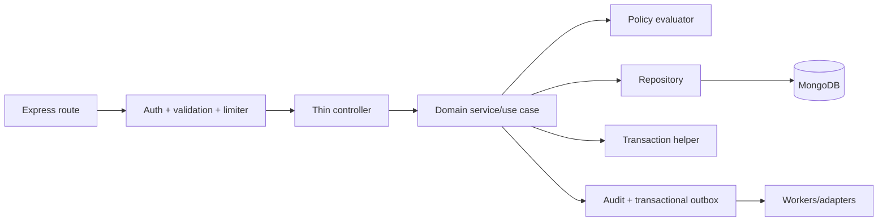
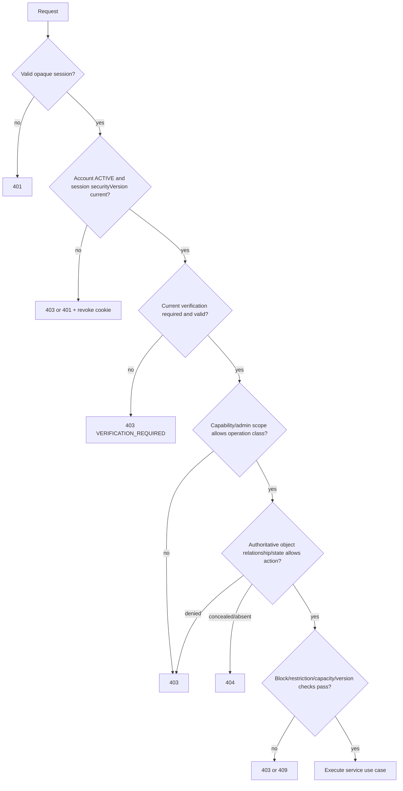
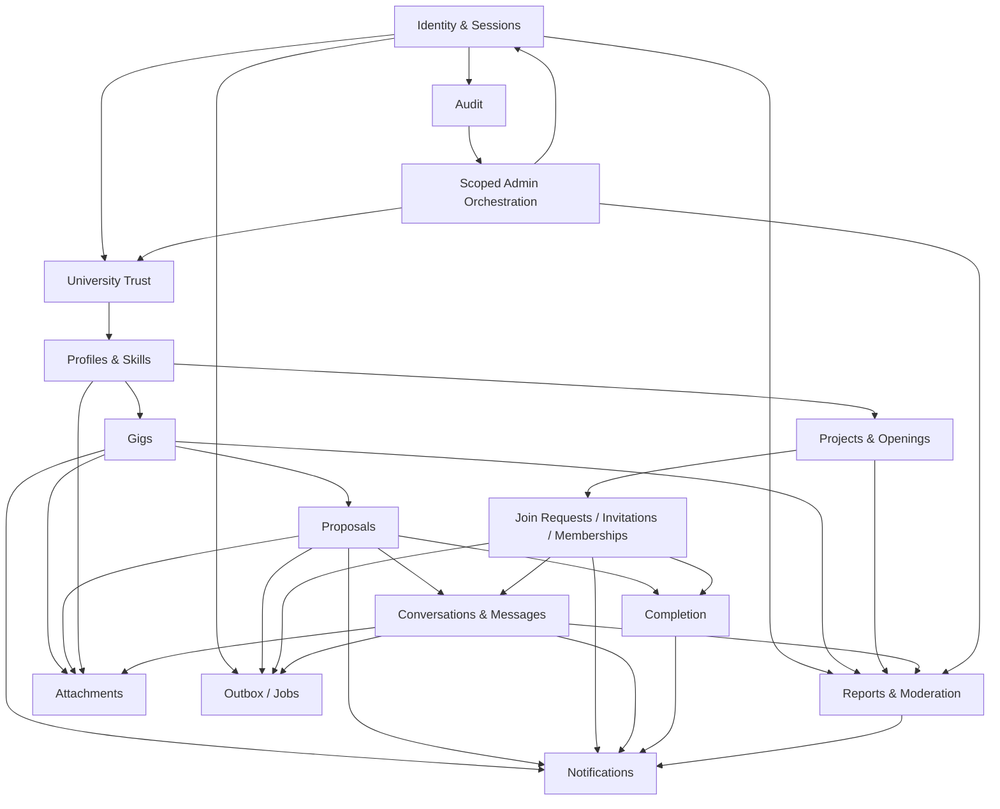

# CampusCollab — Phase 4 REST API Contract and Backend Architecture

**Status:** Architecture specification; no application implementation  
**API style:** REST over HTTPS, JSON, `/api/v1`  
**Backend:** Node.js, Express, JavaScript, MongoDB/Mongoose, Zod  
**Source of truth:** Phase 1 requirements, Phase 2 domain model, Phase 3 database architecture

## 0. Scope and Binding Decisions

This phase defines the external contract and internal modular-monolith boundaries. It does not create Mongoose models, controllers, services, routes, React code, Socket.IO handlers, jobs, or business implementation.

The following provisional Phase 2/3 assumptions remain provisional rather than silently becoming product approval:

1. Only currently verified students can own Gigs or Projects.
2. University verification lasts 12 months and one active affiliation is allowed.
3. Ratings/reviews, external organization owners, payments, AI matching, and exact per-message receipts are deferred.
4. Account deletion has a proposed 30-day recovery window.
5. Completion uses participant-level acknowledgement with a proposed 14-day response window.
6. Multi-hire Gigs remain `PUBLISHED` while capacity remains; Project recruitment is controlled independently by `acceptingMembers`.
7. Administrators restrict/hide content and append moderation history; they do not rewrite user-authored content.

No contradiction with Phases 1–3 is introduced. Uppercase enum values in this contract follow the canonical representation used by the Phase 3 database design.

## 1. Review of Previous Phases

### 1.1 Required MVP domains and entities

| Domain | Principal entities/collections | Required behavior |
|---|---|---|
| Identity | User, Session, Verification Challenge | Registration, login/logout, recovery, revocable sessions, account lifecycle |
| University Trust | University, Domain, Affiliation | Domain allowlist, email verification, expiry/revocation |
| Profile | Profile, Skill, Portfolio Item | Public/private professional identity, skills, availability, portfolio |
| Gig Marketplace | Gig, Proposal, Bookmark | Publish/discover, propose, decide atomically, close/archive |
| Collaboration | Project, embedded Opening, Join Request, Invitation, Membership | Recruit, capacity-safe acceptance, team authorization |
| Messaging | Conversation, Message, Attachment | Contextual participant-only history, read cursor, immutable send |
| Notifications | Notification | Private actionable feed and read state |
| Completion | Completion Record | Participant response, dispute, finalization |
| Trust & Safety | Report, Moderation Case/Action | Confidential reporting, scoped moderation, suspension |
| Governance/Operations | Audit Event, Outbox Event, Deletion Job | Append-only audit, reliable events, deletion workflow |

### 1.2 Binding invariants and transitions

- Identity, active-account state, current university verification, capability, ownership/membership, block/restriction state, and resource lifecycle are rechecked server-side on every sensitive operation.
- One active Proposal per applicant/Gig; one active Membership per user/Project; one pending Join Request or Invitation per applicable unique scope.
- Owners cannot apply to their own Gig or join their own Project.
- Capacity is never reserved by shortlisting and cannot exceed Gig/Opening capacity.
- Accepted relationship creation, capacity update, conversation access, audit, and outbox changes use Phase 3 transaction boundaries.
- Business history is closed/archived/soft-deleted, not silently hard-deleted.
- Messages are immutable in MVP; authorization comes from the Conversation participant record, never a client-supplied participant list.
- Normal API transitions are allowlisted by the Phase 2/3 state machines; administrative correction is a separately authorized, reasoned, audited action.

### 1.3 Deferred functionality

No Phase 4 endpoint is defined for payments, escrow, reviews/ratings, external organizations, AI-generated matching, video/audio interviews, project boards, time tracking, exact message delivery receipts, or native applications.

## 2. Modular-Monolith Backend Architecture

### 2.1 Proposed directory structure

```text
src/
  app.js                         # Builds/configures Express; no network listen
  server.js                      # Config validation, dependencies, listen, shutdown
  config/
    env.js                       # Zod-validated environment adapter
    database.js                  # MongoDB connection policy
    logger.js                    # Structured logger/redaction configuration
    security.js                  # CORS, cookie, upload, proxy policy
  routes/
    v1.js                        # Mounts module routers at /api/v1
  middleware/
    authentication.js            # Resolve opaque session and principal
    authorization.js             # Capability/admin-scope boundary helpers
    csrf.js                      # CSRF verification for cookie-authenticated writes
    validate.js                  # Zod params/query/body adapters
    rateLimit.js                 # Named limiter policies
    requestContext.js            # Request/correlation ID and timing
    errorHandler.js              # Final safe error serializer
    notFound.js                  # Unmatched route normalization
  modules/
    auth/ users/ university/ profiles/ skills/
    gigs/ proposals/ projects/ participation/
    messaging/ notifications/ completion/
    moderation/ admin/ audit/ files/
      <module>.routes.js
      <module>.controller.js
      <module>.service.js
      <module>.repository.js
      <module>.policy.js
      <module>.validation.js
      <module>.events.js
      <module>.errors.js          # Only when domain-specific errors add value
      __tests__/
  lib/
    mongo/                        # Transaction/session helpers; no domain decisions
    redis/                        # Client and distributed coordination adapters
    email/                        # Provider-neutral delivery adapter
    storage/                      # Signed upload/delivery/delete adapter
    crypto/                       # Token hashing and constant-time helpers
  events/
    eventTypes.js                 # Stable event-name registry
    outboxPublisher.js            # Outbox dispatch contract
    consumers/                    # Cross-module idempotent projections
  jobs/
    expireChallenges.js
    expireInvitations.js
    deadlineTransitions.js
    deletionWorkflow.js
    outboxWorker.js
  errors/
    applicationError.js           # Safe common error taxonomy
  utils/
    cursor.js                     # Signed/opaque pagination cursors
    objectId.js
    time.js
  docs/
    openapi/                      # Future generated/checked API description
tests/
  integration/ contract/ security/ fixtures/
```

`participation` owns Join Requests, Invitations, and Memberships because all three compete for the same Project Opening capacity and transaction path. `files` owns attachment metadata/provider operations but asks the parent domain to authorize access. `admin` orchestrates scoped administrative use cases while authoritative writes remain in the owning domain service.

### 2.2 Layer rules



- **Routes** declare path, HTTP method, middleware, validation schemas, and controller binding.
- **Controllers** translate HTTP input to a use-case command/query and map the result; no policy or business decisions.
- **Services** own lifecycle, invariant, transaction, idempotency, and cross-module orchestration decisions.
- **Policies** answer explicit authorization questions from authoritative data and return allow/deny reasons.
- **Repositories** contain database queries, projections, conditional updates, and index-dependent access; no HTTP objects.
- **Events** define minimum-data event contracts. Synchronous security/capacity effects never depend only on events.
- **Tests** colocate unit policy/service tests; cross-module contracts and transaction races live under top-level integration/security tests.

## 3. Backend Module Map

In the table, “A” means authentication plus active account; “V” adds current verified affiliation; “O” means resource ownership; “M” means active Project/Conversation membership; “S” means named admin scope.

| Module | Routes | Controller | Service/repository responsibility | Validation and authorization | Events and tests |
|---|---|---|---|---|---|
| `auth` | `/auth/*` | Session/credential HTTP exchange | Hash credentials/tokens, issue/revoke Sessions, challenge lifecycle | Strict email/password/token schemas; public limiters or A | REGISTERED, VERIFIED, SESSION_REVOKED; enumeration, replay, rotation tests |
| `users` | `/users/me`, deletion/session endpoints | Self-account transport | Account projection, capability/status, deletion request | A; self or S | ACCOUNT_DELETION_REQUESTED; BOLA/status tests |
| `university` | `/universities*`, verification via auth | Reference/search transport | Domain lookup, affiliation verification/revocation | Public reads; V/self; S for writes | AFFILIATION_*; shared-domain/expiry tests |
| `profiles` | `/profiles*`, `/me/profile*` | Profile/portfolio transport | Privacy projection, completion, owned edits | A/V for edits; public visibility policy | PROFILE_UPDATED; mass-assignment/privacy tests |
| `skills` | `/skills` and admin route | Taxonomy transport | Canonical lookup and scoped management | Public reads; S writes | SKILL_UPDATED; duplicate/disabled tests |
| `gigs` | `/gigs*`, bookmarks | Marketplace transport | Gig state/search/bookmark use cases | Reads by visibility; V+capability+O writes | GIG_*; ownership/state/search tests |
| `proposals` | Gig nested creates/owner lists; `/proposals*` | Proposal transport | Submission/revisions/decision transaction | V applicant; O decision; object proof | PROPOSAL_*; duplicate/capacity/race tests |
| `projects` | `/projects*`, nested openings | Project transport | Project/opening lifecycle and recruitment | V+owner capability+O writes | PROJECT_*; transition/version tests |
| `participation` | Join Requests, Invitations, Memberships | Participation transport | Capacity-safe acceptance transaction, access changes | V/self/O/M according to operation | *_ACCEPTED/MEMBER_*; cross-flow race tests |
| `messaging` | `/conversations*`, messages/read | Message transport | Context conversation query/send/read cursor | A+active participant; content/attachment validation | MESSAGE_SENT; removed/suspended/idempotency tests |
| `notifications` | `/notifications*` | Recipient-feed transport | Projection read/mark state | A and recipient only | NOTIFICATION_READ; BOLA/cursor tests |
| `completion` | `/completion-records*` | Completion command transport | Response/finalization transaction | Participant, owner, or S resolution | COMPLETION_*; dispute/race tests |
| `moderation` | `/reports*` | Report transport | Confidential report creation/status | A reporter/self projection | REPORT_CREATED; confidentiality/duplicate tests |
| `admin` | `/admin/*` | Admin transport/orchestration | Queue/read models; delegates writes to owner modules | A+named S+step-up for critical actions | MODERATION_*; scope/escalation tests |
| `audit` | Admin audit reads; internal append | Query transport only | Append-only write API and restricted queries | Internal append; dedicated S read | AUDIT_RECORDED; immutability/redaction tests |
| `files` | Signed upload/attachment endpoints | Upload transport | Provider signature, metadata, scan/status | A plus parent authorization | ATTACHMENT_*; MIME/size/ownership tests |

## 4. REST Versioning and Naming Conventions

- Base path: `/api/v1`; health probes are operational exceptions at `/health/live` and `/health/ready`.
- Breaking request/response or semantic changes require `/api/v2`. Backward-compatible optional fields and new endpoints remain in v1 and are announced.
- Plural, lowercase, hyphenated resource nouns: `/join-requests`, `/completion-records`. Never use verbs except lifecycle actions that are commands, such as `:publish`, `:accept`, or `:withdraw`.
- Nest only for clear ownership/creation context (`/gigs/{gigId}/proposals`); use canonical top-level URLs for a specific child.
- `GET` is safe, `PUT` is full replacement only (not used in MVP), `PATCH` is allowlisted partial update, `POST` creates/executes a command, `DELETE` removes a reversible association such as a bookmark.
- JSON fields use `camelCase`; identifiers are opaque 24-character MongoDB ObjectId strings at the boundary. Dates are UTC RFC 3339 strings.
- Collection responses use cursor pagination: `?limit=20&after=<opaqueCursor>`. Default 20, maximum 100; Messages maximum 50. Admin reference lists may use shallow offset only where explicitly stated.
- Sort values are allowlisted symbolic values (`newest`, `deadlineAsc`, `relevance`), never raw field names.
- Conditional mutable resources accept `If-Match: "<version>"`; stale writes return `409 VERSION_CONFLICT`.
- `Idempotency-Key` is a client-generated opaque string (8–128 characters) required on designated commands. Scope is `(authenticated actor, route family, key)`; retain outcome at least 24 hours. Same key/different payload returns `409 IDEMPOTENCY_KEY_REUSED`.

### 4.1 Status-code conventions

| Code | Use |
|---|---|
| `200` | Successful read/update/command or idempotent replay with existing result |
| `201` | New resource created; include `Location` where meaningful |
| `202` | Durable asynchronous workflow accepted, such as account deletion |
| `204` | Successful action with no response data, such as logout/bookmark removal |
| `400` | Malformed JSON, invalid cursor, or protocol error |
| `401` | Missing/invalid/expired session; do not reveal account existence |
| `403` | Authenticated but policy denies action; hide existence as `404` where object disclosure is unsafe |
| `404` | Resource absent or intentionally concealed |
| `409` | Duplicate, capacity race, stale version, or invalid lifecycle transition |
| `413` | Request/upload too large |
| `415` | Unsupported media type |
| `422` | Structurally valid JSON that fails Zod/domain input validation |
| `423` | Attachment or resource is quarantined/locked by a safety restriction |
| `429` | Rate limit exceeded; return `Retry-After` |
| `500` | Unexpected safe internal failure |
| `503` | Required dependency unavailable/readiness failed |

## 5. Request and Response Standard

Every response includes `X-Request-Id`; clients may send a valid UUID/ULID request ID, but the server replaces malformed values.

```json
{
  "data": { "id": "...", "type": "gig", "attributes": {} },
  "meta": { "requestId": "01...", "nextCursor": null }
}
```

For a `204`, there is no body. List `data` is an array. `meta.nextCursor`, `meta.hasMore`, and optional safe totals appear only when relevant.

```json
{
  "error": {
    "code": "VALIDATION_FAILED",
    "message": "One or more request values are invalid.",
    "details": [
      { "location": "body", "path": "title", "code": "too_small", "message": "Title is required." }
    ],
    "requestId": "01..."
  }
}
```

- Validation details contain allowlisted paths/codes only; submitted secrets and values are excluded.
- `401`: `AUTHENTICATION_REQUIRED` or `SESSION_EXPIRED`.
- `403`: `ACTION_FORBIDDEN`, `VERIFICATION_REQUIRED`, `ACCOUNT_RESTRICTED`, or a safe policy code.
- `404`: `RESOURCE_NOT_FOUND` without revealing concealed resources.
- `409`: `DUPLICATE_RESOURCE`, `INVALID_STATE_TRANSITION`, `CAPACITY_UNAVAILABLE`, `VERSION_CONFLICT`, or idempotency conflict.
- `429`: `RATE_LIMITED` with safe `retryAfterSeconds` metadata.
- `500`: `INTERNAL_ERROR`; stack, driver error, collection/index names, internal paths, credentials, and policy internals are never returned.

## 6. Complete MVP API Contract

### 6.1 Contract notation and common controls

Each endpoint row explicitly defines method/path, purpose, authentication/authorization, inputs/validation, success, expected errors, pagination, limiter, idempotency, and audit. Common error suffix **C** means `400/401/403/404/409/422/429/500` as applicable; rows narrow the main domain errors but never remove safe unexpected handling.

Named limiters are defined in Section 15. `standard-read` and `standard-write` are abuse ceilings, not business quotas. `I:req` means `Idempotency-Key` required; `I:opt` supported; `I:no` not used. `Audit:security/domain/admin` means an immutable event is required; routine reads are not audited unless privacy-sensitive.

All object IDs must pass strict ObjectId syntax validation before lookup. All bodies use `.strict()` Zod objects; unknown fields fail to prevent mass assignment. Text is Unicode-normalized, trimmed where appropriate, length-bounded, and stored/displayed as text rather than trusted HTML.

### 6.2 Authentication and account

| Method and URL | Purpose; authentication/authorization | Path/query/body validation | Success | Errors/status | Page; limit; idempotency; audit |
|---|---|---|---|---|---|
| `POST /api/v1/auth/register` | Create pending account; anonymous only | Body: `email`, `password`, `displayName`, `acceptedTermsVersion`; normalized university email, password policy, current terms | `201` generic registration result and verification next step | `409` safe duplicate or generic accepted response by enumeration policy; `422`; C | —; `register`; I:req; Audit:security |
| `POST /api/v1/auth/login` | Authenticate and set Secure HttpOnly opaque session cookie | Body: `email`, `password`; optional device label; exact limits | `200` safe current-user summary + CSRF token; `Set-Cookie` | Generic `401 INVALID_CREDENTIALS`, `403 ACCOUNT_RESTRICTED`; C | —; `login`; I:no; Audit:security success/failure metadata |
| `POST /api/v1/auth/logout` | Revoke current session; A | CSRF header; no body | `204`, expired cookie | `401`; C | —; `standard-write`; I:opt; Audit:security |
| `POST /api/v1/auth/logout-all` | Revoke all sessions/increment security version; A | CSRF; optional `{exceptCurrent:false}` | `204` | `401/409`; C | —; `auth-sensitive`; I:req; Audit:security |
| `POST /api/v1/auth/session/renew` | Rotate nearing-expiry opaque token; A/active | CSRF; no body | `200` session expiry + rotated cookie/CSRF | `401/403/409`; C | —; `auth-sensitive`; I:req; Audit:security |
| `GET /api/v1/auth/me` | Return safe current principal/account/profile state; A | No body | `200` `CurrentUser` | `401`; C | —; `standard-read`; I:no; Audit:no |
| `POST /api/v1/auth/verify-email` | Consume university verification challenge | Body: opaque `token`; single-use/purpose/expiry | `200` affiliation/account verification summary | Generic `400 INVALID_OR_EXPIRED_TOKEN`, `409 ALREADY_USED`; C | —; `verify`; I:req; Audit:security |
| `POST /api/v1/auth/verification/resend` | Supersede/send challenge without enumeration | Body: `email`; normalized | `202` generic response regardless of account existence | `422/429`; C | —; `resend`; I:req; Audit:security metadata |
| `POST /api/v1/auth/password/forgot` | Start reset without enumeration | Body: normalized `email` | `202` generic response | `422/429`; C | —; `password-recovery`; I:req; Audit:security metadata |
| `POST /api/v1/auth/password/reset` | Consume reset and revoke existing sessions | Body: `token`, `newPassword`; strict policy | `204` | Generic `400 INVALID_OR_EXPIRED_TOKEN`, `409 ALREADY_USED`; C | —; `password-reset`; I:req; Audit:security |
| `GET /api/v1/users/me/sessions` | List own devices without token material; A | Cursor query | `200` `SessionSummary[]` | `401`; C | Cursor; `standard-read`; I:no; Audit:no |
| `DELETE /api/v1/users/me/sessions/{sessionId}` | Revoke owned session; A+self object proof | `sessionId` | `204` | Concealed `404`; C | —; `auth-sensitive`; I:opt; Audit:security |
| `POST /api/v1/users/me/account-deletion` | Begin recoverable deletion workflow; A+active+step-up | Body: `{password, confirmation}`; exact confirmation | `202` deletion job/status | `401/403/409/422`; C | —; `auth-sensitive`; I:req; Audit:security |
| `POST /api/v1/users/me/account-deletion:cancel` | Cancel inside recovery window; A or recovery proof | Body: approved recovery proof | `200` account status | `400/401/409 WINDOW_EXPIRED`; C | —; `auth-sensitive`; I:req; Audit:security |

### 6.3 Profiles, skills, portfolio, and universities

| Method and URL | Purpose; authentication/authorization | Path/query/body validation | Success | Errors/status | Page; limit; idempotency; audit |
|---|---|---|---|---|---|
| `GET /api/v1/profiles/me` | Full own Profile; A | — | `200` private `ProfileSelf` | `401/404`; C | —; standard-read; I:no; Audit:no |
| `GET /api/v1/profiles/{userId}` | Public profile projection; public or A depending privacy | `userId` | `200` `ProfilePublic` | Concealed `404`; C | —; profile-read; I:no; Audit:no |
| `PATCH /api/v1/profiles/me` | Update allowlisted bio/headline/academic/links/preferences; A+active | Body strict partial; field length/URL/privacy enums; `If-Match` | `200` Profile + ETag | `409 VERSION_CONFLICT`, `422`; C | —; standard-write; I:opt; Audit:domain for privacy fields |
| `PUT /api/v1/profiles/me/skills` | Replace bounded canonical skill set; A+active | Body `{skills:[{skillId,level}]}`; unique IDs, cap, active taxonomy; `If-Match` | `200` skills/Profile ETag | `404/409/422`; C | —; standard-write; I:req; Audit:domain |
| `PATCH /api/v1/profiles/me/availability` | Set availability/status/capacity; A+active | Strict availability enum/hours/date; `If-Match` | `200` availability | `409/422`; C | —; standard-write; I:opt; Audit:domain |
| `GET /api/v1/profiles/me/portfolio-items` | List own all-visible states; A | `status`, cursor, limit | `200` `PortfolioItem[]` | `422`; C | Cursor; standard-read; I:no; Audit:no |
| `GET /api/v1/profiles/{userId}/portfolio-items` | Public visible items only | `userId`, cursor, limit | `200` public items | `404`; C | Cursor; profile-read; I:no; Audit:no |
| `POST /api/v1/profiles/me/portfolio-items` | Create owned item; A+active | Strict title/description/URLs/skill IDs/visibility, attachment IDs | `201` PortfolioItem | `404/409/422`; C | —; standard-write; I:req; Audit:domain |
| `GET /api/v1/portfolio-items/{itemId}` | Read if owner/public/admin-policy | `itemId` | `200` appropriate projection | Concealed `404`; C | —; standard-read; I:no; Audit:no |
| `PATCH /api/v1/portfolio-items/{itemId}` | Edit own item; A+active+O | Strict partial + `If-Match` | `200` item + ETag | `404/409/422`; C | —; standard-write; I:opt; Audit:domain |
| `DELETE /api/v1/portfolio-items/{itemId}` | Soft-delete own eligible item; A+active+O | `itemId`, `If-Match` | `204` | `404/409`; C | —; standard-write; I:req; Audit:domain |
| `GET /api/v1/skills` | Search active canonical skills | `q` 1–80, cursor, limit | `200` `Skill[]` | `422`; C | Cursor; public-read; I:no; Audit:no |
| `GET /api/v1/universities` | Search/list active universities | `q`, country, cursor, limit | `200` `UniversitySummary[]` | `422`; C | Cursor; public-read; I:no; Audit:no |
| `GET /api/v1/universities/{universityId}` | Public active university detail/domains safe projection | `universityId` | `200` University | `404`; C | —; public-read; I:no; Audit:no |
| `GET /api/v1/users/me/university-affiliation` | Current/history-safe own verification status; A | — | `200` AffiliationSummary | `401/404`; C | —; standard-read; I:no; Audit:no |

### 6.4 Gigs and bookmarks

| Method and URL | Purpose; authentication/authorization | Path/query/body validation | Success | Errors/status | Page; limit; idempotency; audit |
|---|---|---|---|---|---|
| `POST /api/v1/gigs` | Create draft; A+V+owner capability | Strict title/description/category/skill IDs/budget display/deadline/capacity; no payment fields | `201` Gig | `403/404/422`; C | —; gig-create; I:req; Audit:domain |
| `GET /api/v1/gigs` | Discover visible Gigs/search/filter/sort | `q`, skills, university, status=`PUBLISHED`, deadline, availability, sort allowlist, cursor | `200` `GigCard[]` + search metadata | `400 INVALID_CURSOR`, `422`; C | Cursor; public-search; I:no; Audit:no |
| `GET /api/v1/gigs/mine` | Owner dashboard list; A | status/sort/cursor | `200` owned Gigs | `401/422`; C | Cursor; standard-read; I:no; Audit:no |
| `GET /api/v1/gigs/{gigId}` | Read public or owner/admin projection | `gigId` | `200` Gig; owner fields only if authorized | Concealed `404`; C | —; public-read; I:no; Audit:no |
| `PATCH /api/v1/gigs/{gigId}` | Allowlisted edit; A+active+O; lifecycle field restrictions | Strict partial, `If-Match`; material-change rule | `200` Gig + ETag | `403/404/409 INVALID_STATE/TERMS_LOCKED/422`; C | —; standard-write; I:opt; Audit:domain |
| `POST /api/v1/gigs/{gigId}:publish` | `DRAFT→PUBLISHED`; A+V+O | `If-Match`; optional `{confirmation:true}` | `200` Gig | `409 INVALID_STATE/INCOMPLETE_RESOURCE`; C | —; standard-write; I:req; Audit:domain |
| `POST /api/v1/gigs/{gigId}:close` | Close intake under allowed states; A+O | Body `{reasonCode,note?}`; `If-Match` | `200` Gig | `409 INVALID_STATE`; C | —; standard-write; I:req; Audit:domain |
| `POST /api/v1/gigs/{gigId}:archive` | Terminal→`ARCHIVED`; A+O | `If-Match` | `200` Gig | `409 INVALID_STATE`; C | —; standard-write; I:req; Audit:domain |
| `POST /api/v1/gigs/{gigId}:start` | `ASSIGNED→ACTIVE`; A+O | `If-Match` | `200` Gig | `409`; C | —; standard-write; I:req; Audit:domain |
| `POST /api/v1/gigs/{gigId}:cancel` | Allowed state→`CANCELLED`; A+O | Required reason/note per policy, `If-Match` | `200` Gig | `409`; C | —; standard-write; I:req; Audit:domain |
| `POST /api/v1/gigs/{gigId}/bookmark` | Save visible Gig; A+active | `gigId` | `200` existing or `201` bookmark | `404/409`; C | —; standard-write; I:req; Audit:no |
| `DELETE /api/v1/gigs/{gigId}/bookmark` | Remove own bookmark; A | `gigId` | `204` even when absent | `401`; C | —; standard-write; I:opt; Audit:no |
| `GET /api/v1/users/me/bookmarked-gigs` | List own saved visible/history-safe Gigs; A | cursor, sort | `200` GigCard[] | `422`; C | Cursor; standard-read; I:no; Audit:no |

### 6.5 Proposals

| Method and URL | Purpose; authentication/authorization | Path/query/body validation | Success | Errors/status | Page; limit; idempotency; audit |
|---|---|---|---|---|---|
| `POST /api/v1/gigs/{gigId}/proposals` | Submit to eligible published Gig; A+V+applicant capability; not O | `gigId`; strict cover text/terms/availability/attachment IDs | `201` Proposal | `403/404/409 DUPLICATE/DEADLINE/CAPACITY/422`; C | —; proposal-submit; I:req; Audit:domain |
| `GET /api/v1/proposals/mine` | Applicant list; A | status/gigId/sort/cursor | `200` ProposalSummary[] | `422`; C | Cursor; standard-read; I:no; Audit:no |
| `GET /api/v1/proposals/{proposalId}` | Applicant or Gig owner; scoped admin with reason | `proposalId` | `200` role-safe Proposal | Concealed `404`; C | —; standard-read; I:no; Audit:privacy for admin |
| `PATCH /api/v1/proposals/{proposalId}` | Add bounded revision while editable; A+applicant O | Strict editable fields; `If-Match` | `200` Proposal | `404/409 INVALID_STATE/REVISION_LIMIT/422`; C | —; standard-write; I:req; Audit:domain |
| `POST /api/v1/proposals/{proposalId}:withdraw` | Applicant withdrawal | `If-Match`; optional reason | `200` Proposal | `404/409 INVALID_STATE`; C | —; standard-write; I:req; Audit:domain |
| `GET /api/v1/gigs/{gigId}/proposals` | Owner review list; A+O | status/sort/cursor; safe applicant projection | `200` ProposalSummary[] | Concealed `404`; C | Cursor; owner-sensitive-read; I:no; Audit:access metadata |
| `POST /api/v1/proposals/{proposalId}:shortlist` | Owner shortlist; A+O via Gig | `If-Match` | `200` Proposal | `404/409 INVALID_STATE`; C | —; standard-write; I:req; Audit:domain |
| `POST /api/v1/proposals/{proposalId}:accept` | Atomic accept/capacity/conversation; A+O | `If-Match`; optional Gig version precondition | `200` accepted Proposal + Gig/conversation refs | `404/409 CAPACITY_UNAVAILABLE/VERSION_CONFLICT/INVALID_STATE`; C | —; proposal-decision; I:req; Audit:domain/security |
| `POST /api/v1/proposals/{proposalId}:reject` | Owner reject; A+O | Body optional bounded reason visible per policy; `If-Match` | `200` Proposal | `404/409 INVALID_STATE/422`; C | —; proposal-decision; I:req; Audit:domain |

### 6.6 Projects and embedded openings

| Method and URL | Purpose; authentication/authorization | Path/query/body validation | Success | Errors/status | Page; limit; idempotency; audit |
|---|---|---|---|---|---|
| `POST /api/v1/projects` | Create draft; A+V+owner capability | Strict title/summary/details/skills/timeline/privacy; bounded openings optional | `201` Project | `403/404/422`; C | —; project-create; I:req; Audit:domain |
| `GET /api/v1/projects` | Discover recruiting/visible Projects | `q`, skills, university, status, acceptingMembers, sort, cursor | `200` ProjectCard[] | `400/422`; C | Cursor; public-search; I:no; Audit:no |
| `GET /api/v1/projects/mine` | Owned/member Projects; A | relationship/status/sort/cursor | `200` ProjectSummary[] | `422`; C | Cursor; standard-read; I:no; Audit:no |
| `GET /api/v1/projects/{projectId}` | Public/owner/member/admin-safe projection | `projectId` | `200` Project | Concealed `404`; C | —; public-read; I:no; Audit:no |
| `PATCH /api/v1/projects/{projectId}` | Edit allowed fields; A+active+O | Strict partial + `If-Match`; lifecycle/material terms policy | `200` Project + ETag | `404/409/422`; C | —; standard-write; I:opt; Audit:domain |
| `POST /api/v1/projects/{projectId}:publish` | `DRAFT→RECRUITING`; A+V+O | `If-Match`; validity/start constraints | `200` Project | `409 INCOMPLETE/INVALID_STATE`; C | —; standard-write; I:req; Audit:domain |
| `POST /api/v1/projects/{projectId}:transition` | Execute allowlisted normal transition | Body `{toStatus,reason?}` + `If-Match`; service validates state graph | `200` Project | `409 INVALID_STATE/COMPLETION_REQUIRED`; C | —; project-transition; I:req; Audit:domain |
| `PATCH /api/v1/projects/{projectId}/recruitment` | Toggle `acceptingMembers` when allowed; A+O | Body `{acceptingMembers}` + `If-Match` | `200` Project | `409 INVALID_STATE`; C | —; standard-write; I:req; Audit:domain |
| `POST /api/v1/projects/{projectId}/openings` | Add bounded embedded Opening; A+O | Strict role/title/description/skill IDs/capacity; `If-Match` | `201` Opening + Project ETag | `409 LIMIT/INVALID_STATE/422`; C | —; standard-write; I:req; Audit:domain |
| `PATCH /api/v1/projects/{projectId}/openings/{openingId}` | Edit opening without invalidating commitments; A+O | IDs, strict partial, `If-Match`; capacity ≥ filledCount | `200` Opening + ETag | `404/409 CAPACITY_BELOW_FILLED/TERMS_LOCKED/422`; C | —; standard-write; I:opt; Audit:domain |
| `POST /api/v1/projects/{projectId}/openings/{openingId}:close` | Stop intake; preserve opening/history; A+O | IDs, `If-Match`, optional reason | `200` Opening | `404/409 INVALID_STATE`; C | —; standard-write; I:req; Audit:domain |

### 6.7 Join Requests, Invitations, and Memberships

| Method and URL | Purpose; authentication/authorization | Path/query/body validation | Success | Errors/status | Page; limit; idempotency; audit |
|---|---|---|---|---|---|
| `POST /api/v1/projects/{projectId}/openings/{openingId}/join-requests` | Apply; A+V; non-owner/non-member | IDs; strict motivation/availability/attachment IDs | `201` JoinRequest | `403/404/409 DUPLICATE/CAPACITY/NOT_RECRUITING/422`; C | —; join-request; I:req; Audit:domain |
| `GET /api/v1/join-requests/mine` | Applicant list | status/projectId/cursor | `200` JoinRequest[] | `422`; C | Cursor; standard-read; I:no; Audit:no |
| `GET /api/v1/projects/{projectId}/join-requests` | Owner list; A+O | openingId/status/sort/cursor | `200` JoinRequestSummary[] | `404/422`; C | Cursor; owner-sensitive-read; I:no; Audit:access metadata |
| `GET /api/v1/join-requests/{requestId}` | Applicant or Project owner | `requestId` | `200` role-safe request | Concealed `404`; C | —; standard-read; I:no; Audit:no |
| `POST /api/v1/join-requests/{requestId}:withdraw` | Applicant withdraw pending | `If-Match` | `200` request | `404/409`; C | —; standard-write; I:req; Audit:domain |
| `POST /api/v1/join-requests/{requestId}:accept` | Owner capacity-safe transaction | `If-Match`; Project version optional precondition | `200` request + Membership | `404/409 CAPACITY/DUPLICATE_MEMBER/INVALID_STATE`; C | —; participation-decision; I:req; Audit:domain/security |
| `POST /api/v1/join-requests/{requestId}:reject` | Owner reject pending | Optional bounded reason, `If-Match` | `200` request | `404/409/422`; C | —; participation-decision; I:req; Audit:domain |
| `POST /api/v1/projects/{projectId}/openings/{openingId}/invitations` | Owner invites eligible user | IDs; body `{inviteeId,message?,expiresAt?}`; expiry bounds | `201` Invitation | `403/404/409 DUPLICATE/MEMBER/CONFLICTING_REQUEST/422`; C | —; invitation-send; I:req; Audit:domain |
| `GET /api/v1/invitations/mine` | Invitee inbox/history | status/projectId/cursor | `200` Invitation[] | `422`; C | Cursor; standard-read; I:no; Audit:no |
| `GET /api/v1/projects/{projectId}/invitations` | Owner list | status/openingId/cursor | `200` Invitation[] | `404/422`; C | Cursor; owner-sensitive-read; I:no; Audit:access metadata |
| `GET /api/v1/invitations/{invitationId}` | Invitee or Project owner | ID | `200` role-safe Invitation | Concealed `404`; C | —; standard-read; I:no; Audit:no |
| `POST /api/v1/invitations/{invitationId}:accept` | Invitee capacity-safe Membership transaction | `If-Match` | `200` Invitation + Membership | `404/409 EXPIRED/CAPACITY/DUPLICATE_MEMBER`; C | —; participation-decision; I:req; Audit:domain/security |
| `POST /api/v1/invitations/{invitationId}:reject` | Invitee rejects | Optional reason, `If-Match` | `200` Invitation | `404/409`; C | —; participation-decision; I:req; Audit:domain |
| `POST /api/v1/invitations/{invitationId}:revoke` | Owner revokes pending invitation | `If-Match`, optional reason | `200` Invitation (`REVOKED`) | `404/409`; C | —; participation-decision; I:req; Audit:domain |
| `POST /api/v1/invitations/{invitationId}:expire` | **Internal/admin-operations only**, force due-expiry evaluation; not ordinary public UI | ID; S `jobs:execute`; must already be due/ineligible | `200` expired/current result | `403/404/409 NOT_DUE`; C | —; admin-sensitive; I:req; Audit:admin |
| `GET /api/v1/projects/{projectId}/members` | List visibility-safe members; public/member/owner per Project visibility | role/status/cursor | `200` MemberSummary[] | `404/422`; C | Cursor; standard-read; I:no; Audit:no |
| `POST /api/v1/projects/{projectId}/memberships/{membershipId}:leave` | Active member leaves; self and policy allows | IDs; body reason optional; `If-Match` | `200` Membership | `403/404/409 INVALID_STATE`; C | —; participation-decision; I:req; Audit:domain/security |
| `POST /api/v1/projects/{projectId}/memberships/{membershipId}:remove` | Owner removes non-owner member under policy | IDs; required reason; `If-Match` | `200` Membership | `403/404/409 INVALID_STATE/OWNER_IMMUTABLE`; C | —; participation-decision; I:req; Audit:domain/security |

### 6.8 Messaging, attachments, and notifications

REST remains authoritative for history, send idempotency, attachment setup, and read state. Future Socket.IO may deliver authorized events but cannot bypass the same services/policies.

| Method and URL | Purpose; authentication/authorization | Path/query/body validation | Success | Errors/status | Page; limit; idempotency; audit |
|---|---|---|---|---|---|
| `GET /api/v1/conversations` | List active/historical allowed conversations; A | contextType, unreadOnly, cursor | `200` ConversationSummary[] | `422`; C | Cursor; messaging-read; I:no; Audit:no |
| `GET /api/v1/conversations/{conversationId}` | Get context/participants safe projection; A+participant | ID | `200` Conversation | Concealed `404`; C | —; messaging-read; I:no; Audit:no |
| `GET /api/v1/conversations/{conversationId}/messages` | Cursor history; A+participant historical-access policy | `before`/`after` mutually exclusive, limit ≤50 | `200` Message[] | `400 INVALID_CURSOR/404`; C | Cursor; messaging-read; I:no; Audit:no |
| `POST /api/v1/conversations/{conversationId}/messages` | Send immutable Message; A+active participant+send permission | Strict `{clientMessageId,text?,attachmentIds[]}`; at least one content; caps | `201`, or `200` exact replay, Message | `403/404/409 KEY_REUSE/422`; C | —; message-send; I:req plus unique clientMessageId; Audit:no/content not logged |
| `POST /api/v1/conversations/{conversationId}:mark-read` | Advance own monotonic read cursor | Body `{lastReadMessageId}` belonging to conversation | `200` participant read state | `404/409 CURSOR_REGRESSION`; C | —; message-read-write; I:opt; Audit:no |
| `POST /api/v1/attachments/upload-authorizations` | Create signed, constrained upload authorization; A+active | Body `{purpose,parentType,parentId?,fileName,mimeType,size}`; allowlists/size/parent policy | `201` short-lived provider parameters + attachment ID; never provider secret | `403/404/413/415/422`; C | —; upload-init; I:req; Audit:domain metadata |
| `POST /api/v1/attachments/{attachmentId}:complete` | Confirm provider object and queue scan | ID; provider public ID/signature/metadata; owner | `202` Attachment `SCANNING` | `403/404/409/413/415`; C | —; upload-complete; I:req; Audit:domain |
| `GET /api/v1/attachments/{attachmentId}/access` | Issue short-lived authorized delivery URL | ID; A plus parent-domain authorization and clean scan | `200` expiring URL/metadata | Concealed `404`, `409 SCAN_PENDING`, `423 QUARANTINED`; C | —; attachment-read; I:no; Audit:privacy metadata |
| `DELETE /api/v1/attachments/{attachmentId}` | Detach/delete eligible own uncommitted object | ID, `If-Match`; parent rules | `204` | `403/404/409 ATTACHMENT_IN_USE`; C | —; standard-write; I:req; Audit:domain |
| `GET /api/v1/notifications` | Recipient-only feed | type, unreadOnly, cursor, limit | `200` Notification[] | `422`; C | Cursor; standard-read; I:no; Audit:no |
| `GET /api/v1/notifications/unread-count` | Recipient-only count projection | — | `200 {count}` | `401`; C | —; standard-read; I:no; Audit:no |
| `POST /api/v1/notifications/{notificationId}:mark-read` | Mark recipient's item | ID | `200` Notification | Concealed `404`; C | —; standard-write; I:opt; Audit:no |
| `POST /api/v1/notifications:mark-all-read` | Mark recipient items through captured timestamp | Body optional `{through}` not future | `200 {updatedCount,through}` | `422`; C | —; standard-write; I:req; Audit:no |

### 6.9 Completion and reports

| Method and URL | Purpose; authentication/authorization | Path/query/body validation | Success | Errors/status | Page; limit; idempotency; audit |
|---|---|---|---|---|---|
| `POST /api/v1/completion-records` | Owner/authorized initiator creates participant acknowledgements for ACTIVE context | Body strict `{contextType,contextId,summary}`; context allowlist | `201` record(s) | `403/404/409 DUPLICATE/INVALID_STATE/422`; C | —; completion; I:req; Audit:domain |
| `POST /api/v1/completion-records/{recordId}:respond` | Required participant acknowledges/disputes | Body `{decision:ACKNOWLEDGED|DISPUTED,note?}`; `If-Match` | `200` CompletionRecord | `403/404/409 ALREADY_RESPONDED/INVALID_STATE`; C | —; completion; I:req; Audit:domain |
| `POST /api/v1/completion-records/{recordId}:finalize` | Owner when all requirements met, or scoped admin resolution | Body optional resolution; `If-Match`; S+reason if admin | `200` finalized context/record | `403/404/409 OUTSTANDING_RESPONSE/DISPUTED`; C | —; completion; I:req; Audit:domain/admin |
| `POST /api/v1/reports` | Report allowlisted user/content target; A+active | Strict targetType/targetId/reasonCode/description/evidence attachment IDs | `201` safe Report receipt | `404/409 DUPLICATE_REPORT/422`; C | —; reports; I:req; Audit:security; reporter confidential |
| `GET /api/v1/reports/mine` | Reporter sees limited own status only | status/cursor | `200` ReportStatus[] with no case/private notes | `422`; C | Cursor; standard-read; I:no; Audit:no |
| `GET /api/v1/reports/{reportId}` | Own limited status; A+self | ID | `200` ReportStatus | Concealed `404`; C | —; standard-read; I:no; Audit:no |

### 6.10 Administrative API

All `/admin` routes require A, active account, explicit named scope, recent step-up authentication for critical writes, reason/ticket metadata, and audit. Admin list endpoints use cursors except small taxonomy lists. Private-content access requires a case/support/legal purpose and produces an access audit event. Administrative status correction never masquerades as an owner action.

| Method and URL | Purpose and required admin scope | Inputs/validation | Success | Main errors/status | Page; limiter; idempotency; audit |
|---|---|---|---|---|---|
| `GET /api/v1/admin/users` | Search safe account summaries; `users:read` | status, verification, universityId, q, cursor | `200` UserAdminSummary[] | `403/422`; C | Cursor; admin-read; I:no; Audit:privacy query |
| `GET /api/v1/admin/users/{userId}` | Account/moderation summary; `users:read` | ID, purpose header | `200` safe details | `403/404`; C | —; admin-read; I:no; Audit:privacy |
| `POST /api/v1/admin/users/{userId}:suspend` | Suspend/revoke sessions; `users:suspend` | reasonCode, note, until?, ticketId; step-up | `200` User status | `403/404/409/422`; C | —; admin-critical; I:req; Audit:admin/security |
| `POST /api/v1/admin/users/{userId}:reinstate` | Reinstate under policy; `users:suspend` | reason, ticket; step-up | `200` User status | `403/404/409`; C | —; admin-critical; I:req; Audit:admin/security |
| `POST /api/v1/admin/users/{userId}/verification:revoke` | Revoke affiliation; `verification:manage` | reason, ticket, `If-Match`; step-up | `200` affiliation | `403/404/409`; C | —; admin-critical; I:req; Audit:admin/security |
| `GET /api/v1/admin/universities` | Manage reference list; `universities:read` | status/q/cursor | `200` Universities | `403/422`; C | Cursor; admin-read; I:no; Audit:no |
| `POST /api/v1/admin/universities` | Create University; `universities:write` | canonical name/country/status/domains; strict | `201` University | `409 DOMAIN_CONFLICT/422`; C | —; admin-write; I:req; Audit:admin |
| `PATCH /api/v1/admin/universities/{id}` | Edit status/metadata; `universities:write` | strict partial + `If-Match` | `200` University | `404/409/422`; C | —; admin-write; I:opt; Audit:admin |
| `POST /api/v1/admin/universities/{id}/domains` | Add domain evidence; `universities:write` | normalized domain/status/evidence | `201` Domain | `409 DOMAIN_CONFLICT/422`; C | —; admin-write; I:req; Audit:admin |
| `PATCH /api/v1/admin/university-domains/{domainId}` | Approve/disable domain; `universities:write` | status/reason + `If-Match` | `200` Domain | `404/409`; C | —; admin-write; I:req; Audit:admin |
| `GET /api/v1/admin/skills` | Full taxonomy; `skills:read` | status/q/cursor | `200` Skills | `403/422`; C | Cursor; admin-read; I:no; Audit:no |
| `POST /api/v1/admin/skills` | Create canonical Skill; `skills:write` | name/slug/category/aliases strict | `201` Skill | `409 DUPLICATE/422`; C | —; admin-write; I:req; Audit:admin |
| `PATCH /api/v1/admin/skills/{skillId}` | Edit/disable Skill; `skills:write` | allowlisted fields + `If-Match` | `200` Skill | `404/409/422`; C | —; admin-write; I:opt; Audit:admin |
| `GET /api/v1/admin/reports` | Moderation queue; `reports:read` | status/priority/type/assignee/cursor | `200` ReportQueueItem[] | `403/422`; C | Cursor; admin-read; I:no; Audit:privacy |
| `GET /api/v1/admin/reports/{reportId}` | Report evidence; `reports:read` + purpose | ID | `200` confidential Report | `403/404`; C | —; admin-read; I:no; Audit:privacy |
| `POST /api/v1/admin/moderation-cases` | Create/group case; `cases:write` | reportIds/target/priority/assignee; strict | `201` Case | `404/409/422`; C | —; admin-write; I:req; Audit:admin |
| `PATCH /api/v1/admin/moderation-cases/{caseId}` | Assign/transition case; `cases:write` | allowlisted transition/assignee + `If-Match` | `200` Case | `404/409 INVALID_STATE`; C | —; admin-write; I:req; Audit:admin |
| `POST /api/v1/admin/moderation-cases/{caseId}/actions` | Apply hide/restrict/warn action; specific `moderation:<action>` | actionType,target,reason,effective dates,ticket; step-up | `201` ModerationAction | `403/404/409/422`; C | —; admin-critical; I:req; Audit:admin/security |
| `POST /api/v1/admin/moderation-actions/{actionId}:reverse` | Authorized reversal; `moderation:reverse` | reason/ticket; step-up | `200` reversal/action state | `403/404/409`; C | —; admin-critical; I:req; Audit:admin/security |
| `GET /api/v1/admin/gigs` | Moderation/operations view; `content:read` | status/visibility/reported/cursor | `200` GigAdminSummary[] | `403/422`; C | Cursor; admin-read; I:no; Audit:privacy when private |
| `POST /api/v1/admin/gigs/{gigId}:restrict` | Hide/restrict, not rewrite; `content:moderate` | reason/caseId/action + step-up | `200` visibility/status result | `403/404/409`; C | —; admin-critical; I:req; Audit:admin |
| `GET /api/v1/admin/projects` | Moderation/operations view; `content:read` | status/visibility/reported/cursor | `200` ProjectAdminSummary[] | `403/422`; C | Cursor; admin-read; I:no; Audit:privacy when private |
| `POST /api/v1/admin/projects/{projectId}:restrict` | Hide/restrict, not rewrite; `content:moderate` | reason/caseId/action + step-up | `200` result | `403/404/409`; C | —; admin-critical; I:req; Audit:admin |
| `GET /api/v1/admin/audit-events` | Restricted audit search; `audit:read` | actor/target/category/from/to/requestId/cursor; bounded range | `200` AuditEvent[] | `403/422`; C | Cursor; admin-read; I:no; Audit:audit-query |
| `GET /api/v1/admin/audit-events/{eventId}` | Audit detail; `audit:read` | ID/purpose | `200` AuditEvent | `403/404`; C | —; admin-read; I:no; Audit:audit-query |

### 6.11 Operational endpoints

| Method and URL | Contract |
|---|---|
| `GET /health/live` | Process liveness only; no dependency details or secrets; `200` while event loop can serve. |
| `GET /health/ready` | Readiness after configuration and required MongoDB connection; returns generic component states, `200` ready or `503` unavailable. Protect detailed diagnostics internally. |

## 7. Authorization Architecture

Authorization is a service-side policy pipeline, not a set of frontend visibility rules. A route may perform coarse authentication, but the domain service must authorize the actual resource loaded from the repository.



### 7.1 Middleware and policy responsibilities

| Concept | Responsibility | Must not do |
|---|---|---|
| `authenticateSession` | Hash cookie token, load Session/User, check expiry/revocation/securityVersion, attach minimal immutable principal | Trust user/capabilities supplied in headers/body |
| `requireActiveAccount` | Reject suspended, deletion-pending, or otherwise mutation-restricted accounts | Replace resource-specific checks |
| `requireCurrentAffiliation` | Verify active/non-expired affiliation for verified-only actions | Cache indefinitely or accept an email domain alone as proof |
| `requireCapability(name)` | Coarse feature capability such as `GIG_OWNER` | Infer ownership of a particular Gig |
| Domain policy (`canEditGig`, `canReadProposal`) | Evaluate principal plus authoritative resource/parent/state | Authorize from denormalized display snapshots |
| `requireProjectRelationship` | Load Membership/Conversation participation and activity/send state | Trust a `memberId` or participant list from client |
| `requireAdminScope(scope)` | Require explicit grant, active admin context, and step-up where critical | Treat `ADMIN` as unrestricted superuser |

### 7.2 Object proofs

- Gig writes query by `_id` and `ownerId`; Proposal decisions prove Proposal → Gig → owner.
- Project/opening writes prove the embedded opening belongs to the loaded Project and the actor owns it.
- Join Request/Invitation decisions prove source, Project, actor relationship, current state, and target eligibility inside the transaction.
- Message reads/sends prove the principal is an embedded Conversation participant with appropriate historical/send access.
- Notification and self-report queries always include `recipientId`/`reporterId` in the repository predicate.
- Attachments delegate to the parent domain; knowing an attachment ID never grants access.
- Admin access requires scope and purpose. Where revealing existence is unsafe, unauthorized and absent objects both map to `404`.

This directly addresses object-level authorization: OWASP recommends checking authorization in every function that uses a client-supplied identifier to access a record ([OWASP API1:2023 BOLA](https://owasp.org/API-Security/editions/2023/en/0xa1-broken-object-level-authorization/)).

## 8. Zod Validation Architecture

1. Route-level schemas validate `params`, `query`, `body`, and selected headers before the controller.
2. Each endpoint exports one request contract composed from shared primitives (`objectId`, bounded text, cursor, ISO time, idempotency key).
3. Body schemas are strict. Query schemas explicitly reject duplicate scalar parameters and unknown keys where practical.
4. Coercion is narrow: numeric `limit`/ports and explicit booleans may be coerced; IDs, dates, enums, money-like values, and credentials are not guessed.
5. Sanitization means normalization, allowlisting, and safe output encoding—not destructive HTML-stripping as a substitute for validation. Rich HTML is not accepted in MVP.
6. Normalize emails/domains and Unicode text in a single shared utility. Preserve meaningful user text after normalization; reject control characters and forbidden schemes.
7. Service-level domain validation rechecks database-dependent facts: uniqueness, ownership, state, deadline, capacity, skill activity, attachment ownership, and version.
8. Repository predicates enforce final race-safe invariants. Validation success never implies authorization.
9. Zod issues map to the safe error structure in Section 5; values, passwords, tokens, and refinements that disclose security policy are omitted. Zod provides structured formatting helpers, but CampusCollab owns a stable public error mapper ([Zod error formatting](https://zod.dev/error-formatting)).
10. Response schemas are also checked in contract tests to prevent excessive data exposure.

## 9. Centralized Error Architecture

Custom classes are appropriate for stable operational semantics, but not every domain message needs its own class.

| Class | Default HTTP | Public purpose |
|---|---:|---|
| `ApplicationError` | varies | Base with safe code/status/details/exposure/cause metadata |
| `RequestValidationError` | 422 | Zod/body/query/params failure |
| `AuthenticationError` | 401 | Session or credential failure |
| `AuthorizationError` | 403 | Authenticated policy denial; may be concealed as 404 |
| `NotFoundError` | 404 | Missing/concealed resource |
| `ConflictError` | 409 | Duplicate, version, lifecycle, capacity, idempotency conflict |
| `RateLimitError` | 429 | Named limiter exhausted |
| `DependencyUnavailableError` | 503 | Required external dependency unavailable |
| `DatabaseError` | 500/503 | Internal adapter wrapper; driver details never public |

The controller passes errors to the final error middleware. The service throws domain-safe errors; repository/provider errors are mapped centrally by stable categories. Duplicate index names, Mongo error documents, stack traces, SQL/NoSQL syntax, file paths, secret configuration, session/token state, and raw upstream responses are redacted. Unexpected errors receive `INTERNAL_ERROR`, a request ID, and server-side severity logging. Programmer errors remain visible in development logs/tests but not responses. A response-headers-sent condition delegates to Express's safe termination behavior.

## 10. Environment Configuration Architecture

`config/env.js` will parse `process.env` once at startup with Zod and export an immutable typed configuration object. Modules do not read `process.env` directly. Startup rejects missing required variables, unresolved `your_..._here` placeholders, invalid URLs/ports, secrets below the approved entropy/length policy, non-HTTPS production URLs, unsafe cookie settings, or production without Redis.

The canonical backend template is `C:\CampusColab\server\.env.example`; the manual guide is `C:\CampusColab\docs\setup\environment-variables.md`. It lives with the backend package so backend configuration is contained under `server`, while the shared root `.gitignore` protects secrets across the whole repository.

| Group | Variables | Requirement |
|---|---|---|
| Application | `NODE_ENV`, `PORT`, `API_URL`, `CLIENT_URL`, `LOG_LEVEL`, `TRUST_PROXY` | Required; non-secret |
| Database | `MONGODB_URI` | Required secret |
| Session/CSRF | `SESSION_SECRET`, `CSRF_SECRET`, `SESSION_COOKIE_NAME`, `SESSION_TTL_DAYS` | Secrets plus public behavior values; required |
| Email | `SMTP_HOST`, `SMTP_PORT`, `SMTP_SECURE`, `SMTP_USER`, `SMTP_PASSWORD`, `EMAIL_FROM` | Required for verification/recovery; credentials secret |
| Redis | `REDIS_URL` | Optional single-process local; required scaled production |
| Storage | `CLOUDINARY_CLOUD_NAME`, `CLOUDINARY_API_KEY`, `CLOUDINARY_API_SECRET`, `CLOUDINARY_FOLDER`, `MAX_UPLOAD_BYTES` | Required when attachment/upload endpoints enabled |

JWT variables are intentionally absent. Browser authentication uses a random opaque token in a `Secure`, `HttpOnly`, appropriately `SameSite` cookie; only a hash/derived lookup value is stored server-side. State-changing requests also require CSRF proof. CORS never substitutes for CSRF or authorization.

### 10.1 Secret handling

- `.env`, `.env.*` are ignored while `!.env.example` remains tracked.
- Development uses separate sandbox credentials. Production and CI inject environment-scoped secrets from their secret managers.
- Docker images never copy `.env`; orchestration injects environment variables or mounted secrets at runtime.
- Rotation uses create/deploy/verify/revoke, with emergency revocation. Session/CSRF rotation has explicit logout/token invalidation consequences.
- Secret values are redacted by logger keys and pattern safeguards and never appear in health checks, error details, traces, metrics labels, or audit payloads.

## 11. MongoDB Connection Architecture

1. Validate `MONGODB_URI` before constructing the app.
2. Create one Mongoose connection/client pool per process and inject repositories; never connect per request. MongoDB documents that a client maintains pools and should be reused ([connection pools](https://www.mongodb.com/docs/drivers/node/current/connect/connection-options/connection-pools/)).
3. Configure server-selection, connect, socket, and pool wait timeouts to bound failure. Size pools from measured concurrency and database limits, not arbitrary high defaults.
4. Before listening, connect and issue a minimal ping. Initial failure causes startup failure after a bounded exponential-backoff-with-jitter retry budget; orchestration restarts the process. Do not serve a partially initialized API.
5. Runtime disconnect marks readiness false. Driver reconnection handles transient topology changes; application retries only safe reads and explicitly retryable/idempotent transactions, never blind non-idempotent writes.
6. Transaction helper uses the Phase 3 boundaries, primary read preference, approved concerns, bounded commit time, and transaction retry labels. No external network calls run inside a transaction. The Node driver notes operations inside one transaction must not be run in parallel ([MongoDB Node transaction guide](https://www.mongodb.com/docs/drivers/node/v6.x/crud/transactions/)).
7. `SIGTERM`/`SIGINT`: fail readiness, stop accepting connections, allow a bounded HTTP/job drain, stop workers/Socket.IO later, finish/abort transactions, close Redis/email/storage adapters, then close MongoDB and exit. Force-exit after the platform grace period.
8. Log topology state transitions, pool pressure, retry category, and duration without logging the URI, credentials, query values, or private documents. MongoDB exposes pool events useful for monitoring ([driver monitoring](https://www.mongodb.com/docs/drivers/node/v6.x/monitoring-and-logging/monitoring/)).
9. Liveness does not ping MongoDB. Readiness returns generic dependency status; detailed pool metrics remain internal.

## 12. Security Middleware Stack

Order matters:

1. Proxy-trust allowlist and TLS enforcement at the platform/proxy.
2. Request context/request ID and start timer.
3. Structured request logging with early redaction.
4. Disable `x-powered-by`; apply Helmet secure headers. CSP is primarily a frontend concern but backend responses still use safe defaults.
5. Exact-origin credentialed CORS using `CLIENT_URL`; reject unapproved origins. Non-browser clients still require authentication.
6. Early global IP abuse ceiling and header/request-line timeouts at proxy.
7. JSON parser only for expected content types, default small limit (for example 100 KiB); uploads bypass JSON and use signed direct-to-storage flow.
8. Cookie parsing/signature and session authentication.
9. CSRF validation for unsafe cookie-authenticated methods.
10. Endpoint-specific distributed rate limiter.
11. Zod params/query/body validation and normalization.
12. Domain authorization/service execution.
13. Not-found handler and centralized error serializer.

Helmet, secure cookies, brute-force protection, TLS, input distrust, and reduced fingerprinting align with Express production security guidance ([Express security practices](https://expressjs.com/en/advanced/best-practice-security.html)).

Package decisions:

- Use `helmet` because secure header configuration is easy to misapply manually.
- Use `cors` only with a callback/exact allowlist; never `origin: *` with credentials.
- Use a maintained limiter with a Redis store in production.
- Do **not** rely on generic “NoSQL sanitizer” mutation. Strict Zod schemas, primitive types, unknown-key rejection, and repository-owned query construction prevent operators; optionally reject `$`/`.` keys globally as defense in depth.
- Prevent HTTP parameter pollution by rejecting duplicate scalar query parameters and allowlisting arrays; a separate package is optional if framework parsing tests prove behavior.
- XSS is controlled by accepting plain text, output encoding in React, safe link schemes, CSP at the web tier, and sanitizing only any future approved rich text.
- Cookies: `HttpOnly`, `Secure` in production, `SameSite=Lax` or stricter when topology permits, host-only scope, narrow path, no sensitive readable cookie. Cross-site deployment would require an explicit `SameSite=None; Secure` and CSRF review.

## 13. Structured Logging and Observability

Use JSON structured logs in production (Pino is the recommended implementation candidate); pretty human-readable transport is development-only and never changes recorded fields.

Common fields: timestamp, severity, service, environment, requestId, correlationId/eventId, route template (not raw secret-bearing URL), method, safe status, durationMs, authenticated actor ID when allowed, outcome code, deployment/version, and safe dependency timing.

Log categories:

- Request completion at `info`; expected 4xx at appropriate low severity; 5xx at `error`.
- Authentication failures and limit triggers as security events with hashed/risk-safe identifiers, never passwords/emails in plaintext by default.
- Authorization denial code and resource type, not private resource content.
- Audit events are durable database records for governed actions, distinct from operational logs.
- Outbox/job attempts include event/job ID, attempt count, and outcome without payload contents.
- Metrics: request rate/error/latency by route template, DB pool saturation/selection latency, transaction conflicts/retries, limiter denials, email/storage/job outcomes, outbox lag, queue depth, and readiness.
- Alert on elevated 5xx, login attack patterns, sustained capacity conflicts, outbox/deletion failure, unavailable MongoDB/Redis, and moderation queue SLA.

Mandatory redaction keys/patterns include password, authorization/cookie headers, session/CSRF tokens, verification/reset tokens, SMTP/storage/database credentials, signed upload/delivery URLs, private message text, report evidence, and sensitive profile fields. Avoid high-cardinality raw IDs in metrics labels.

## 14. Event and Future Socket.IO Architecture

- Services write domain state, Audit, and Outbox in the same transaction where required.
- Workers claim Outbox events, deliver idempotently, and mark/retry with bounded exponential backoff and dead-letter alerting.
- Notification and email consumers receive minimum identifiers and reload an authorized projection; event payloads omit secrets/private full text.
- Future Socket.IO authenticates the same opaque session during handshake, rechecks `securityVersion`, authorizes every room join from Conversation/Project data, and removes access after membership/suspension events.
- REST remains the source for history and mutation acknowledgement. Socket events are acceleration/delivery, not a second business API.
- Multi-instance Socket.IO requires Redis-compatible adapter/pub-sub, but this phase creates no sockets.

## 15. Rate-Limiting Architecture

Limits are proposed starting points and must be load/abuse-tested. Keys combine normalized IP prefix and account/session or privacy-preserving email hash where appropriate. Trusted proxy configuration is mandatory before IP enforcement. Successful login does not reset all attacker-controlled IP counters. Responses use generic `429`, `Retry-After`, and no account existence signal.

| Named policy | Proposed limit/window | Endpoints/notes |
|---|---|---|
| `public-read` | 120/min/IP | University/skill/public details |
| `public-search` | 60/min/IP; burst 15/10s | Gig/Project search; cap query complexity |
| `register` | 5/hour/IP and 3/day/email hash | Registration plus downstream email quota |
| `login` | 10/15min/IP and 5/15min/account hash; progressive delay | Generic failures; alert credential stuffing |
| `verify` | 10/hour/IP and 6/challenge | Single-use token still authoritative |
| `resend` | 3/hour/account/email hash and 10/hour/IP | Always generic `202`; daily provider cap |
| `password-recovery` | 3/hour/account hash and 10/hour/IP | Generic response |
| `password-reset` | 5/hour/IP and 5/token hash | Token single-use plus session revocation |
| `auth-sensitive` | 10/hour/account | Logout-all, renewal abuse, session revocation/deletion |
| `standard-read` | 180/min/session | Authenticated ordinary reads |
| `standard-write` | 60/min/session | Ordinary profile/state writes |
| `gig-create`, `project-create` | 10/hour/account | Business-flow abuse ceiling |
| `proposal-submit` | 20/day/account and 5/min | Does not replace one-active-Proposal rule |
| `proposal-decision` | 60/hour/owner | Owner decisions |
| `join-request` | 30/day/account and 5/min | Duplicate uniqueness still enforced |
| `invitation-send` | 50/day/owner and 10/min/project | Prevent spam to candidates |
| `participation-decision` | 60/hour/account | Accept/reject/leave/remove |
| `messaging-read` | 240/min/session | Cursor/limit caps also apply |
| `message-send` | 30/min/user, burst 10/10s, plus recipient/context abuse controls | Size/attachment limits; block restrictions |
| `message-read-write` | 120/min/session | Coalesce frequent read-cursor updates client-side |
| `upload-init`/`upload-complete` | 20/hour/user | Storage byte quotas and scan controls separate |
| `reports` | 10/day/user and target-duplicate controls | Urgent categories must not be silently dropped; escalate |
| `admin-read` | 120/min/admin | Audit sensitive reads separately |
| `admin-write` | 60/hour/admin | Named scopes |
| `admin-critical` | 20/hour/admin plus step-up | Suspension/restriction/reversal |

An in-memory store is acceptable only for deterministic local development. Redis-backed atomic counters are required for multi-process or multi-instance deployments, and limiter degradation policy must fail closed for authentication/admin-sensitive routes while applying a conservative local emergency ceiling for low-risk reads.

## 16. API Documentation Strategy

Use OpenAPI 3.1 as a checked contract because it supports JSON Schema-aligned request/response documentation, generated clients/test fixtures, reviewable breaking-change detection, and security-scheme clarity. Zod schemas should be the implementation validation source and produce or be checked against OpenAPI rather than maintaining two silently divergent hand-written contracts.

Phase 5 should add tooling only after package decisions. CI will lint OpenAPI, validate representative responses, run backward-compatibility diff checks, and serve interactive documentation only in protected development/admin environments. Production public docs must exclude internal/admin schemas unless intentionally published. The opaque cookie security scheme and CSRF header requirement must both be described.

## 17. API Dependency Graph



Dependency direction follows ownership: downstream modules may refer to upstream IDs/contracts but do not write upstream collections directly. Cross-domain writes go through the owning service; transaction orchestration lives in the service that owns the invariant.

## 18. SQA API Contract Testing Matrix

Every test verifies status, response schema, absence of sensitive fields, request ID, database side effects, Audit/Outbox where required, and exact idempotency behavior. Integration tests use a real transaction-capable MongoDB test deployment; mocks alone cannot validate unique indexes or races.

| API group | Happy path | Validation failure | Authentication / authorization | Not found | Conflict / duplicate / lifecycle | Rate-limit case |
|---|---|---|---|---|---|---|
| Authentication | Register→verify→login→renew→logout | Malformed email, weak password, extra fields | Invalid credential is generic; suspended user denied; CSRF failure | Never reveal account absence | Reused token/key; concurrent renew/reset; session version invalidation | Per-IP/account/email dimensions and generic `429` |
| Sessions/account | List/revoke owned session; request/cancel deletion | Bad ID/confirmation | Cross-user session BOLA; step-up required | Foreign and absent session concealed | Duplicate deletion returns same job; recovery window closed | Sensitive-account limiter |
| University | Public search; own verified affiliation | Invalid cursor/query/domain input admin | Unscoped admin domain write denied | Disabled/unknown hidden appropriately | Unique normalized domain; concurrent approval | Public/admin policies |
| Profiles/skills | Own edit and public privacy projection | Unknown/mass-assigned fields, caps, URLs | Private fields never public; cross-user edit denied | Concealed private/deleted Profile | Stale ETag; disabled/duplicate Skill | Profile/search ceilings |
| Portfolio/files | Create item, signed upload, scan, authorized access | MIME/size/count/purpose violations | Parent access, foreign attachment denial | Random ID concealed | Replay upload completion; attachment in use/quarantined | Upload count/byte ceiling |
| Gigs | Draft→publish→search→close→archive | Invalid deadline/capacity/filter/sort | Non-owner mutation; unverified owner; hidden draft | Unknown/invisible Gig | Duplicate key, stale ETag, invalid transition | Create/search/write limits |
| Proposals | Submit, revise, shortlist, accept | Text/attachment/terms errors | Self-Gig, unverified, non-owner decision, private read | Concealed Proposal/Gig | Duplicate active Proposal; replay; two accepts for last slot; withdrawal race | Submit/decision limits |
| Projects/openings | Draft→recruiting; manage opening/recruitment | Capacity below filled, invalid status | Non-owner edits; private Project visibility | Missing embedded Opening | Stale Project version; invalid transition | Create/write/search limits |
| Join Requests | Submit/list/withdraw/accept/reject | Wrong opening, excess content | Owner/self/member rules | Concealed Request | Duplicate pending; Request vs Invitation last-slot race | Daily/minute application limits |
| Invitations | Send/list/accept/reject/revoke/expire | Invalid invitee/expiry | Non-owner send; wrong invitee response; job scope | Concealed Invitation | Duplicate pending, expired/filled role, replay | Owner/project spam limits |
| Memberships | List, leave, remove | Invalid reason/version | Cross-project BOLA; owner cannot be removed | Concealed Membership | Leave/remove race; count never below zero | Participation limiter |
| Messaging | List/history/send/read cursor | Empty/oversize text, bad client ID/cursor | Nonparticipant, removed/suspended/blocked user | Concealed Conversation/Attachment | Duplicate client message exact replay; key/payload mismatch; removal/send race | Send/read limits and burst |
| Notifications | Recipient feed/read/all-read | Bad cursor/future timestamp | Cross-recipient BOLA | Concealed Notification | Duplicate consumer event, repeated mark-read idempotent | Standard limits |
| Completion | Initiate/respond/finalize | Invalid context/decision | Nonparticipant/owner/admin scope denied | Concealed Record/context | Duplicate response, dispute blocks finalize, concurrent finalization | Completion command limits |
| Reports | Create and own limited status | Target/reason/evidence validation | Reporter confidentiality, foreign report denial | Concealed target/report | Duplicate target/reason window but new evidence path retained | Per-user/IP/target controls |
| Admin | Scoped list/case/action/suspend/reverse/audit | Missing purpose/reason/ticket, mass assignment | Each scope denied independently; step-up expiry; ordinary/admin context separation | Concealed out-of-scope object | Duplicate action, invalid case state, replay, reversal race | Admin read/write/critical limits |
| Operations | Liveness/readiness and graceful shutdown | N/A | Detailed diagnostics unavailable publicly | N/A | Dependency loss toggles readiness; in-flight drain | Probe source/network policy |

### 18.1 Contract and security suites

- OpenAPI/request/response schema conformance and snapshot-compatible error codes.
- Property/fuzz tests for params/query/parser nesting, `$`/`.` operator keys, duplicate query parameters, Unicode, oversized payloads, invalid JSON, and content types.
- BOLA matrix that substitutes every resource ID with another user's ID for every object endpoint.
- Mass-assignment tests for `ownerId`, `userId`, status, capability, moderation fields, counters, versions, and internal flags.
- Concurrency tests with barriers for Proposal acceptance, Membership acceptance, leave/remove, completion, message retries, and session/deletion races.
- Rate-limit distributed-store tests, proxy/IP-spoofing tests, fail-closed/degraded behavior, and `Retry-After`.
- Log/audit capture tests proving secrets/private content are absent and mandatory critical actions are present.
- Failure injection for MongoDB transaction retries, Redis loss, email/storage failure, outbox retry, shutdown, and idempotent recovery.
- Performance tests for indexed cursor plans, search query complexity, large conversation history, and admin bounded-date audit queries.

## 19. API Security Threat Review

The review follows the risk categories emphasized by the [OWASP API Security Top 10](https://owasp.org/API-Security/editions/2023/en/0x11-t10/) and the stricter Phase 2 object-proof model.

| Threat | Attack example | Required mitigation and verification |
|---|---|---|
| BOLA/IDOR | Change Proposal, Membership, Message, Notification, Attachment, or Report ID | Repository predicate includes actor relationship; parent proof; concealed 404; BOLA substitution suite on every ID route |
| Broken authentication | Stolen/replayed cookie, credential stuffing, fixation | High-entropy opaque token, hashed storage, secure cookie, CSRF, rotation, securityVersion, session revocation, progressive distributed limits, generic failures |
| Broken function authorization | Ordinary admin calls suspension or case action | Named admin scopes per route and service, step-up, separate admin context, default deny, audit |
| Broken object-property authorization/mass assignment | Client sets `ownerId`, status, count, capabilities, admin fields | Strict per-use-case Zod schemas, unknown-key rejection, command construction, response projections, tests for forbidden fields |
| NoSQL injection | `$ne`, `$where`, dotted keys, regex abuse | Primitive strict schemas, reject operator keys, repository-owned filters, escaped/bounded search, no raw client filters or collection names |
| HTTP parameter pollution | Duplicate `status`, `limit`, sort, or ID changes parser meaning | Explicit query parser configuration, reject duplicate scalars, allowlist array parameters, parser contract tests |
| Excessive data exposure | Public Profile leaks email; owner list leaks private admin/report data | Role-specific DTO projections, response-schema tests, minimal events, no generic document serialization/populate |
| Rate-limit bypass | Rotate headers/IPs, forge proxy headers, multi-instance counters | Exact proxy trust, Redis atomic store, composite keys, provider/account quotas, anomaly detection, no trust in `X-Forwarded-For` from untrusted peers |
| Enumeration | Login/recovery/resend reveals registered address, private object, report | Generic auth responses/timing, concealed 404, privacy-preserving rate keys, avoid totals/error differences |
| Replay attacks | Repeat acceptance, report, reset, upload completion | Required idempotency keys, payload fingerprint, single-use challenges, version predicates, unique indexes, bounded retention |
| Duplicate requests | Browser retries create two Proposals/Messages/Memberships | Idempotency outcome store plus Phase 3 unique constraints; exact replay returns prior result, changed payload conflicts |
| Race conditions | Two proposals or membership paths consume last capacity | Short transaction, conditional state/version/capacity update, unique Membership, conflict mapping, deterministic retries |
| File-upload abuse | Oversize/polyglot/malware, private-file guessing, storage cost attack | Signed short-lived direct uploads, MIME+magic-byte verification, byte/count quotas, quarantine/scan, random provider IDs, parent authorization, expiring download URLs |
| Admin privilege escalation | Self-grant scope, stale admin session, unaudited impersonation | No public scope mutation API, separate grant process, short step-up, session invalidation, immutable audit, alerting, no impersonation |
| CSRF | Malicious site submits cookie-authenticated mutation | SameSite cookie, exact credentialed CORS, CSRF token/header on unsafe methods, origin checks as defense in depth |
| SSRF/open redirect | Portfolio URL or provider callback causes backend fetch/redirect | Do not server-fetch arbitrary links; allowlisted URL schemes; exact frontend redirect bases; provider adapters validate endpoints |
| Resource exhaustion | Deep JSON, catastrophic regex, huge pages, slow uploads/search | Parser depth/bytes, cursor/limit caps, escaped search, Atlas Search definitions, timeouts, storage direct upload, proxy limits, metrics |
| Sensitive logs/errors | Password/token/message or Mongo URI reaches telemetry/client | Central redaction, stable safe errors, no raw bodies, secret scanning and log-capture tests |
| Unsafe downstream provider | Email/storage error or payload is trusted | Adapter validation, timeouts, circuit/retry policy, signed requests, minimum returned fields, quarantine state |

## 20. Architecture Risks, Trade-offs, and Open Decisions

### 20.1 Risks and controls

| Risk | Impact | Control |
|---|---|---|
| Contract breadth creates implementation drift | Client/server inconsistency | OpenAPI generation/checking, contract tests, one version registry |
| Cookie sessions require CSRF and shared invalidation thinking | Account compromise | Secure cookie + CSRF + database session/securityVersion; Redis only as acceleration |
| MongoDB transaction deployment unavailable locally | False confidence/failing flows | Use replica-set test/dev deployment; readiness verifies capability before transactional features |
| Redis omitted in scaled production | Rate-limit bypass and Socket/job inconsistency | Configuration validation requires it when production scaling is enabled |
| Search behavior differs between `$text` local and Atlas Search production | Relevance/pagination defects | Shared filter contract, environment-specific integration suite, do not promise identical scores |
| Admin surface exposes high-value operations | Privacy/safety compromise | Named scopes, step-up, purpose, audit, alerts, least-privilege UI/API |
| Direct-to-cloud uploads complicate scan/access states | Malware/private exposure | Quarantine state and deny delivery before clean scan |
| Idempotency records add storage/complexity | Incorrect replay or unbounded data | Stable scope/hash/TTL policy and tests; reuse Outbox/job infrastructure only where ownership is clear |
| Response DTO duplication | Maintenance overhead | Explicit projection builders are intentional to prevent excessive exposure; schema reuse by audience |
| Large Phase 4 endpoint inventory may overbuild MVP | Schedule pressure | Implement by dependency graph and acceptance slices in Phase 5+, while retaining full contract |

### 20.2 Open product/architecture decisions

1. Approve or change the seven provisional Phase 2/3 assumptions listed in Section 0.
2. Confirm exact password policy, session idle/absolute lifetime, reauthentication window, and concurrent-session/device limit.
3. Choose production email provider and validate sender-domain requirements.
4. Approve Cloudinary or replace it with a single object-storage provider; approve formats, 10 MiB placeholder, retention, and malware scanner.
5. Select Redis provider and define production scaling threshold; Redis remains mandatory for multi-instance deployment.
6. Decide whether public Profile/Gig/Project reads require authentication or allow anonymous discovery; authorization projections already support either.
7. Approve proposal revision count/edit window and whether shortlist is exposed in applicant UI.
8. Define Project minimum staffing conditions for `RECRUITING→ACTIVE`.
9. Define blocked-user relationship model and historical Message access after leave/removal.
10. Approve report duplicate window, urgent safety escalation SLA, and admin scope/grant process.
11. Approve API/idempotency retention periods and exact default limits after load/abuse testing.
12. Confirm production topology (same-site subdomains preferred) because it affects cookies, CORS, and CSRF settings.

### 20.3 Explicit trade-offs

- Opaque sessions match Phase 3 revocation semantics and browser security but require stateful lookup and CSRF protection; JWT complexity is avoided.
- Command suffixes (`:accept`) make state transitions auditable and prevent broad status mass assignment, at the cost of less purely resource-shaped REST.
- `participation` combines three closely coupled domain concepts to own one capacity invariant while preserving separate collections/contracts.
- Cursor pagination favors consistency and performance over arbitrary page-number navigation.
- Redis is not forced on first local startup but is an operational production dependency once more than one process serves traffic.
- OpenAPI is planned as executable documentation, but tooling/package implementation is deferred to Phase 5.

## 21. Phase 4 Exit Criteria

- [x] Modular-monolith backend structure and directory responsibilities defined
- [x] Domain-to-backend module map and layer ownership defined
- [x] `/api/v1`, naming, HTTP/status, cursor, version, ETag, and idempotency conventions defined
- [x] Consistent success/error format and safe error taxonomy defined
- [x] Complete MVP endpoint catalogue with per-endpoint inputs, policies, outputs, errors, paging, rate limits, audit, and idempotency defined
- [x] Server-side authentication and object-level authorization architecture defined
- [x] Zod validation/sanitization/coercion/error mapping architecture defined
- [x] Centralized error handling architecture defined
- [x] Placeholder-only `.env.example` created; no `.env` created
- [x] Manual public/secret environment configuration guide created
- [x] `MONGODB_URI` is the exact database variable; server-side session variables replace JWT variables
- [x] `.gitignore` protects `.env` variants while permitting `.env.example`
- [x] MongoDB initialization, retry, readiness, logging, and graceful shutdown defined
- [x] Security middleware, logging/redaction, event, and future Socket.IO boundaries defined
- [x] Sensitive endpoint rate limits and Redis production policy defined
- [x] OpenAPI documentation strategy defined without tooling implementation
- [x] Major-group API SQA matrix and cross-cutting suites defined
- [x] API threat analysis and mitigations defined
- [x] API dependency graph defined
- [x] No Phase 5 application implementation created

**Recommended next phase:** Phase 5 — MERN Backend Foundation and Mongoose Model Implementation. Do not begin automatically.
